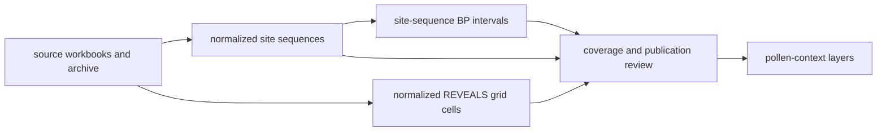

# LandClim

LandClim supplies primary pollen context through normalized site sequences and
REVEALS grid cells. It supports landscape and vegetation interpretation around
other evidence without becoming direct evidence for an archaeological feature
or ancient-DNA sample.

## Checked-In Evidence

The current governed summary records:

| Surface | Count | Meaning |
| --- | ---: | --- |
| normalized site sequences | 492 | pollen-context points retained after family-specific normalization |
| sequences with numeric BP intervals | 482 | records eligible for bounded temporal comparison at site-sequence level |
| REVEALS grid cells | 88 | modeled landscape context rather than sample observations |

Counts describe the checked-in snapshot, not exhaustive coverage. The family
contract identifies `data/landclim/raw/` as captured material,
`data/landclim/normalized/` as normalized evidence, the cross-family evidence
stage matrix as review, and regional pollen layers as publication.

## What LandClim Supports

- broad vegetation and palaeoenvironmental interpretation;
- pollen context around lakes, samples, sites, and regions;
- chronology-aware comparison where a normalized site-sequence interval is
  present;
- comparison between local sequence evidence and modeled landscape context;
- reproducible Nordic pollen layers whose records retain family identity.

Site sequences and grid cells have different meanings. A grid cell summarizes
modeled landscape context; it is not another observation at the cell center.

## Temporal Interpretation

Numeric BP windows belong to normalized site-sequence records. They support
comparison at the precision recorded by the sequence, not automatic alignment
with every sample or event inside the same interval.

The ten sequences without numeric intervals remain spatial pollen context.
They are not assigned synthetic dates to make the family appear uniformly
time-resolved.

## Relationship To Other Families

| Compared with | LandClim contributes | Other family contributes |
| --- | --- | --- |
| Neotoma | broad sequence and REVEALS-oriented landscape context | site-centered palaeoecological comparison |
| SEAD or RAÄ | environmental setting | archaeology context |
| SVAR | pollen setting around candidate basins | lake and hydrographic identity |
| aDNA | surrounding environmental context | direct sample-owned biological evidence |

Proximity between a LandClim record and another feature is a declared spatial
relation. It does not establish shared chronology or causal association unless
those dimensions are supported separately.

## Governing Surfaces

- `data/landclim/raw/landclim_sources.json` records source capture context;
- `data/landclim/normalized/landclim_summary.json` records family counts;
- `data/landclim/normalized/nordic_pollen_site_sequences.geojson` governs
  normalized sequence points;
- `data/landclim/normalized/nordic_reveals_grid_cells.geojson` governs grid
  context;
- `data/source_spatiotemporal_posture_registry.json` records comparison posture.

Public renderings are derived from these surfaces and cannot strengthen their
spatial or temporal claims.
