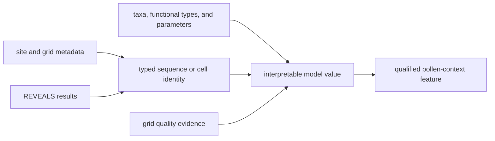
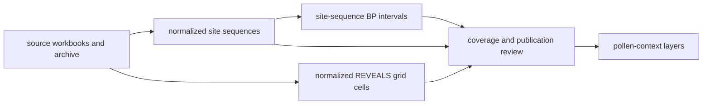
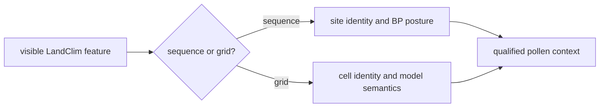
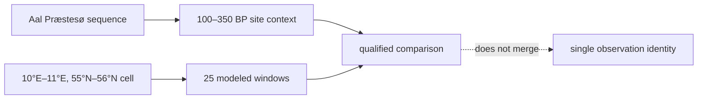

# LandClim

LandClim supplies primary pollen context through normalized site sequences and
REVEALS grid cells. It supports landscape and vegetation interpretation around
other evidence without becoming direct evidence for an archaeological feature
or ancient-DNA sample.

## Checked-In Evidence

The current governed summary records:

| Surface | Count | Meaning |
| --- | ---: | --- |
| normalized site sequences | 492 | pollen-context points retained after family-specific normalization |
| sequences with numeric BP intervals | 482 | records eligible for bounded temporal comparison at site-sequence level |
| REVEALS grid cells | 88 | modeled landscape context rather than sample observations |

Counts describe the checked-in snapshot, not exhaustive coverage. The family
contract identifies `data/landclim/raw/` as captured material,
`data/landclim/normalized/` as normalized evidence, the cross-family evidence
stage matrix as review, and regional pollen layers as publication.

### Curation Lineage

| Boundary | Governing material | Decision preserved |
| --- | --- | --- |
| source capture | `raw/landclim_sources.json` and the checked-in workbooks or archive | which LandClim release material entered the repository |
| sequence normalization | `normalized/nordic_pollen_site_sequences.geojson` | stable site geometry, source identity, and site-level temporal fields |
| model normalization | `normalized/nordic_reveals_grid_cells.geojson` | REVEALS cells remain areal model context rather than site observations |
| family summary | `normalized/landclim_summary.json` | denominators for sequence, interval, and grid-cell claims |
| cross-family review | `data/source_spatiotemporal_posture_registry.json` | whether the family can participate in spatial or temporal comparison |

The split between sequence and model normalization is a scientific boundary,
not a storage convenience. It prevents a modeled grid value from acquiring the
identity or evidentiary meaning of a sampled pollen sequence.

### Multi-Artifact Preparation Receipt

The captured LandClim family is assembled from unlike source artifacts:
site metadata, REVEALS results, grid-cell quality, taxa-to-functional-type
mappings, productivity and dispersal parameters, land-cover classifications,
and archived model outputs. Preparation must preserve the join that brought a
value into a sequence or cell rather than citing the family name alone.

| Prepared claim | Minimum retained lineage |
| --- | --- |
| site-sequence identity and geometry | source artifact, source-native dataset or sequence key, site metadata row, and normalization rule |
| numeric sequence interval | native bounds and basis, parsing rule, normalized BP values, and comparability posture |
| model-cell value | grid-cell identity and geometry, model release, time window, taxon or functional-type mapping, and applicable quality evidence |
| cross-window summary | member cell, exact contributing windows, aggregation method, and missing-window posture |

The receipt matters when a workbook or archive changes independently. A stable
cell count cannot demonstrate unchanged model meaning if its taxon mapping,
time-window definition, or quality evidence changed.

## What LandClim Supports

- broad vegetation and palaeoenvironmental interpretation;
- pollen context around lakes, samples, sites, and regions;
- chronology-aware comparison where a normalized site-sequence interval is
  present;
- comparison between local sequence evidence and modeled landscape context;
- reproducible Nordic pollen layers whose records retain family identity.

Site sequences and grid cells have different meanings. A grid cell summarizes
modeled landscape context; it is not another observation at the cell center.

## Temporal Interpretation

Numeric BP windows belong to normalized site-sequence records. They support
comparison at the precision recorded by the sequence, not automatic alignment
with every sample or event inside the same interval.

The ten sequences without numeric intervals remain spatial pollen context.
They are not assigned synthetic dates to make the family appear uniformly
time-resolved.

## Read A LandClim Member

First identify which normalized unit is visible. A site sequence and a REVEALS
grid cell can occupy the same map but require different interpretations.

| Question | Site sequence | REVEALS grid cell |
| --- | --- | --- |
| what is represented? | a normalized pollen sequence at a source-linked site | modelled vegetation context for a grid area |
| what does geometry mean? | the sequence site's governed point | the spatial support of the model cell, not an observation at its center |
| what does time mean? | the sequence interval when numeric bounds are present | the model's declared temporal context |
| what can be compared? | pollen context within compatible place and time precision | landscape-level model context under the grid contract |
| what must not be inferred? | direct evidence for a nearby sample or event | a measured pollen sample at the rendered coordinate |

A reusable claim retains the feature kind, source identity, normalized member
identifier, spatial basis, temporal posture, and publication scope. “LandClim
point” is not specific enough to preserve those distinctions.

### Worked Sequence And Grid Trace

`Aal Præstesø` demonstrates the site-sequence path. Its stable normalized
member ID is `897303:Aal Præstesø:55.637778:8.257222`; the record points to
PANGAEA dataset `897303`, classifies the site in Denmark, and carries a
`100–350 BP` interval. Those fields support a bounded pollen-context claim for
that sequence. They do not make the interval a date for every archaeological
or biological record near the site.

The REVEALS cell `10.000000,55.000000,11.000000,56.000000` demonstrates the
model path. It is a polygon spanning one degree, combines 25 declared time
windows from LandClim I and II inputs, and summarizes a window range from
`0–100 BP` through `11200–11700 BP`. Its midpoint is useful for navigation,
but the cell remains modeled areal context across many windows—not a pollen
observation at the polygon center and not one continuous sample interval.

This pair exposes a crucial denominator rule: one normalized sequence member,
one grid cell, 25 model windows, and the source observations behind them are
different units. A comparison must name which unit it counts.

## Relationship To Other Families

| Compared with | LandClim contributes | Other family contributes |
| --- | --- | --- |
| Neotoma | broad sequence and REVEALS-oriented landscape context | site-centered palaeoecological comparison |
| SEAD or RAÄ | environmental setting | archaeology context |
| SVAR | pollen setting around candidate basins | lake and hydrographic identity |
| aDNA | surrounding environmental context | direct sample-owned biological evidence |

Proximity between a LandClim record and another feature is a declared spatial
relation. It does not establish shared chronology or causal association unless
those dimensions are supported separately.

LandClim and Neotoma may also carry shared data lineage. Some captured Neotoma
dataset notes attribute contributions to the LandClim project or the European
Pollen Database. A matching or nearby member across the two normalized families
is therefore not automatically independent corroboration. Independence review
must compare dataset identity, contributor, site, and underlying sequence
lineage before treating the two records as separate support.

## Choose LandClim For The Question

| Question | Use | Retain with the claim |
| --- | --- | --- |
| What pollen sequence context exists near this place? | normalized site sequences | member identifier, distance rule, and sequence temporal posture |
| What modeled vegetation context covers this area? | REVEALS grid cells | cell identifier, model semantics, and declared time context |
| Can this record be compared with a dated sample? | only sequence rows with compatible admitted intervals | both intervals, units, precision, and overlap rule |
| Does nearby pollen prove association with an aDNA or archaeology feature? | neither LandClim surface alone | a separate association design and evidence would be required |

## Governing Surfaces

- `data/landclim/raw/landclim_sources.json` records source capture context;
- `data/landclim/normalized/landclim_summary.json` records family counts;
- `data/landclim/normalized/nordic_pollen_site_sequences.geojson` governs
  normalized sequence points;
- `data/landclim/normalized/nordic_reveals_grid_cells.geojson` governs grid
  context;
- `data/source_spatiotemporal_posture_registry.json` records comparison posture.

Public renderings are derived from these surfaces and cannot strengthen their
spatial or temporal claims.
