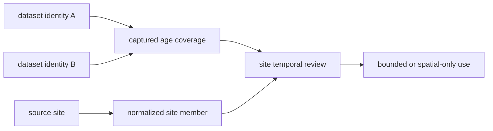
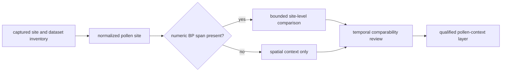
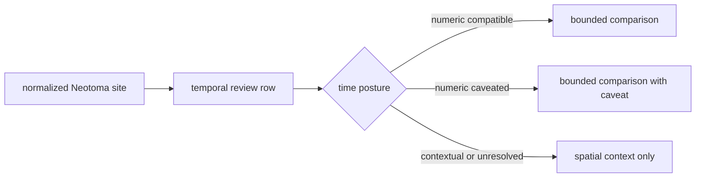
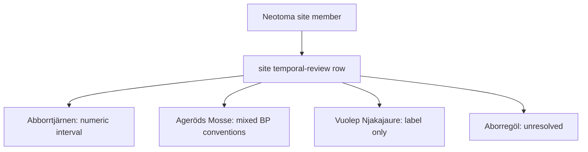
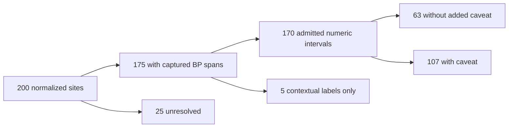

# Neotoma

Neotoma supplies primary pollen context as normalized palaeoecological site
records. It complements LandClim with a site-centered view, but temporal
support varies by record and remains distinct from a captured chronology
model.

Its pollen-site context is governed at the site and dataset levels. A public
point can orient a reader to a place, while dataset identity and the temporal
review determine whether the record supports spatial context, bounded temporal
comparison, or no numeric-time claim.

## Checked-In Evidence

The current temporal review covers 200 normalized sites:

| Posture | Count | Interpretation |
| --- | ---: | --- |
| site has a numeric BP span | 175 | bounded site-level comparison is possible under the recorded caveat |
| site lacks a BP span | 25 | spatial context only |
| captured chronology rows | 0 | the snapshot does not provide a separate chronology-row foundation |

Within the review, 63 records are numeric intervals, 107 are numeric intervals
with caveats, 5 retain contextual labels only, and 25 remain unresolved. These
categories are more informative than calling all 200 sites “dated.”

### Curation Lineage

| Boundary | Governing material | Decision preserved |
| --- | --- | --- |
| dataset acquisition | `raw/neotoma_pollen_dataset_downloads/manifest.json` and its captured parts | which downloaded responses belong to the snapshot |
| dataset inventory | `raw/neotoma_pollen_dataset_inventory.json` | dataset identity and coverage represented by the capture |
| site capture | `raw/neotoma_pollen_sites.json` | source site records before family normalization |
| site normalization | `normalized/nordic_pollen_sites.geojson` | stable spatial members used by public products |
| temporal review | `review/temporal_review.json` | numeric, caveated, contextual, or unresolved time posture per site |

The download bundle is preserved separately from the normalized map layer so a
reader can distinguish what the source returned from what the product admits.
A normalized point is therefore inspectable as a transformation, not presented
as an unexplained database export.

### Dataset And Site Are Different Identity Levels

A Neotoma site can expose one or more dataset records, while a dataset can
carry age-range statements, contributor notes, and lineage that do not belong
to the site name alone. Preparation therefore retains both levels:

| Identity level | What it owns | Unsafe collapse |
| --- | --- | --- |
| site | stable place-oriented source identity and reported geometry | treating the display name as a universal pollen-sequence key |
| dataset | dataset identity, type, contributor and source notes, and captured age coverage | merging several datasets into one unexplained site interval |
| normalized site member | repository spatial member plus summarized temporal posture | presenting the summary as a chronology or age-depth model |
| temporal review row | comparability decision and caveat for the current capture | inheriting family-wide time eligibility |

The review can summarize a site for product use while the captured dataset
inventory retains the members needed to challenge that summary.

## What Neotoma Supports

- site-centered pollen and palaeoenvironmental comparison;
- cross-place context across the governed capture;
- lake-linked or proximity-based pollen support under explicit spatial rules;
- temporal comparison when the individual review row records a compatible
  numeric BP interval;
- public context layers that preserve site identity and temporal posture.

## Chronology Limit

A site span summarizes captured age coverage. It is not equivalent to a
chronology table, age-depth model, or sample-level date. The current snapshot
contains no chronology rows for this Sweden-facing family, so a site with a BP
span may support a bounded comparison while still carrying a chronology
caveat.

Units and interval semantics also matter. A numeric label is not accepted for
comparison merely because it contains “BP”; the review posture records whether
the value is compatible with repository temporal rules.

## Site-Level Temporal Admission

Temporal eligibility is decided per normalized site, not inherited from the
family name or the visual presence of a marker.

For a temporal comparison, retain the site identifier, numeric bounds, unit
and basis, review class, caveat, and the other member's compatible interval.
For a spatial-only comparison, say explicitly that the site contributes pollen
context without a numeric chronology claim. This prevents the 175 sites with
captured spans from making the full 200-site layer appear uniformly dated.

### Four Governed Outcomes

The checked-in review contains concrete examples of every temporal posture:

| Site | Review outcome | Why |
| --- | --- | --- |
| `13338` Abborrtjärnen | `numeric_interval` | one calibrated BP site span, `0–9815 BP`, is available |
| `12` Ageröds Mosse | `numeric_interval_with_caveat` | the site summary combines calibrated and uncalibrated radiocarbon BP conventions |
| `28859` Lake Vuolep Njakajaure | `contextual_label_only` | age coverage is visible, but the normalized record does not support repository numeric comparison |
| `2961` Aborregöl | `unresolved` | no age-range detail is available in the captured site review |

These are not successive quality grades through which every site should move.
They are claim-specific outcomes derived from the captured evidence. A site
may remain useful spatial context even when numeric comparison is refused, and
a broad numeric span does not substitute for the missing chronology rows.

### Preserve The Admission Denominator

The 175 sites with a captured BP span are not the same population as sites
admitted to numeric comparison. Admission is narrower:

| Population | Count | Permitted use |
| --- | ---: | --- |
| captured site members | 200 | denominator for the governed Neotoma layer |
| members with a captured BP span | 175 | evidence that some temporal description was captured |
| admitted numeric intervals | 63 | bounded comparison under the recorded interval semantics |
| admitted numeric intervals with caveats | 107 | bounded comparison only when the caveat travels with the result |
| contextual labels only | 5 | spatial or descriptive context; no repository numeric comparison |
| unresolved time posture | 25 | spatial context only |

Thus, 170 members currently enter numeric comparison, not 175 and not 200.
The five contextual-label members are the important boundary case: source age
coverage is visible, but the normalized review refuses to promote it into a
repository numeric interval.

Every summary must name its denominator. “Most Neotoma sites are dated” hides
the distinction between captured labels, admitted comparison intervals, and
sample chronology that this review exists to preserve.

## Relationship To LandClim

Both families provide primary pollen context, but their normalized units and
strengths differ:

- LandClim combines site sequences with REVEALS grid context;
- Neotoma centers the comparison on palaeoecological sites and their captured
  dataset coverage;
- neither family replaces the other;
- neither becomes direct sample evidence when displayed beside aDNA.

The two families are not guaranteed to be statistically independent. Captured
Neotoma dataset notes include contributions associated with the LandClim
project and the European Pollen Database. Before describing agreement as
corroboration, compare source dataset identity, contributor, site, sequence,
and age coverage. Two publication layers can be separate repository families
while still representing one upstream observation lineage.

A direct LandClim–Neotoma comparison therefore pairs a LandClim site sequence
with a Neotoma normalized site member and retains both temporal decisions. A
REVEALS grid cell may provide model context for that pair, but it does not
increase the count of site observations. If shared lineage cannot be excluded,
the result is contextual agreement rather than independent corroboration.

## Choose Neotoma For The Question

| Question | Use | Retain with the claim |
| --- | --- | --- |
| Which captured palaeoecological sites provide pollen context? | normalized site members | site and dataset identity plus publication scope |
| Can two records be compared in time? | the individual temporal-review row | bounds, units, review class, caveat, and comparison rule |
| Does a site's BP span constitute an age-depth model? | no | the span is site-level captured coverage, not sample chronology |
| Is absence from the layer evidence of no palaeoecological record? | no | capture and normalization scope must be checked first |

### Review A Refresh Across Identity Levels

Compare dataset membership before site membership. A dataset can change its
contributor, chronology coverage, or site relation without creating a new
site; conversely, a newly captured dataset can add evidence to a site already
present. The refresh receipt therefore accounts for release and dataset IDs,
site IDs, dataset-to-site relations, admitted temporal rows, exclusions, and
published site members. Equal site counts cannot prove equal pollen evidence.

## Governing Surfaces

- `data/neotoma/raw/neotoma_pollen_dataset_inventory.json` records datasets;
- `data/neotoma/raw/neotoma_pollen_sites.json` records captured sites;
- `data/neotoma/normalized/nordic_pollen_sites.geojson` governs normalized
  spatial records;
- `data/neotoma/review/temporal_review.json` governs temporal posture;
- `data/source_spatiotemporal_posture_registry.json` summarizes cross-family
  comparison status.

A published Neotoma point inherits the posture of its governing review row,
not a stronger interpretation suggested by map precision.
