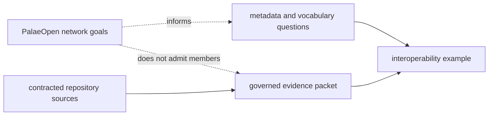
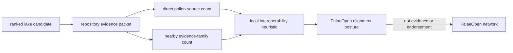

# PalaeOpen

PalaeOpen is COST Action CA23116, an open palaeoecological data network focused
on bringing dispersed data into public use, harmonising taxonomy and metadata,
and connecting domain-specific repositories for continental-scale terrestrial
and aquatic analysis. It is an interoperability network, not a checked-in
evidence family in Bijux Pollenomics.

That distinction is operationally important: no PalaeOpen row, dataset
snapshot, or network membership is used to admit a map feature in the current
repository state.

## Interoperability Boundary

PalaeOpen informs questions about metadata harmonization, vocabulary
alignment, and cross-repository identity. It is not a direct source in the
current evidence database. The repository may use its own governed products to
demonstrate an interoperability problem without attributing those records,
heuristics, or decisions to the network.

## Current Repository Relationship

| Question | Current answer |
| --- | --- |
| Is PalaeOpen one of the eight contracted evidence families? | no |
| Does `data/` contain a PalaeOpen capture or normalized layer? | no |
| Does PalaeOpen add weight to a lake ranking? | no |
| Is it relevant to cross-proxy metadata and taxonomy design? | yes |
| Can it replace LandClim, Neotoma, SEAD, or sample evidence? | no |

The direct evidence remains owned by the repository's contracted families.
PalaeOpen is relevant because its stated aims align with problems already
visible here: connecting terrestrial and aquatic proxies, retaining metadata
across repositories, and making heterogeneous site evidence reusable without
flattening its scientific meaning.

## Alignment In Lake Preparation

The Sweden fieldwork-preparation packet includes a repository-defined
`palaeopen_alignment_posture`. The local rule marks a lake as a stronger
interoperability example when it already has at least two direct pollen sources
and at least four evidence families within 20 km.

This posture is a Bijux Pollenomics heuristic. It is not produced, reviewed,
or endorsed by PalaeOpen; it does not imply participation in the network; and
it does not change the candidate's evidence score. Its purpose is to identify
where an already governed multi-proxy packet could provide a concrete
interoperability example.

## Conditions For A Future Data Integration

Any future PalaeOpen-derived data surface would enter through the same source
contract as every other family. Before publication it would need:

- a stable upstream dataset identity and version;
- licence and retrieval metadata;
- captured artifacts and integrity digests;
- an explicit observation unit and field mapping;
- taxonomy and temporal-semantics rules;
- a declared evidence role distinct from existing families;
- conflict and replacement behavior; and
- product-specific admission and traceability.

Network relevance alone cannot satisfy those requirements. Until a concrete
dataset passes them, PalaeOpen remains an interoperability relationship rather
than an evidence source.

### Interoperability Is Not Evidence Admission

Several useful forms of alignment can exist before any new evidence family is
created. They carry different authority:

| Alignment | What can be reused | What remains unproven |
| --- | --- | --- |
| vocabulary alignment | comparable names for proxy, taxonomy, place, time, and repository roles | equivalent observations or accepted value mappings |
| metadata crosswalk | explicit translation between two declared field contracts | scientific comparability of the underlying measurements |
| identity linkage | recoverable relation between stable dataset or site identifiers | independence, shared chronology, or shared observation lineage |
| workflow example | a governed multi-family packet that demonstrates a concrete interoperability problem | network endorsement or fitness as network evidence |
| evidence-family integration | captured, normalized, reviewed, and admitted members under a source contract | completeness beyond the integrated release and scope |

The current repository relationship reaches the workflow-example boundary.
Moving further requires a named upstream dataset and a governed crosswalk whose
information loss, identity behavior, and scientific claim ceiling can be
reviewed member by member.

## Official Sources

- [PalaeOpen](https://palaeopen.github.io/)
- [General information](https://palaeopen.github.io/About/about.html)
- [Join the network](https://palaeopen.github.io/join_us.html)

Continue to [source comparison](source-comparison.md) for direct source roles
and the [Sweden lake priorities](../../nordic-atlas/sweden-lake-priorities/index.md)
for the governed decision-support product.
