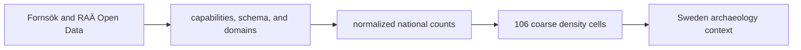

# RAÄ

RAÄ supplies dense, Sweden-specific archaeology context from
Riksantikvarieämbetet's published Fornsök/Open Data surfaces. The repository
publishes a coarse density representation so national archaeological context
can be compared without loading hundreds of thousands of individual markers.
It is a contextual domain, not direct evidence for a nearby biological sample
or a uniform Nordic archaeology layer.

## Checked-In Evidence

| Surface | Current scale | Meaning |
| --- | ---: | --- |
| all published sites represented by the source summary | 761,917 | national registry denominator behind the density product |
| `Fornlämning` records | 318,265 | one governed source classification, not a count of dated events |
| `Fornlämning` or possible records | 416,913 | broader classified subset retained by the normalized summary |
| density cells | 106 | one-degree aggregation cells rendered for public context |
| numeric temporal intervals | 0 | no repository-owned uniform chronology for same-period comparison |

The 761,917 source records are not 761,917 independent, equally dated
observations in the public map. The visible product is a 106-cell aggregation,
and registry practice, classification, preservation, discovery, and reporting
all shape the underlying count.

## Read A Density Cell

A cell answers a bounded question: how many governed RAÄ records in the
selected class fall within this aggregation area? It does not establish:

- a complete inventory of past activity;
- uniform survey or registration effort;
- chronology shared by records inside the cell;
- association with a nearby pollen, lake, fieldwork, or aDNA feature; or
- site-level distance from a feature to every contributing record.

Cell size is part of the result. A one-degree aggregation supports broad
national or regional context, not precise local-distance reasoning. Rendering
the cell with a smooth color ramp does not increase spatial resolution.

## Aggregation Contract

| Layer | Observation unit | Defensible denominator | Spatial meaning |
| --- | --- | --- | --- |
| source summary | published RAÄ registry record | 761,917 records in the governed capture summary | national registry population represented by the capture |
| classified summary | record in a declared RAÄ class | the selected classification population | classification count, not event count |
| density layer | one-degree cell | 106 emitted cells | aggregate registry density within the cell |
| map rendering | colored cell polygon | cells admitted to the Sweden product | visual comparison at cell resolution |

The transformation changes the observation unit. A statement about a density
cell must cite the cell and classification contract; a statement about an
individual RAÄ record requires the source record, which the public density
surface does not expose.

## Audit An Archaeology-Density Claim

1. Identify the Sweden product, RAÄ layer, cell, and classification being read.
2. Confirm the normalized national counts and the density layer use the same
   governed capture.
3. Treat the cell value as an aggregate count, not a site-level distance or a
   chronology statement.
4. State the one-degree spatial support and Sweden-only reach.
5. When comparing with SEAD, retain both observation units and do not add their
   counts into one archaeology population.
6. For a stronger local or temporal claim, return to the appropriate source
   records rather than interpolating detail from the color scale.

## Relationship To SEAD

| Dimension | RAÄ | SEAD |
| --- | --- | --- |
| reach | Sweden-specific | broader environmental-archaeology context |
| current public geometry | coarse density cells | normalized site points |
| temporal posture | density without uniform time | inventory points without captured numeric intervals |
| strongest use | Swedish registry-density context | wider site-centered archaeology context |
| invalid shortcut | generalize Swedish density to the Nordic region | infer same-period evidence from undated proximity |

The families are complementary and must not be merged into one archaeology
denominator. Their observation units, geographic reach, spatial resolution,
and capture depth differ.

## Governing Surfaces

- `data/raa/raw/arkreg_v1_0_wfs_capabilities.xml` preserves service capability
  context;
- `data/raa/raw/publicerade_lamningar_centrumpunkt_schema.xml` preserves the
  captured feature schema;
- `data/raa/raw/fornsok_domains.json` preserves governed domain values;
- `data/raa/normalized/sweden_archaeology_layer.json` governs counts, cell
  size, classification, and source identity; and
- `data/raa/normalized/sweden_archaeology_density.geojson` governs the visible
  density geometry.

Public maps inherit these scale and chronology limits. Continue to
[RAÄ exports](../publications/raa-exports.md) for the publication role and
[source comparison](source-comparison.md) before combining RAÄ with another
family.
