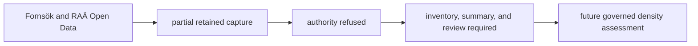
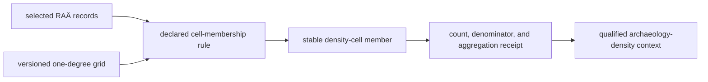

# RAÄ

RAÄ is intended to supply dense, Sweden-specific archaeology context from
Riksantikvarieämbetet's published Fornsök/Open Data surfaces. The repository
retains capture metadata and derived density files for audit, but does not
currently admit or publish them as governed archaeology evidence. RAÄ authority
is refused until the raw inventory, raw summary, normalized counts, and
qualified scientific review reconcile.

## Checked-In Evidence

| Surface | Current state | Meaning |
| --- | --- | --- |
| source inventory denominator | unavailable | no admitted raw inventory and raw summary reconcile the retained metadata |
| classified-record denominators | unavailable | retained summary values are not governed evidence while authority is refused |
| density cells | retained but excluded | the derived one-degree surface is audit material, not an admitted public layer |
| temporal evidence | not applicable | the refused density surface cannot contribute dated evidence or same-period comparison |

Missing governed denominators are not scientific zeros. The refusal means the
repository cannot currently establish which source population the retained
density cells represent or authorize those cells for analytical or public use.

## Read A Density Cell

A retained cell could answer a bounded question only after authority admission:
how many governed RAÄ records in the selected class fall within this
aggregation area? In the current refused state it establishes none of the
following:

- a complete inventory of past activity;
- uniform survey or registration effort;
- chronology shared by records inside the cell;
- association with a nearby pollen, lake, fieldwork, or aDNA feature; or
- site-level distance from a feature to every contributing record.

Cell size is part of the result. A one-degree aggregation supports broad
national or regional context, not precise local-distance reasoning. Rendering
the cell with a smooth color ramp does not increase spatial resolution.

## Aggregation Contract

| Layer | Observation unit | Defensible denominator | Spatial meaning |
| --- | --- | --- | --- |
| source summary | published RAÄ registry record | unavailable while authority is refused | national registry population represented by an admitted capture |
| classified summary | record in a declared RAÄ class | the selected classification population | classification count, not event count |
| density layer | one-degree cell | unavailable while authority is refused | aggregate registry density within the cell |
| map rendering | colored cell polygon | no cells currently admitted | visual comparison only after authority admission |

The transformation changes the observation unit. A statement about a density
cell must cite the cell and classification contract; a statement about an
individual RAÄ record requires the source record, which the public density
surface does not expose.

### Retain The Aggregation Receipt

A density comparison is reusable only when the aggregation choices travel with
the cell value:

| Receipt field | Required meaning |
| --- | --- |
| source population | governed RAÄ capture and source classification included |
| membership predicate | rule assigning source records to cells |
| grid definition | cell geometry, resolution, coordinate reference system, and boundary convention |
| numerator | count of admitted registry records in the named cell |
| denominator | selected source population or comparison-cell population used by the claim |
| missing and duplicate posture | treatment of unusable geometry, repeated identities, and multi-part records |
| product identity | publication version and stable cell identifier |

Two cells are comparable only under the same source population,
classification, grid, and membership rule. Equal color classes from different
contracts are visually similar, not necessarily quantitatively comparable.

## Audit An Archaeology-Density Claim

1. Confirm that RAÄ authority has been admitted; the current repository state
   is refused and cannot support an archaeology-density claim.
2. After admission, identify the Sweden product, RAÄ layer, cell, and
   classification being read and confirm that its counts share one capture.
3. Treat the cell value as an aggregate count, not a site-level distance or a
   chronology statement.
4. State the one-degree spatial support and Sweden-only reach.
5. When comparing with SEAD, retain both observation units and do not add their
   counts into one archaeology population.
6. For a stronger local or temporal claim, return to the appropriate source
   records rather than interpolating detail from the color scale.

## Relationship To SEAD

| Dimension | RAÄ | SEAD |
| --- | --- | --- |
| reach | Sweden-specific | broader environmental-archaeology context |
| current public geometry | none while authority is refused | normalized site points |
| temporal posture | refused; no admitted time dimension | mixed site envelopes: numeric where linked chronology supports them, otherwise label-only or unresolved |
| strongest use | retained provenance pending authority admission | wider site-centered archaeology context |
| invalid shortcut | generalize Swedish density to the Nordic region | infer same-period evidence from undated proximity |

The families are complementary and must not be merged into one archaeology
denominator. Their observation units, geographic reach, spatial resolution,
and capture depth differ.

## Governing Surfaces

- `data/raa/raw/arkreg_v1_0_wfs_capabilities.xml` preserves service capability
  context;
- `data/raa/raw/publicerade_lamningar_centrumpunkt_schema.xml` preserves the
  captured feature schema;
- `data/raa/raw/fornsok_domains.json` preserves governed domain values;
- `data/raa/normalized/sweden_archaeology_layer.json` governs counts, cell
  size, classification, and source identity; and
- `data/raa/normalized/sweden_archaeology_density.geojson` governs the visible
  density geometry.

Public maps must exclude the RAÄ density surface while authority remains
refused. Continue to
[RAÄ exports](../publications/raa-exports.md) for the publication role and
[source comparison](source-comparison.md) before combining RAÄ with another
family.
