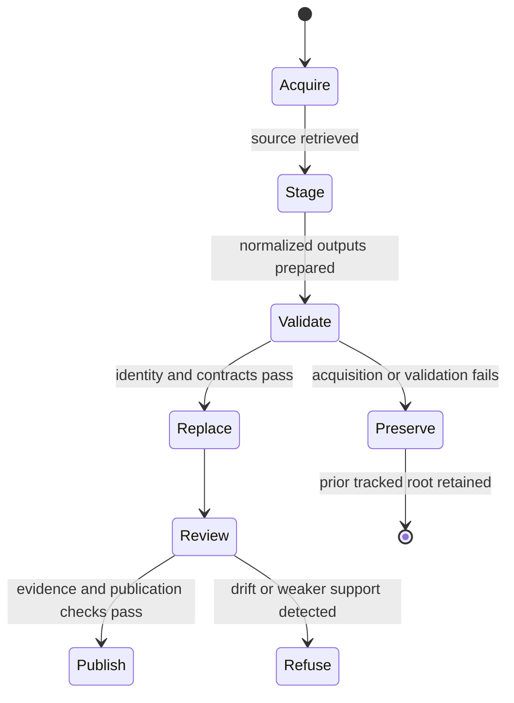

# Source Refresh Policy

A source refresh changes the evidence state from which reports and maps are
derived. It is therefore a governed replacement operation, not an invisible
download or a promise that every count will increase.

## Replacement Model

Collectors prepare each source in a source-specific staging root. The tracked
root is replaced only after preparation succeeds.

This model protects the previous tracked source tree from partial acquisition.
It does not make a successful refresh automatically publishable; the new state
must still pass scientific and publication review.

## Refresh Evidence

`data/collection_summary.json` records, per family:

- source and selected version;
- retrieval date and acquisition method;
- source and normalized output roots;
- source-specific license posture;
- captured and normalized SHA-256 identities;
- provenance metadata;
- staging and final replacement roots; and
- whether a failed refresh preserves the prior output.

The summary binds the repository state to one acquisition event. It does not
replace the narrower manifests or review surfaces owned by each family.

## Required Review

A refresh can change more than counts. Review the following as one evidence
change:

1. source version, retrieval path, license, and content identity;
2. schema and normalization differences;
3. added, removed, merged, or reidentified records;
4. locality, chronology, geometry, and precision changes;
5. coverage metrics and source-family evidence posture;
6. world, regional, country, and ranking diffs; and
7. caveats, exclusions, and release-gate outcomes.

A newer source may reveal that an older claim was too broad. Narrowing or
refusing that claim is a successful refresh outcome when it more accurately
represents the evidence.

## Failure Classes

| Failure | Meaning | Required response |
| --- | --- | --- |
| acquisition failure | the selected source could not be obtained completely | retain the previous root and record the failure |
| identity drift | bytes or version differ from the expected source | investigate before normalization or publication |
| schema drift | upstream structure no longer satisfies the collector contract | adapt and review normalization explicitly |
| normalization loss | expected fields or records disappear during transformation | reject the staged root |
| evidence regression | new records weaken locality, chronology, or source support | qualify or block affected publications |
| publication drift | downstream bundles no longer agree with governed data | regenerate and revalidate the derived surfaces |

## Reproducibility Boundary

The checked-in data tree is the reviewable result of a collection run, not a
guarantee that an external service will return identical content forever.
Reproducibility depends on preserved source identity, captured bytes where
permitted, normalization code, configuration, and manifests—not on a live URL
alone.

`make data-prep` intentionally rewrites tracked source outputs. Read-only
verification should use the repository's validation targets rather than
starting a refresh.
