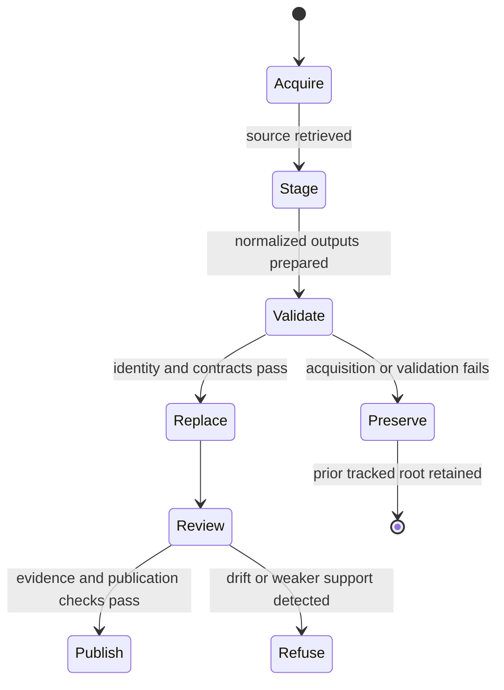
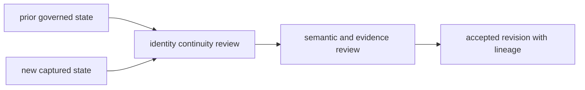
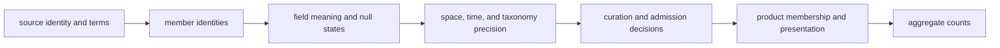

# Source Refresh Policy

A source refresh changes the evidence state from which reports and maps are
derived. It is therefore a governed replacement operation, not an invisible
download or a promise that every count will increase.

## Replacement Model

Collectors prepare each source in a source-specific staging root. The tracked
root is replaced only after preparation succeeds.

This model protects the previous tracked source tree from partial acquisition.
It does not make a successful refresh automatically publishable; the new state
must still pass scientific and publication review.

## Refresh Evidence

`data/collection_summary.json` records, per family:

- source and selected version;
- retrieval date and acquisition method;
- source and normalized output roots;
- source-specific license posture;
- captured and normalized SHA-256 identities;
- provenance metadata;
- staging and final replacement roots; and
- whether a failed refresh preserves the prior output.

The summary binds the repository state to one acquisition event. It does not
replace the narrower manifests or review surfaces owned by each family.

## Required Review

A refresh can change more than counts. Review the following as one evidence
change:

1. source version, retrieval path, license, and content identity;
2. schema and normalization differences;
3. added, removed, merged, or reidentified records;
4. locality, chronology, geometry, and precision changes;
5. coverage metrics and source-family evidence posture;
6. world, regional, country, and ranking diffs; and
7. caveats, exclusions, and release-gate outcomes.

A newer source may reveal that an older claim was too broad. Narrowing or
refusing that claim is a successful refresh outcome when it more accurately
represents the evidence.

## Stable Identity, Revisable Interpretation

A refresh may revise evidence without erasing continuity. The review separates
properties that must remain traceable from properties that may legitimately
change:

| Must remain traceable | May change with evidence | Must never change silently |
| --- | --- | --- |
| source family and upstream identity | recovered member population | observation unit |
| prior release and capture identity | source-native values in the new release | field meaning or unit |
| stable repository identifiers or explicit identity events | normalized interpretation | evidence role |
| prior curation and publication decisions | precision, conflict, and fitness posture | license and use posture |
| previous product membership | admission to affected products | denominator definition |

An upstream rename does not automatically justify a new repository identity,
and an unchanged identifier does not prove unchanged meaning. Merges, splits,
retirements, and semantic changes require explicit identity or contract events
so old and new claims can be compared without guesswork.

## Compare Meaning Before Volume

Review changes in this order:

Counts come last because several important changes can cancel numerically. One
record can replace another; exact geography can become approximate; a direct
role can become contextual; or an admitted member can be exchanged for a
different member while the total stays constant.

For every removal, distinguish upstream deletion, corrected duplication,
changed scope, failed acquisition, and normalization loss. For every addition,
distinguish newly available evidence, a changed parser, a repaired identity,
and a broadened admission rule. These causes have different scientific
meaning even when they produce the same diff shape.

## Failure Classes

| Failure | Meaning | Required response |
| --- | --- | --- |
| acquisition failure | the selected source could not be obtained completely | retain the previous root and record the failure |
| identity drift | bytes or version differ from the expected source | investigate before normalization or publication |
| schema drift | upstream structure no longer satisfies the collector contract | adapt and review normalization explicitly |
| normalization loss | expected fields or records disappear during transformation | reject the staged root |
| evidence regression | new records weaken locality, chronology, or source support | qualify or block affected publications |
| publication drift | downstream bundles no longer agree with governed data | regenerate and revalidate the derived surfaces |

## Acceptance Record

A refresh is ready to replace the governed family only when the review can
state:

- the exact source identity, version, retrieval context, and use posture;
- the expected and recovered assets, including explicit acquisition gaps;
- the normalized member-level additions, removals, and modifications;
- any changed semantics, precision, conflicts, or denominator;
- the curation decisions that changed and the facts they own;
- the publications that changed—or why none changed; and
- whether the prior governed tree remains recoverable from repository history.

This record makes acceptance reviewable after the live service and local logs
are gone. Successful execution alone is not an acceptance record.

## Reproducibility Boundary

The checked-in data tree is the reviewable result of a collection run, not a
guarantee that an external service will return identical content forever.
Reproducibility depends on preserved source identity, captured bytes where
permitted, normalization code, configuration, and manifests—not on a live URL
alone.

`make data-prep` intentionally rewrites tracked source outputs. Read-only
verification should use the repository's validation targets rather than
starting a refresh.
