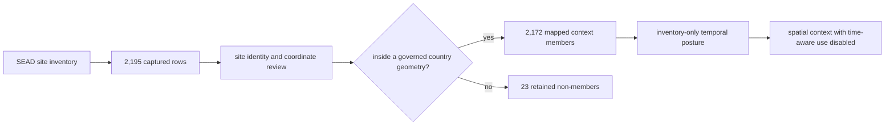

# SEAD Environmental Archaeology Context

SEAD contributes site-level environmental archaeology context to Pollenomics.
It can show that a lake, pollen sequence, or biological record sits within a
documented archaeological landscape. It does not turn proximity into direct
association, and the current capture does not support same-period comparison.

## Current Evidence Posture

| Property | Governed state | Consequence |
| --- | --- | --- |
| captured inventory | 2,195 site rows | the denominator remains visible before publication filtering |
| mapped publication members | 2,172 site points | these rows fall within the four governed country geometries |
| retained non-members | 23 site rows | they remain captured but outside the current country publication scope |
| observation unit | one SEAD site inventory row | a row is not a sample, event, taxon occurrence, or lake record |
| numeric chronology | 0 of 2,195 rows | time-aware overlap and same-period claims are refused |
| evidence role | environmental archaeology context | SEAD cannot establish biological identity or specimen provenance |

The 23-row difference is a spatial membership result, not deduplication and not
data loss. A boundary revision must reassess those same site identities rather
than silently treating the rows as newly collected evidence.

## What One Site Row Establishes

The checked-in inventory retains the site identifier, site name, available
national identifier, coordinates, country assignment, description, and stable
upstream site-page route where available. Those fields support a bounded claim:
a named environmental archaeology site is represented at a reported location
in the captured SEAD inventory.

They do not establish:

- a specimen-level link to nearby pollen or ancient-DNA evidence;
- a causal relation between a site and a lake catchment;
- temporal overlap with another record;
- sampling suitability, sediment preservation, access, or permitting; or
- complete representation of the upstream relational database.

The repository publishes derived context from a thin site inventory. When the
claim requires proxy records, bibliography, chronology, or a fuller site
dossier, the upstream SEAD site must be inspected and the additional evidence
captured before the claim can be strengthened.

## Evidence Chain

Each transition preserves a different decision. Capture establishes what was
retrieved. Identity review establishes the record being represented. Country
membership controls the current publication scope. Temporal review controls
which comparisons remain scientifically eligible.

## Appropriate Use

SEAD is suitable for questions such as:

| Question | Result that may be reported | Required qualification |
| --- | --- | --- |
| Which environmental archaeology sites are mapped near this feature? | site identities and distances under a declared spatial rule | proximity is contextual, not association |
| Is a candidate lake surrounded by documented archaeology? | a spatial context count or descriptive neighbourhood | no direct lake evidence and no fieldwork recommendation |
| Does a country view include the captured site? | inclusion under the current governed boundary geometry | membership may change when boundaries change |
| Is a SEAD site contemporaneous with an aDNA or pollen interval? | no numeric answer from the current capture | recover chronology before comparison |

Spatial context may contribute to Sweden lake triage, but SEAD does not prove
that a lake is archaeologically linked, suitable for coring, or temporally
aligned with a research question. Those decisions require lake identity,
fieldwork evidence, chronology, and product-specific review from their owning
sources.

## Reuse Contract

A reusable SEAD-derived statement retains:

- the SEAD site identifier and displayed name;
- the captured source and retrieval identity;
- reported coordinates and their spatial basis;
- current country-membership decision and boundary basis;
- the `site_inventory_only` temporal posture;
- the contextual evidence role; and
- the named product rule that admitted or excluded the row.

A distance alone is not sufficient lineage. Neither a nearby feature name nor
a country match may replace the SEAD site identifier.

## Recovery Boundary

The governed review artifacts distinguish absent evidence from evidence not yet
captured:

- `data/sead/review/access_model.json` records upstream visibility and reuse
  posture for each site;
- `data/sead/review/temporal_review.json` records the current refusal of numeric
  temporal comparison;
- `data/sead/review/evidence_legibility_review.json` records whether the
  captured representation is interpretable; and
- `data/sead/review/recovery_requirements.json` identifies the evidence gaps,
  required evidence, and satisfaction signals that would materially
  strengthen future use.

Recovery should target the missing claim dimension. A chronology question
requires temporal evidence; a source-attribution question requires references;
a proxy question requires the relevant upstream dataset relation. Adding more
nearby points cannot substitute for any of them.

### Claim-Led Relation Recovery

| Proposed stronger claim | Relation that must be recovered | Minimum review before use |
| --- | --- | --- |
| a site overlaps a pollen or aDNA interval | dating range or relative-period evidence with basis and uncertainty | normalize time basis, retain source labels, and test interval eligibility |
| a site interpretation is supported by named literature | bibliography relation and stable reference identity | verify the reference-to-site relation and preserve access posture |
| a site contains a named environmental proxy | dataset, sample group, physical sample, analysis entity, and analysis value lineage | retain observation unit, method, taxon or proxy vocabulary, and units |
| two rows describe the same archaeological place | governing identity evidence rather than name or coordinate similarity | record alias, merge, split, or unresolved collision posture |

Relation recovery is member-specific. Finding a rich dossier for one site does
not raise the maturity of the other inventory rows, and recovering one table
does not authorize a join until the intervening keys and observation units are
also governed.

## Related Evidence Contracts

- [SEAD source contract](sead.md) defines capture, normalization, and the
  23-row publication difference.
- [Temporal semantics](../evidence/temporal-semantics.md) defines comparison
  eligibility and refusal.
- [Coordinates](../evidence/coordinates.md) defines spatial basis and derived
  relations.
- [Sweden lake priorities](../../nordic-atlas/sweden-lake-priorities/index.md) explains
  how contextual layers enter candidate analysis.
