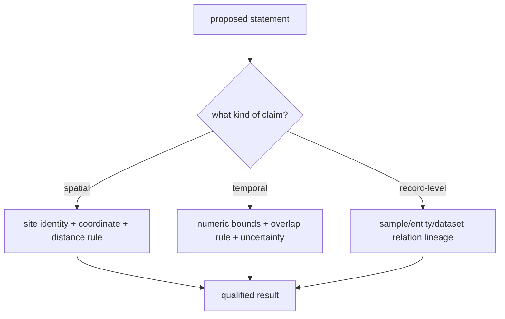

# SEAD Environmental Archaeology Context

This handbook explains how to read SEAD as both spatial and temporal evidence
without asking the data to say more than it does. The central skill is to
separate five things that are easy to collapse: a site, the records linked
beneath it, a grouped chronology feature, a derived site-level time envelope,
and a map interaction.

## Begin With The Observation Unit

One normalized SEAD feature represents one upstream site. A site can contain
many sample groups, physical samples, analysis entities, dates, datasets, and
references. Therefore:

> A site point is an index into an evidence dossier, not an archaeological
> event and not a specimen.

This matters most when time enters the analysis. A `7000–10000 BP` site
envelope says that captured relations beneath the site establish that overall
coverage. It does not say that every observation at the site has a 3,000-year
duration.

## Read A Site In Four Passes

### 1. Establish identity and geography

Read the SEAD site identifier, name, coordinate, country assignment, and
source page. The identifier is the durable join back to the captured archive;
the display name alone is not.

### 2. Inspect the evidence depth

Use popup rows and the raw archive to see whether the site has sample groups,
physical samples, analysis entities, datasets, dating ranges, relative
periods, or references. A high analysis-entity count means a richer captured
relational neighbourhood, not automatically a stronger chronology.

### 3. Choose the temporal observation unit

| Product | Reader interpretation | Numeric slider behavior |
| --- | --- | --- |
| temporal-evidence feature | one interval shared by identified linked chronology rows | included when that interval overlaps |
| dated site summary | the widest captured chronology envelope beneath one site | useful for overview, too coarse for event-level reading |
| unresolved site inventory | spatial identity without captured numeric chronology | withheld from narrowed windows |

### 4. Return to the intended claim

Ask whether the conclusion is spatial, temporal, or record-level. A nearby
site can support a spatial-context statement even when its time is unresolved.
A contemporaneity statement requires numeric interval evidence on both sides.
A claim about a particular sample or proxy requires the linked record lineage,
not only the site envelope.

## Work Through Three Examples

### Agerod V: numeric interval and context

Agerod V (`4237`) has a normalized site envelope of `7000–10000 BP`. The
temporal-evidence layer also publishes the linked chronology as narrower
features with source-record identifiers. If an atlas window is `8000–9000 BP`,
only chronology features whose own intervals overlap remain visible. Use the
site envelope to understand total coverage and the temporal layer to ask which
captured dates support the window.

### Borgholm: source label without an interval

Borgholm (`3776`) retains `Quaternary`. The label is useful for interpreting
the source and deciding what to inspect next. It is not converted into a BP
range by this repository, because such a conversion would import a boundary
that SEAD did not govern for this row. Borgholm is available in the optional
site-inventory layer and absent from the temporal-evidence layer.

### An unresolved site

An unresolved site still supplies a source identity and spatial context. Its
null temporal fields are not zeroes. When a narrow time window hides the
point, the correct reading is “temporal eligibility unknown,” not “site absent
in this period.”

## Understand The Current Denominators

| Population | Count |
| --- | ---: |
| sites in bounding-box review | 2,195 |
| assigned four-country sites | 2,069 |
| Swedish sites with comparable chronology | 370 |
| Swedish sites without comparable chronology | 1,555 |
| Swedish numeric chronology features | 8,172 |
| chronology claims | 25,109 |
| comparable chronology claims | 14,264 |
| context-only chronology claims | 10,144 |
| temporal-contract-refused chronology claims | 60 |
| unresolved chronology claims | 641 |
| country-review rows | 103 |
| unassigned rows | 23 |

The 25,109 chronology claims comprise 7,377 dating ranges, 10,057 relative
period rows, 641 analysis-entity ages, 87 geochronology rows, and 6,947
dendrochronology rows. Exactly 14,264 claims are comparable; 10,144 remain
context-only, 60 are explicitly refused by the nonnegative-BP contract, and 641
are unresolved. The atlas renders the comparable Swedish relations as 8,172
interval features without promoting the other claims.

## Use The Timeline Correctly

The temporal-evidence layer is the comparison mode and is enabled by default.
All 8,172 of its Swedish features are eligible for interval filtering. The
site-inventory layer is optional: turn it on to inspect the full 2,069-site
four-country spatial population. Claims without comparable intervals remain
context-only, explicitly refused, or unresolved and cannot enter a narrowed
time window.

```mermaid
stateDiagram-v2
    [*] --> FullExtent
    FullExtent: temporal evidence visible; site inventory optional
    FullExtent --> NarrowWindow: reader narrows BP range
    NarrowWindow: record-level interval overlaps visible
    NarrowWindow: unresolved site inventory withheld
    NarrowWindow --> FullExtent: reader restores full span
```

This behavior prevents two opposite errors: discarding valuable undated
spatial context from the overview, and pretending that undated sites are
present in every period.

## Use The Governed Sweden Discovery Surface

For Sweden, the Nordic Atlas combines those two reading needs without erasing
their distinction. Every one of the 1,925 assigned Swedish SEAD sites appears through
either its linked numeric chronology features or one explicitly unresolved
feature. The layer therefore supports both full-population spatial discovery
and honest interval filtering.

Its rank is an evidence-readiness order. Chronology and bibliography coverage
come first, followed by chronology breadth and represented record depth. The
order does not measure archaeological importance or current activity. RAÄ
density is displayed only as coarse context and cannot supply a site identity,
date, or rank contribution.

See [Sweden archaeology site discovery](../publications/archaeology-site-discovery.md)
for the complete 1,925-site contract and its JSON, CSV, GeoJSON, and Markdown
companions.

## Compare With Other Evidence Families

For a SEAD–LANDCLIM–AADR comparison, perform three independent checks:

1. **Spatial eligibility:** each record is admitted under its own geography
   and the distance rule is stated.
2. **Temporal eligibility:** each compared member has numeric bounds and the
   overlap calculation is explicit.
3. **Semantic eligibility:** the observation units are not treated as
   interchangeable.

An overlapping SEAD chronology feature, pollen sequence, and human-sample
interval can motivate investigation. It does not prove that the people
represented by the aDNA sample used the SEAD site or caused the pollen change.

## Reuse Contract

A reusable SEAD-derived statement carries:

- the SEAD site identifier and source page;
- the coordinate and governed country-membership result;
- the evidence role, normally environmental-archaeology context;
- numeric bounds when present, including BP basis and uncertainty notes;
- original and normalized period labels when present;
- the temporal comparison posture;
- the observation unit, explicitly “linked chronology interval” or “site
  envelope”; and
- the product rule that admitted, withheld, or excluded the feature.

Do not replace this lineage with a point name, distance, or broad period label.

## Access And Recovery Boundaries

The repository mirrors a large relational projection, not the complete SEAD
database or browsing experience. The governed artifacts distinguish what is
captured from what remains upstream:

- `data/sead/review/access_model.json` records site-page and reference
  visibility;
- `data/sead/review/temporal_review.json` records numeric and unresolved site
  postures;
- `data/sead/review/evidence_legibility_review.json` records whether the
  captured representation is interpretable; and
- `data/sead/review/recovery_requirements.json` names remaining gaps and the
  evidence that would satisfy them.

Recovery remains claim-led. A sample-level chronology needs sample-to-date
lineage. A proxy claim needs dataset and analysis lineage. A literature claim
needs the site-reference-to-bibliography chain. More site points cannot
substitute for any of those relations.

## Related Evidence Contracts

- [SEAD source contract](sead.md) defines the materialization, temporal
  postures, and map rule.
- [Temporal semantics](../evidence/temporal-semantics.md) defines comparison
  eligibility and refusal.
- [Coordinates](../evidence/coordinates.md) defines spatial basis and derived
  relations.
- [Sweden lake priorities](../../nordic-atlas/sweden-lake-priorities/index.md)
  explains how contextual evidence enters candidate analysis.
