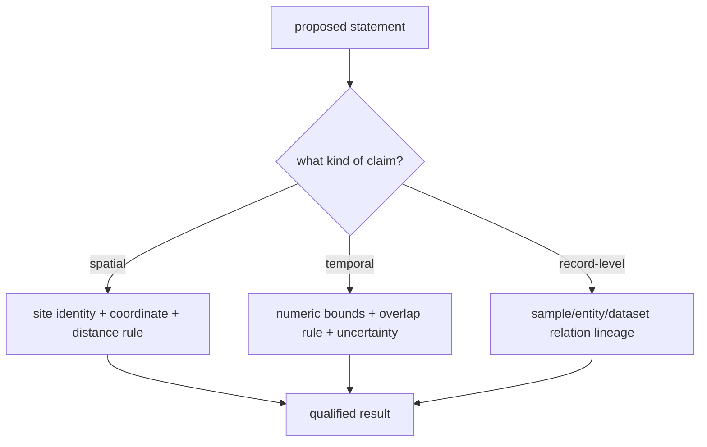
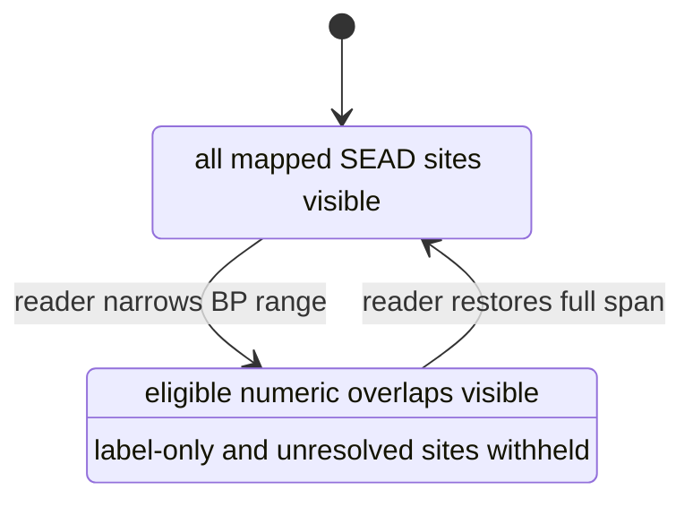

# SEAD Environmental Archaeology Context

This handbook explains how to read SEAD as both spatial and temporal evidence
without asking the data to say more than it does. The central skill is to
separate four things that are easy to collapse: a site, the records linked
beneath it, a derived site-level time envelope, and a map interaction.

## Begin With The Observation Unit

One normalized SEAD feature represents one upstream site. A site can contain
many sample groups, physical samples, analysis entities, dates, datasets, and
references. Therefore:

> A site point is an index into an evidence dossier, not an archaeological
> event and not a specimen.

This matters most when time enters the analysis. A `7000–10000 BP` site
envelope says that captured relations beneath the site establish that overall
coverage. It does not say that every observation at the site has a 3,000-year
duration.

## Read A Site In Four Passes

### 1. Establish identity and geography

Read the SEAD site identifier, name, coordinate, country assignment, and
source page. The identifier is the durable join back to the captured archive;
the display name alone is not.

### 2. Inspect the evidence depth

Use popup rows and the raw archive to see whether the site has sample groups,
physical samples, analysis entities, datasets, dating ranges, relative
periods, or references. A high analysis-entity count means a richer captured
relational neighbourhood, not automatically a stronger chronology.

### 3. Identify the temporal posture

| Posture | Reader interpretation | Numeric slider behavior |
| --- | --- | --- |
| numeric interval and context | accepted BP bounds plus retained source context | included when intervals overlap |
| contextual label only | meaningful period language without accepted numeric bounds | withheld from narrowed windows |
| unresolved | insufficient captured material for temporal comparison | withheld from narrowed windows |

### 4. Return to the intended claim

Ask whether the conclusion is spatial, temporal, or record-level. A nearby
site can support a spatial-context statement even when its time is unresolved.
A contemporaneity statement requires numeric interval evidence on both sides.
A claim about a particular sample or proxy requires the linked record lineage,
not only the site envelope.

## Work Through Three Examples

### Agerod V: numeric interval and context

Agerod V (`4237`) has a normalized site envelope of `7000–10000 BP`. If an
atlas window is `8000–9000 BP`, the intervals overlap and the point remains
visible. The defensible conclusion is that captured chronology beneath Agerod
V intersects that window. The map does not identify which specific analysis
entity supplies every part of the envelope; inspect the raw relational
capture for that question.

### Borgholm: contextual label only

Borgholm (`3776`) retains `Quaternary`. The label is useful for interpreting
the source and deciding what to inspect next. It is not converted into a BP
range by this repository, because such a conversion would import a boundary
that SEAD did not govern for this row. Borgholm is visible in the full map and
withheld from a narrowed numeric window.

### An unresolved site

An unresolved site still supplies a source identity and spatial context. Its
null temporal fields are not zeroes. When a narrow time window hides the
point, the correct reading is “temporal eligibility unknown,” not “site absent
in this period.”

## Understand The Current Denominators

| Population | Count |
| --- | ---: |
| captured site inventory | 2,195 |
| mapped four-country population | 2,172 |
| numeric mapped features | 497 |
| contextual-label-only mapped features | 12 |
| unresolved mapped features | 1,663 |
| captured rows outside mapped population | 23 |

The raw relational inventory also records 7,775 dating-range rows, 10,950
relative-date rows, 142 relative-age rows, and 831 site-reference rows. These
are relation counts, not additional sites. Report them only when explaining
capture depth or relational provenance.

## Use The Timeline Correctly

The full temporal extent is an overview mode. It includes all 2,172 mapped
SEAD features so the reader can see the spatial evidence population. A
narrowed extent is a comparison mode. It includes the 497 numeric features
only when their site envelopes overlap the active window.

This behavior prevents two opposite errors: discarding valuable undated
spatial context from the overview, and pretending that undated sites are
present in every period.

## Compare With Other Evidence Families

For a SEAD–LANDCLIM–AADR comparison, perform three independent checks:

1. **Spatial eligibility:** each record is admitted under its own geography
   and the distance rule is stated.
2. **Temporal eligibility:** each compared member has numeric bounds and the
   overlap calculation is explicit.
3. **Semantic eligibility:** the observation units are not treated as
   interchangeable.

An overlapping SEAD site envelope, pollen sequence, and human-sample interval
can motivate investigation. It does not prove that the people represented by
the aDNA sample used the SEAD site or caused the pollen change.

## Reuse Contract

A reusable SEAD-derived statement carries:

- the SEAD site identifier and source page;
- the coordinate and governed country-membership result;
- the evidence role, normally environmental-archaeology context;
- numeric bounds when present, including BP basis and uncertainty notes;
- original and normalized period labels when present;
- the temporal comparison posture;
- the observation unit, explicitly “site envelope” when using site time; and
- the product rule that admitted, withheld, or excluded the feature.

Do not replace this lineage with a point name, distance, or broad period label.

## Access And Recovery Boundaries

The repository mirrors a large relational projection, not the complete SEAD
database or browsing experience. The governed artifacts distinguish what is
captured from what remains upstream:

- `data/sead/review/access_model.json` records site-page and reference
  visibility;
- `data/sead/review/temporal_review.json` records interval, label-only, and
  unresolved postures;
- `data/sead/review/evidence_legibility_review.json` records whether the
  captured representation is interpretable; and
- `data/sead/review/recovery_requirements.json` names remaining gaps and the
  evidence that would satisfy them.

Recovery remains claim-led. A sample-level chronology needs sample-to-date
lineage. A proxy claim needs dataset and analysis lineage. A literature claim
needs the site-reference-to-bibliography chain. More site points cannot
substitute for any of those relations.

## Related Evidence Contracts

- [SEAD source contract](sead.md) defines the materialization, temporal
  postures, and map rule.
- [Temporal semantics](../evidence/temporal-semantics.md) defines comparison
  eligibility and refusal.
- [Coordinates](../evidence/coordinates.md) defines spatial basis and derived
  relations.
- [Sweden lake priorities](../../nordic-atlas/sweden-lake-priorities/index.md)
  explains how contextual evidence enters candidate analysis.
