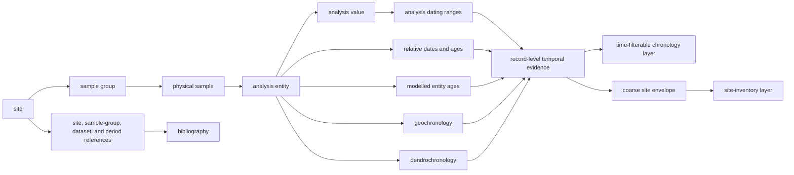
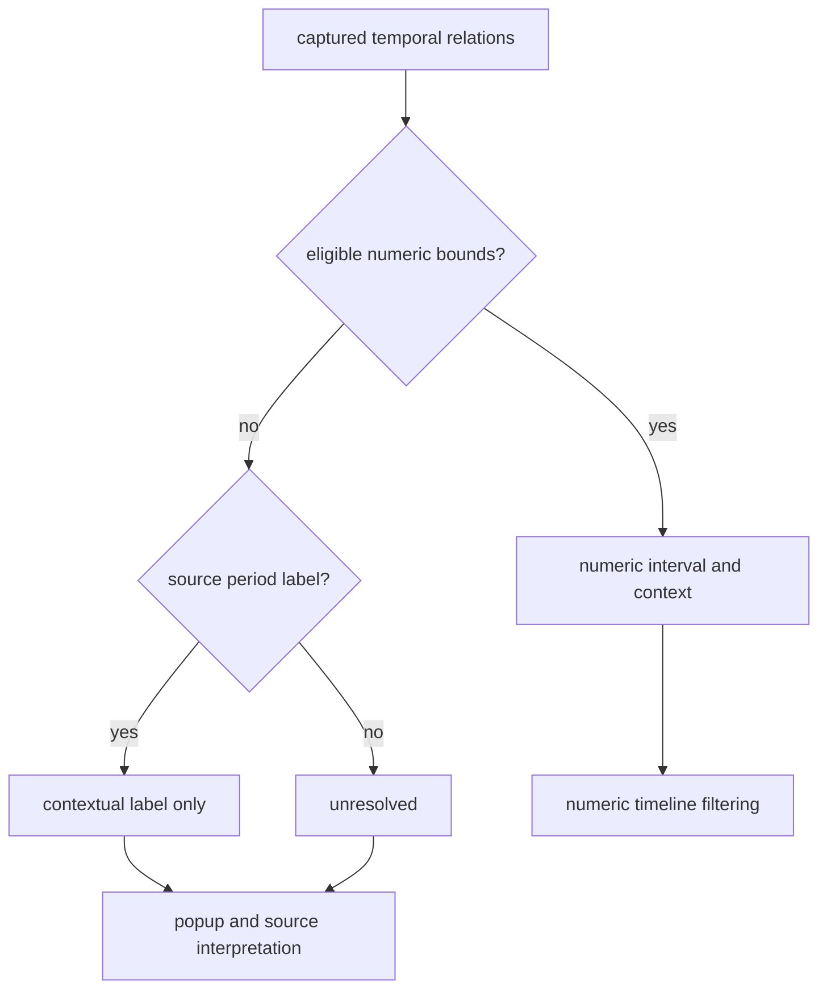
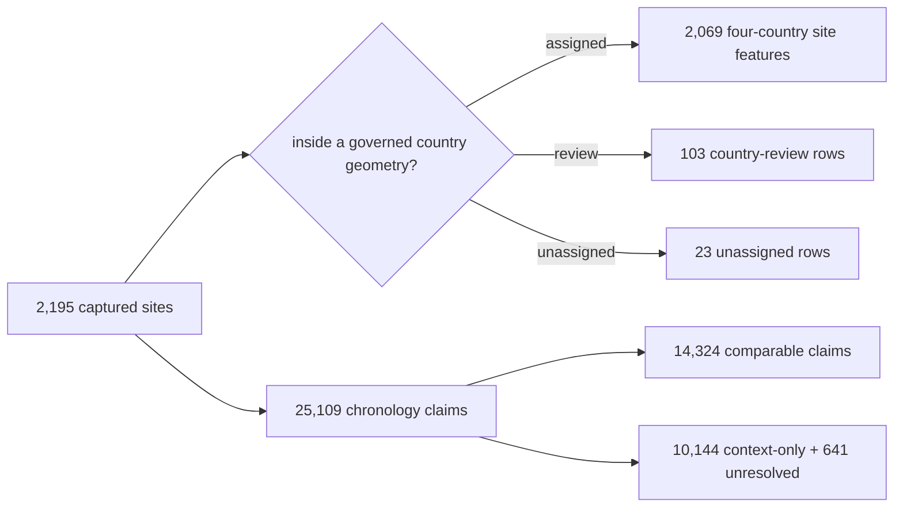

# SEAD

SEAD contributes environmental-archaeology sites to the Nordic evidence
atlas. Those sites are not static. Many are connected to dating ranges or
relative periods in SEAD's relational database, while others still have no
usable numeric chronology. The repository preserves that unevenness instead
of forcing every site into one temporal category.

This source family stays an archaeology context layer: it is strong contextual
evidence for nearby activity and chronology review, but it is not sample-owned
proof of one lake event.

The practical rule is simple: use the governed Sweden discovery surface in the
Nordic Atlas, then return to the normalized temporal-evidence and site-inventory
products when auditing its source. The discovery surface keeps every Swedish
site, preserves each eligible linked interval, and represents missing numeric
chronology explicitly rather than as a static or timeless point.

## Current Evidence State

<!-- sead-evidence:generated:start -->
The current governed full-evidence run is `sead-full-evidence-39bfff6a-ce80714e` (`sha256:ce80714e4c9e9974b24913e5da50f49854670ed642879c1ca5076499e1d56725`). Its denominators are:

| Governed population | Count | Interpretation |
| --- | ---: | --- |
| source tables | 61 | complete captured relational table set |
| sites in the Nordic bounding-box review | 2,195 | country-decision denominator |
| assigned four-country sites | 2,069 | SE 1,925, DK 59, NO 45, FI 40 |
| sites requiring country review | 103 | retained outside assigned publication membership |
| unassigned sites | 23 | retained without a governed country assignment |
| atlas SEAD features | 11,807 | 2,069 four-country site features plus 9,738 Swedish chronology-discovery features; not a distinct-site count |
| chronology claims | 25,109 | 14,324 comparable, 10,144 context-only, 641 unresolved |
| source-native observations | 177,763 | quantitative observation denominator |
| source-native taxon relations | 1,974 | preserved source taxonomy, not accepted cross-source classification |
| dimension relations | 2,639 | explicit source-native measurement dimensions |
| eligible / refused propagation events | 0 / 177,763 | `refused`: `source_classification_not_accepted` |

Site, feature, claim, observation, relation, and event counts are different units. The atlas may display SEAD chronology and source-native detail, but it must not turn the refused event population into migration or propagation evidence.
<!-- sead-evidence:generated:end -->

## From A Relational Database To A Map Point

A SEAD date belongs to a chain of records, not directly to a coordinate. The
collector follows that chain and retains the intermediate identities before
deriving a site envelope.

The site envelope remains a publication convenience for ranking and overview.
The temporal-evidence layer is the appropriate product for chronological
navigation: each feature keeps one interval and the identifiers of all source
rows grouped into it. For sample-level reasoning, continue into
`raw/nordic_sites.json`; a mapped chronology feature is more precise than a
site envelope but is still contextual evidence, not proof of a lake event.

## Site Posture And Chronology Posture

### Numeric interval and context

A site has a normalized `time_start_bp` and `time_end_bp` derived from
captured temporal relations. It may also retain the original relative-period
labels and uncertainty notes. The atlas can test interval overlap for this
site.

For example, Agerod V (`4237`) is published with a site envelope of
`7000–10000 BP`. That makes it eligible for a map window that overlaps the
interval. It does not prove that every Agerod V observation belongs to every
year in that span.

### Source label without numeric support

A site can have source period language but no stable numeric interval accepted
by the repository. A self-encoded label such as `CAL_1242_AD-` can be converted
because the bounds and era are present in the source value. A broad label such
as `Quaternary` cannot be placed on the slider by name alone. In the current
snapshot, such sites are part of the unresolved site population rather than a
separate numeric chronology layer.

### Unresolved

The captured relations do not support either an eligible numeric envelope or
a useful normalized period label. The site remains valid spatial context. A
null time value means “not resolved under this contract,” not `0 BP`, “modern,”
or “undated in the upstream database.”

## How The Atlas Timeline Treats SEAD

The Nordic Atlas exposes one governed Sweden archaeology discovery layer. It
contains all 1,925 assigned Swedish SEAD sites as 8,184 linked numeric
chronology features plus 1,554 explicitly unresolved site features. Once a reader narrows
the time window:

1. numeric features remain visible only when their own linked interval
   overlaps the selected window; and
2. unresolved features are withheld because overlap is unknown.

This is different from declaring unresolved sites absent from the selected
period. The interface is refusing a comparison it cannot make.
Static layers such as boundaries are unaffected by this rule.

The Nordic normalized site and temporal-evidence products remain available for
audit and reuse. They are not loaded beside the discovery layer because doing
so would duplicate the same SEAD population and obscure the governed
discovery contract.

## Compare SEAD With LANDCLIM And AADR Carefully

All three families can appear on one numeric BP timeline, but their
observation units remain different.

| Source family | Timed map unit | What interval overlap supports | What it does not support |
| --- | --- | --- | --- |
| SEAD temporal evidence | grouped linked chronology interval | one or more identified source chronology rows overlap the selected window | the chronology proves a lake event or every record at the site is contemporaneous |
| LANDCLIM | pollen site-sequence interval | the sequence covers part of the selected window | direct association with a nearby archaeological site |
| AADR | dated human sample or governed locality descendant | the sample chronology overlaps the window | identity between a sample and a nearby site |

Temporal overlap is therefore a candidate relation for investigation, not a
join key. Keep source identity, spatial distance, interval basis, and
observation unit with any cross-source statement.

## The 126 Captured Non-Members

The difference between 2,195 bounding-box review rows and 2,069 assigned site
points is a country-membership decision. The 126 non-members comprise 103 rows
requiring country review and 23 unassigned rows. They retain source identities
and coordinates without being silently promoted into one of the four governed
publication countries.

This is not deduplication or evidence deletion. A boundary or publication
scope change must reevaluate the same 23 identities.

## Appropriate Claims

SEAD supports:

- finding environmental-archaeology sites near a lake, pollen sequence, or
  aDNA locality under a declared distance rule;
- navigating 14,324 comparable chronology claims through interval-preserving features;
- retaining relative-period language for human interpretation without
  inventing numeric bounds;
- identifying sites whose bibliography or deeper relational evidence merits
  inspection; and
- comparing regional evidence coverage while keeping capture and publication
  denominators separate.

SEAD does not by itself support:

- treating proximity as direct association;
- treating a site envelope as a sample or event date;
- assigning dates to unresolved sites from neighbours or broad historical
  expectations;
- interpreting database density as past population or activity; or
- merging SEAD and RAÄ into one archaeology truth set.

Continue with [Sweden archaeology site discovery](../publications/archaeology-site-discovery.md)
for the complete population, readiness order, artifact set, and interpretation
contract.

## Governing Surfaces

| Surface | Responsibility |
| --- | --- |
| `data/sead/raw/nordic_sites.json` | captured site rows, relational inventories, source counts, and acquisition lineage |
| `data/sead/normalized/nordic_environmental_sites.geojson` | mapped features, temporal fields, popup evidence, and country membership |
| `data/sead/normalized/nordic_temporal_evidence.geojson` | mapped record-level chronology groups used by the atlas time filter |
| `data/sead/derived/sweden_archaeology_site_discovery.json` | complete Swedish site registry and evidence-readiness contract |
| `data/sead/derived/sweden_archaeology_site_discovery.geojson` | Atlas-ready exact intervals and explicitly unresolved Swedish sites |
| `data/sead/review/temporal_review.json` | row-level comparison posture and capture denominators |
| `data/sead/review/access_model.json` | mirrored versus upstream-only access boundary |
| `data/sead/review/evidence_legibility_review.json` | interpretability and publication risk |
| `data/sead/review/recovery_requirements.json` | remaining evidence gaps and their satisfaction signals |
| `data/source_spatiotemporal_posture_registry.json` | cross-source summary of allowed spatial and temporal use |

The [SEAD handbook](sead-handbook.md) provides a step-by-step reading method.
The [SEAD exports guide](../publications/sead-exports.md) explains which
artifact to use for analysis, review, and publication.
