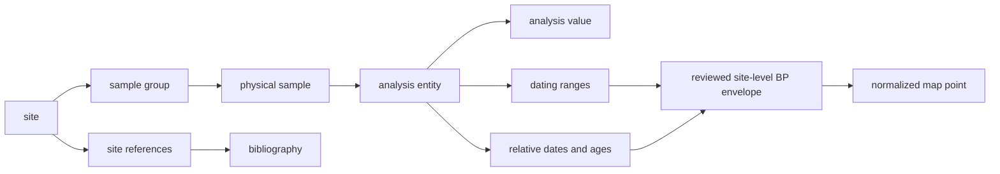
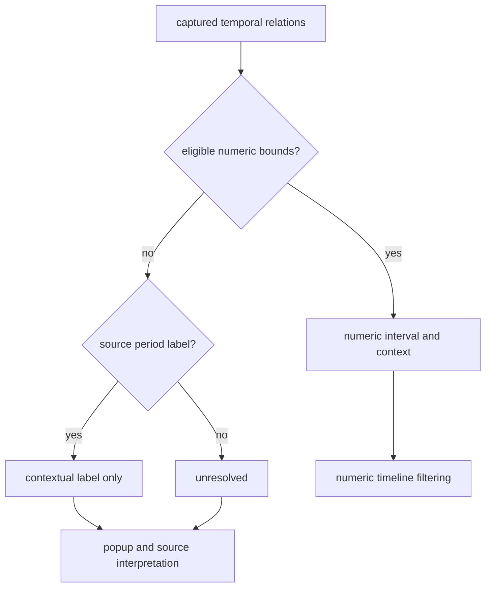
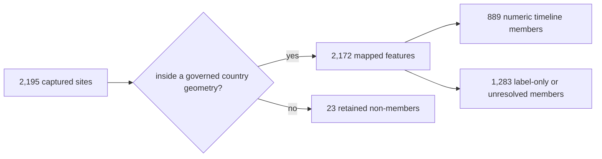

# SEAD

SEAD contributes environmental-archaeology sites to the Nordic evidence
atlas. Those sites are not static. Many are connected to dating ranges or
relative periods in SEAD's relational database, while others still have no
usable numeric chronology. The repository preserves that unevenness instead
of forcing every site into one temporal category.

This source family stays an archaeology context layer: it is strong contextual
evidence for nearby activity and chronology review, but it is not sample-owned
proof of one lake event.

The practical rule is simple: **filter a SEAD site through time only when its
captured relations support a numeric BP interval**. A cultural-period label is
useful context, but it is not automatically a numeric date. A site with no
chronology remains visible in the full-extent view and is withheld from a
narrowed time window because overlap cannot be demonstrated.

## Current Evidence State

The governed snapshot begins with 2,195 captured site rows. Spatial
normalization admits 2,172 of them to the Sweden, Norway, Finland, and Denmark
map layer.

| Evidence property | Count | What the count means |
| --- | ---: | --- |
| captured site rows | 2,195 | denominator before map-country membership |
| mapped Nordic features | 2,172 | sites inside the four governed country geometries |
| captured rows with numeric interval material | 911 | source rows from which a numeric site envelope can be derived |
| mapped features with numeric intervals | 889 | points that can participate in atlas time filtering |
| mapped features with contextual labels only | 12 | points with period language but no eligible numeric interval |
| mapped features with unresolved time | 1,271 | points retained as spatial context only |
| captured rows linked to dating ranges | 392 | sites connected through the SEAD dating-range relation |
| captured rows linked to relative periods | 531 | sites connected through relative-date or relative-age relations |
| captured rows linked to bibliography | 1,034 | sites with captured site-reference lineage |
| captured site-inventory-only rows | 1,137 | sites without the linked evidence required for a richer posture |

These denominators answer different questions. The 911 numeric source rows
must not be reported as 911 visible timed points: only 889 are members of the
current mapped population. Likewise, 7,775 raw dating-range relation rows are
not 7,775 sites. They are linked records from which site-level summaries are
derived.

## From A Relational Database To A Map Point

A SEAD date belongs to a chain of records, not directly to a coordinate. The
collector follows that chain and retains the intermediate identities before
deriving a site envelope.

The site envelope is a publication convenience. It expresses the temporal
coverage captured beneath a site; it does not claim that every sample,
analysis, or archaeological event at that site shares the whole interval.
For sample-level reasoning, follow the relation identities in
`raw/nordic_sites.json` rather than reading the envelope as an event date.

## Three Temporal Postures

### Numeric interval and context

A site has a normalized `time_start_bp` and `time_end_bp` derived from
captured temporal relations. It may also retain the original relative-period
labels and uncertainty notes. The atlas can test interval overlap for this
site.

For example, Agerod V (`4237`) is published with a site envelope of
`7000–10000 BP`. That makes it eligible for a map window that overlaps the
interval. It does not prove that every Agerod V observation belongs to every
year in that span.

### Contextual label only

A site has source period language but no stable numeric interval accepted by
the repository. Borgholm (`3776`), for example, retains the label
`Quaternary`. The label supports human interpretation and source review, but
it is too broad to place on the numeric slider without an explicit,
source-governed conversion.

### Unresolved

The captured relations do not support either an eligible numeric envelope or
a useful normalized period label. The site remains valid spatial context. A
null time value means “not resolved under this contract,” not `0 BP`, “modern,”
or “undated in the upstream database.”

## How The Atlas Timeline Treats SEAD

At the full temporal extent, the atlas shows all admitted SEAD points. This is
the honest overview of spatial coverage. Once a reader narrows the time
window:

1. numeric SEAD intervals remain visible only when they overlap the selected
   window;
2. label-only and unresolved sites are hidden because their overlap is
   unknown; and
3. restoring the full extent restores those contextual sites.

This is different from declaring label-only or unresolved sites absent from
the selected period. The interface is refusing a comparison it cannot make.
Static layers such as boundaries are unaffected by this rule.

## Compare SEAD With LANDCLIM And AADR Carefully

All three families can appear on one numeric BP timeline, but their
observation units remain different.

| Source family | Timed map unit | What interval overlap supports | What it does not support |
| --- | --- | --- | --- |
| SEAD | derived site envelope | a captured site chronology overlaps the selected window | every sample or event at the site is contemporaneous |
| LANDCLIM | pollen site-sequence interval | the sequence covers part of the selected window | direct association with a nearby archaeological site |
| AADR | dated human sample or governed locality descendant | the sample chronology overlaps the window | identity between a sample and a nearby site |

Temporal overlap is therefore a candidate relation for investigation, not a
join key. Keep source identity, spatial distance, interval basis, and
observation unit with any cross-source statement.

## The 23 Captured Non-Members

The difference between 2,195 captured rows and 2,172 mapped points is a
country-membership decision. The omitted rows retain source identities and
coordinates but do not fall inside the four governed publication-country
geometries. The set includes places east or south of the current scope and
some island or boundary-edge cases.

This is not deduplication or evidence deletion. A boundary or publication
scope change must reevaluate the same 23 identities.

## Appropriate Claims

SEAD supports:

- finding environmental-archaeology sites near a lake, pollen sequence, or
  aDNA locality under a declared distance rule;
- navigating the 889 mapped numeric site envelopes through BP time;
- retaining relative-period language for human interpretation without
  inventing numeric bounds;
- identifying sites whose bibliography or deeper relational evidence merits
  inspection; and
- comparing regional evidence coverage while keeping capture and publication
  denominators separate.

SEAD does not by itself support:

- treating proximity as direct association;
- treating a site envelope as a sample or event date;
- assigning dates to unresolved sites from neighbours or broad historical
  expectations;
- interpreting database density as past population or activity; or
- merging SEAD and RAÄ into one archaeology truth set.

## Governing Surfaces

| Surface | Responsibility |
| --- | --- |
| `data/sead/raw/nordic_sites.json` | captured site rows, relational inventories, source counts, and acquisition lineage |
| `data/sead/normalized/nordic_environmental_sites.geojson` | mapped features, temporal fields, popup evidence, and country membership |
| `data/sead/review/temporal_review.json` | row-level comparison posture and capture denominators |
| `data/sead/review/access_model.json` | mirrored versus upstream-only access boundary |
| `data/sead/review/evidence_legibility_review.json` | interpretability and publication risk |
| `data/sead/review/recovery_requirements.json` | remaining evidence gaps and their satisfaction signals |
| `data/source_spatiotemporal_posture_registry.json` | cross-source summary of allowed spatial and temporal use |

The [SEAD handbook](sead-handbook.md) provides a step-by-step reading method.
The [SEAD exports guide](../publications/sead-exports.md) explains which
artifact to use for analysis, review, and publication.
