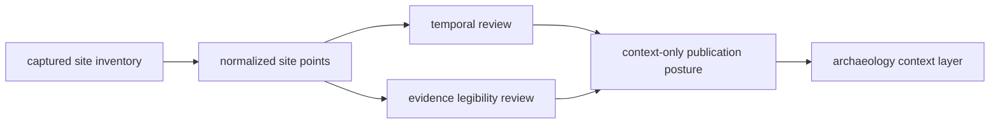
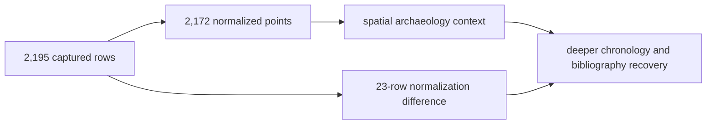

# SEAD

SEAD supplies environmental-archaeology context. In the current checked-in
state it is a spatial site inventory, not a uniformly time-resolved
archaeology layer. Its value is substantial precisely when that contextual
role and temporal limit remain explicit.

## Checked-In Evidence

The current temporal and legibility reviews cover 2,195 captured site rows:

| Property | Count | Posture |
| --- | ---: | --- |
| site inventory rows | 2,195 | spatial archaeology context |
| numeric temporal intervals | 0 | no numeric same-period comparison |
| linked dating-range rows | 0 | dating foundation not captured here |
| linked relative-period rows | 0 | period foundation not captured here |
| bibliography rows | 0 | bibliography linkage not captured here |

The normalized spatial layer contains 2,172 records. The difference between
captured and normalized counts must remain visible; it is not evidence that
the omitted records never existed.

Every current legibility-review row is classified as inventory-only or
unresolved for time, with high risk from the thin site-inventory capture and a
publication posture of context with an explicit caveat.

### Curation Lineage

| Boundary | Governing material | Decision preserved |
| --- | --- | --- |
| inventory capture | `raw/nordic_sites.json` | the site identities and geometry available in the checked-in snapshot |
| spatial normalization | `normalized/nordic_environmental_sites.geojson` | the 2,172 members eligible for contextual mapping |
| access review | `review/access_model.json` | how the captured surface relates to deeper SEAD information |
| temporal review | `review/temporal_review.json` | refusal of unsupported numeric comparison |
| evidence legibility | `review/evidence_legibility_review.json` | why inventory visibility is not record-level interpretive depth |
| recovery direction | `review/recovery_roadmap.json` | which missing relations would materially strengthen future claims |

These surfaces turn a thin database capture into an auditable evidence state.
They do not conceal the missing chronology and bibliography behind a successful
normalization count.

## What SEAD Supports

- environmental-archaeology context around samples, pollen records, lakes,
  and regions;
- spatial density and proximity comparisons under declared distance bands;
- cross-regional context beyond one national registry;
- identification of places where deeper source recovery may be valuable;
- landscape interpretation that keeps archaeology visible beside biological
  and environmental evidence.

## What The Current Capture Does Not Support

- same-period claims between SEAD sites and nearby pollen or aDNA;
- exact sample identity, locality, chronology, or species assignment;
- duration or phase comparison across the captured inventory;
- bibliography-backed interpretation for every normalized site;
- treating site density as a direct measure of past activity or preservation.

The absence of numeric intervals is not repaired with inferred dates. SEAD can
affect spatial decision support while receiving no chronology credit.

## Interpret The Capture Gap

The difference between inventory visibility and evidentiary depth is itself a
governed result:

| State | What is known | What remains unavailable |
| --- | --- | --- |
| captured inventory row | a source site identity entered the repository | linked dating, period, bibliography, and deeper record relations |
| normalized site point | a spatial representation passed family normalization | uniform numeric chronology and record-level interpretive depth |
| contextual publication member | the point is eligible for declared archaeology context | same-period support or direct association with nearby evidence |
| omitted captured row | the upstream inventory included a row not present in the normalized point layer | the exact normalization, identity, or geometry issue must be inspected |

The 23-row difference is not automatically an error or a valid deletion; it is
a review boundary that requires member-level explanation. Likewise, the lack
of linked chronology is a source-recovery limitation, not permission to assign
dates from nearby records or broad archaeological expectations.

## Relationship To RAÄ

SEAD provides wider environmental-archaeology context. RAÄ provides denser
Sweden-specific registry context. Their records may overlap spatially, but the
families have different coverage, source systems, and normalization semantics.
They should be compared as complementary context rather than merged into a
single archaeology truth set.

## Choose SEAD For The Question

| Question | Use | Retain with the claim |
| --- | --- | --- |
| Which environmental-archaeology sites are spatially near this feature? | normalized site points under a declared distance rule | SEAD member identity, distance, and inventory-only posture |
| Were nearby records contemporaneous? | not from the current capture | linked dating or period evidence must first be recovered and reviewed |
| Does a dense cluster represent greater past activity? | not directly | capture, investigation, preservation, and database-selection effects remain alternatives |
| Where would deeper source recovery add the most value? | inventory, gap, and recovery-review surfaces together | the missing relation and the claim it would unlock |

## Governing Surfaces

- `data/sead/raw/nordic_sites.json` records the captured inventory;
- `data/sead/normalized/nordic_environmental_sites.geojson` governs normalized
  points;
- `data/sead/review/access_model.json` records access posture;
- `data/sead/review/evidence_legibility_review.json` records interpretability;
- `data/sead/review/temporal_review.json` records temporal refusal;
- `data/sead/review/recovery_roadmap.json` records recovery direction.

The [SEAD handbook](sead-handbook.md) expands the interpretation and
collaboration context without changing these evidence limits.
