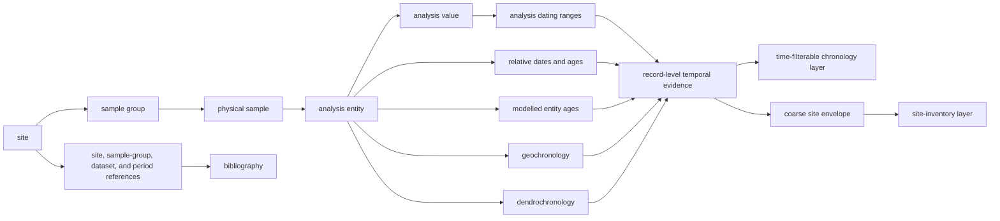
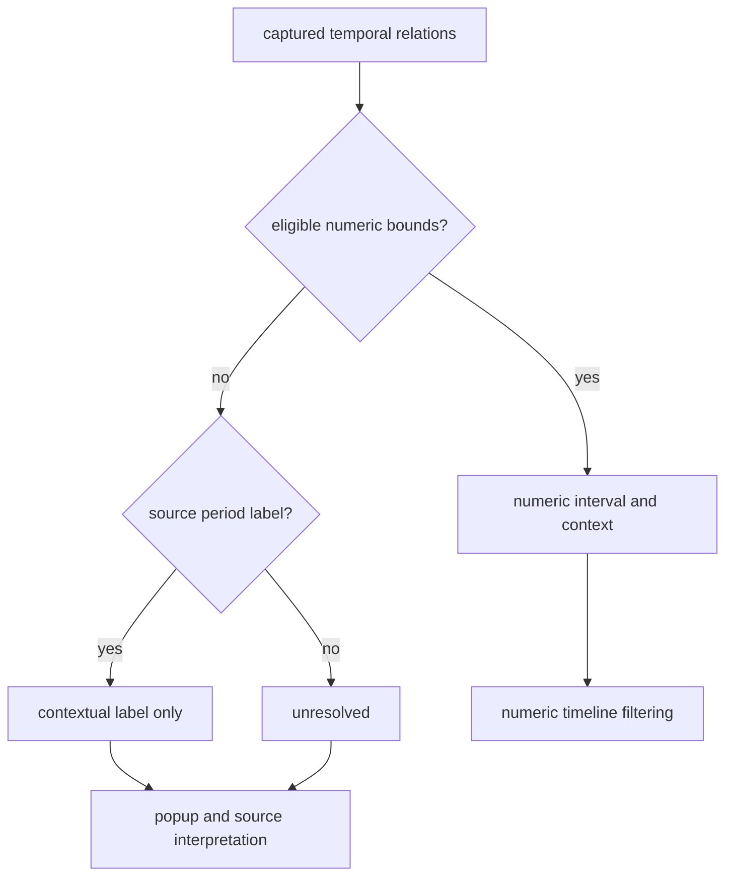
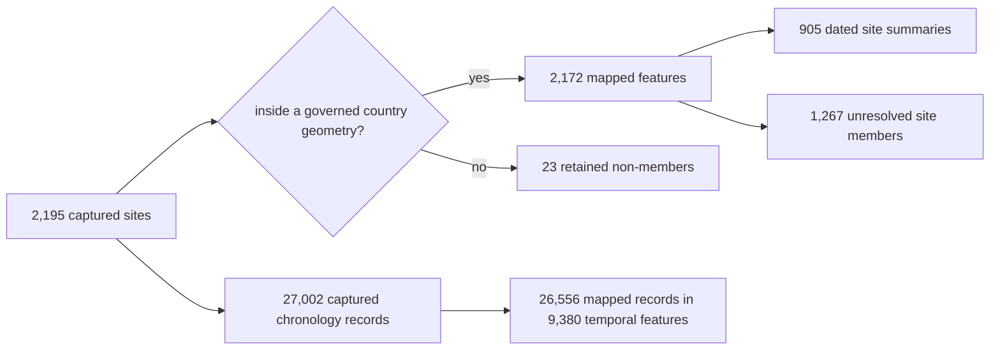

# SEAD

SEAD contributes environmental-archaeology sites to the Nordic evidence
atlas. Those sites are not static. Many are connected to dating ranges or
relative periods in SEAD's relational database, while others still have no
usable numeric chronology. The repository preserves that unevenness instead
of forcing every site into one temporal category.

This source family stays an archaeology context layer: it is strong contextual
evidence for nearby activity and chronology review, but it is not sample-owned
proof of one lake event.

The practical rule is simple: **use the temporal-evidence layer for time
navigation and the site-inventory layer for spatial discovery**. The first
keeps the intervals of linked dating records. The second keeps one point per
site, including sites for which SEAD publishes no usable chronology. This
separation prevents a long site-wide envelope from flattening many distinct
dates into one apparently static point.

## Current Evidence State

The governed snapshot begins with 2,195 captured site rows. Spatial
normalization admits 2,172 of them to the Sweden, Norway, Finland, and Denmark
map layer.

| Evidence property | Count | What the count means |
| --- | ---: | --- |
| captured site rows | 2,195 | denominator before map-country membership |
| mapped Nordic features | 2,172 | sites inside the four governed country geometries |
| captured sites with numeric interval material | 927 | sites with at least one linked chronology interval |
| mapped sites with numeric intervals | 905 | mapped site summaries that can participate in coarse site-level filtering |
| mapped sites with unresolved time | 1,267 | points retained for spatial discovery, not temporal comparison |
| captured chronology source records | 27,002 | dating ranges, relative periods, modelled ages, geochronology, and dendrochronology rows with normalized BP intervals |
| mapped temporal-evidence features | 9,380 | coincident chronology rows grouped only when site, kind, interval, label, and uncertainty agree |
| mapped chronology source records represented | 26,556 | source records carried by the 9,380 time-filterable features |
| captured sites linked to bibliography | 1,300 | sites with bibliography reached through site, dataset, sample-group, or relative-age relations |
| captured sites without usable chronology | 1,268 | sites for which the captured upstream relations provide no numeric interval |

These denominators answer different questions. A site count measures spatial
coverage. A chronology-record count measures temporal evidence. A grouped
feature count measures what the browser must render. They must not be used
interchangeably. The 446 chronology records outside the mapped population are
retained in the raw capture; their sites fall outside the four governed
country geometries.

## From A Relational Database To A Map Point

A SEAD date belongs to a chain of records, not directly to a coordinate. The
collector follows that chain and retains the intermediate identities before
deriving a site envelope.

The site envelope remains a publication convenience for ranking and overview.
The temporal-evidence layer is the appropriate product for chronological
navigation: each feature keeps one interval and the identifiers of all source
rows grouped into it. For sample-level reasoning, continue into
`raw/nordic_sites.json`; a mapped chronology feature is more precise than a
site envelope but is still contextual evidence, not proof of a lake event.

## Site Posture And Chronology Posture

### Numeric interval and context

A site has a normalized `time_start_bp` and `time_end_bp` derived from
captured temporal relations. It may also retain the original relative-period
labels and uncertainty notes. The atlas can test interval overlap for this
site.

For example, Agerod V (`4237`) is published with a site envelope of
`7000–10000 BP`. That makes it eligible for a map window that overlaps the
interval. It does not prove that every Agerod V observation belongs to every
year in that span.

### Source label without numeric support

A site can have source period language but no stable numeric interval accepted
by the repository. A self-encoded label such as `CAL_1242_AD-` can be converted
because the bounds and era are present in the source value. A broad label such
as `Quaternary` cannot be placed on the slider by name alone. In the current
snapshot, such sites are part of the unresolved site population rather than a
separate numeric chronology layer.

### Unresolved

The captured relations do not support either an eligible numeric envelope or
a useful normalized period label. The site remains valid spatial context. A
null time value means “not resolved under this contract,” not `0 BP`, “modern,”
or “undated in the upstream database.”

## How The Atlas Timeline Treats SEAD

The atlas exposes two SEAD toggles. `SEAD temporal evidence` is enabled by
default and every one of its 9,380 mapped features has numeric BP bounds.
`SEAD sites` is an optional inventory layer for discovering all 2,172 mapped
sites, including upstream-undated sites. Once a reader narrows the time
window:

1. temporal-evidence features remain visible only when their own interval
   overlaps the selected window;
2. dated site summaries can also be filtered coarsely when the optional site
   layer is enabled; and
3. unresolved site-inventory points are withheld because overlap is unknown.

This is different from declaring unresolved sites absent from the selected
period. The interface is refusing a comparison it cannot make.
Static layers such as boundaries are unaffected by this rule.

## Compare SEAD With LANDCLIM And AADR Carefully

All three families can appear on one numeric BP timeline, but their
observation units remain different.

| Source family | Timed map unit | What interval overlap supports | What it does not support |
| --- | --- | --- | --- |
| SEAD temporal evidence | grouped linked chronology interval | one or more identified source chronology rows overlap the selected window | the chronology proves a lake event or every record at the site is contemporaneous |
| LANDCLIM | pollen site-sequence interval | the sequence covers part of the selected window | direct association with a nearby archaeological site |
| AADR | dated human sample or governed locality descendant | the sample chronology overlaps the window | identity between a sample and a nearby site |

Temporal overlap is therefore a candidate relation for investigation, not a
join key. Keep source identity, spatial distance, interval basis, and
observation unit with any cross-source statement.

## The 23 Captured Non-Members

The difference between 2,195 captured rows and 2,172 mapped points is a
country-membership decision. The omitted rows retain source identities and
coordinates but do not fall inside the four governed publication-country
geometries. The set includes places east or south of the current scope and
some island or boundary-edge cases.

This is not deduplication or evidence deletion. A boundary or publication
scope change must reevaluate the same 23 identities.

## Appropriate Claims

SEAD supports:

- finding environmental-archaeology sites near a lake, pollen sequence, or
  aDNA locality under a declared distance rule;
- navigating 26,556 mapped chronology records through 9,380 interval-preserving features;
- retaining relative-period language for human interpretation without
  inventing numeric bounds;
- identifying sites whose bibliography or deeper relational evidence merits
  inspection; and
- comparing regional evidence coverage while keeping capture and publication
  denominators separate.

SEAD does not by itself support:

- treating proximity as direct association;
- treating a site envelope as a sample or event date;
- assigning dates to unresolved sites from neighbours or broad historical
  expectations;
- interpreting database density as past population or activity; or
- merging SEAD and RAÄ into one archaeology truth set.

## Governing Surfaces

| Surface | Responsibility |
| --- | --- |
| `data/sead/raw/nordic_sites.json` | captured site rows, relational inventories, source counts, and acquisition lineage |
| `data/sead/normalized/nordic_environmental_sites.geojson` | mapped features, temporal fields, popup evidence, and country membership |
| `data/sead/normalized/nordic_temporal_evidence.geojson` | mapped record-level chronology groups used by the atlas time filter |
| `data/sead/review/temporal_review.json` | row-level comparison posture and capture denominators |
| `data/sead/review/access_model.json` | mirrored versus upstream-only access boundary |
| `data/sead/review/evidence_legibility_review.json` | interpretability and publication risk |
| `data/sead/review/recovery_requirements.json` | remaining evidence gaps and their satisfaction signals |
| `data/source_spatiotemporal_posture_registry.json` | cross-source summary of allowed spatial and temporal use |

The [SEAD handbook](sead-handbook.md) provides a step-by-step reading method.
The [SEAD exports guide](../publications/sead-exports.md) explains which
artifact to use for analysis, review, and publication.
