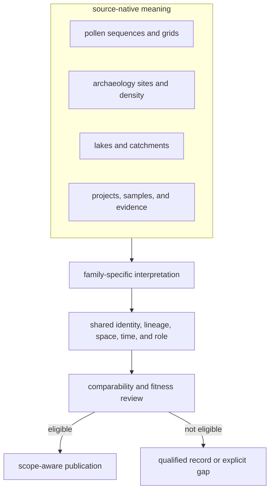

# Shared Normalization

Shared normalization makes records addressable and comparable while
preserving family-specific meaning. It does not force pollen sequences,
archaeology sites, hydrography, boundaries, and ancient-DNA samples into one
scientific schema.

## Common Envelope

A normalized record exposes enough shared structure to answer:

- what object is represented;
- which family and upstream identity supplied it;
- which repository-owned identifier addresses it;
- what geometry and spatial basis it carries;
- what temporal statement and basis it carries;
- which evidence role it may play;
- which captured record and transformation produced it;
- whether it is only normalized, reviewed, qualified, or published.

Family-owned fields remain beside this envelope. A pollen sequence retains
sequence meaning, a registry site retains registry semantics, and a sample
retains sample-level lineage.

## Family Semantics

| Family | Spatial meaning | Temporal meaning | Evidence role |
| --- | --- | --- | --- |
| LandClim | site-sequence point or REVEALS grid | sequence interval where captured | primary pollen context |
| Neotoma | pollen-site point | site span where present; uneven coverage | primary pollen context |
| SEAD | environmental-archaeology site | not uniformly time-resolved in the capture | contextual domain |
| RAÄ | registry point or density surface | no repository-owned uniform time window | contextual domain |
| SVAR | current lake, catchment, or water body | present-day sampling context | sampling context |
| boundaries | country or regional polygon | no temporal evidence claim | geographic framing |
| AADR | release-owned sample point | sample chronology where supported | direct human aDNA |
| animal aDNA | admitted sample-owned site at recorded precision | sample chronology with source and precision | direct animal aDNA |

## Preserved Distinctions

- reported and normalized values remain separately recoverable;
- exact, approximate, substituted, region-only, and withheld geography remain
  different states;
- numeric interval, textual period, project context, and absent chronology
  remain different states;
- direct evidence, context, sampling support, comparator, and framing remain
  different roles;
- missing and unresolved values are not converted to empty certainty;
- normalization status is not publication status.

## Join Eligibility

A shared identifier shape does not authorize a scientific join. A join must
declare the relation and compatible dimensions:

| Relation | Minimum support |
| --- | --- |
| same object | governing identity relation, not label similarity alone |
| same place | compatible geometry, basis, and precision |
| same period | compatible normalized chronology and uncertainty |
| contextual proximity | declared distance or containment rule plus evidence roles |
| product membership | named scope and admission decision |

Co-located records with incompatible time support remain spatially comparable
only. Records within one country remain co-members of a geographic scope, not
evidence of association.

## Publication Boundary

The normalized collection is intentionally broader than the published subset.
Review evaluates fitness for one claim and product; publication admits only
records that satisfy that contract and preserves qualifications or exclusions
for those that do not.

Continue with the [spatiotemporal posture](spatiotemporal-posture.md) for
comparison limits and [map inputs](../publications/map-inputs.md) for the
publication handoff.
