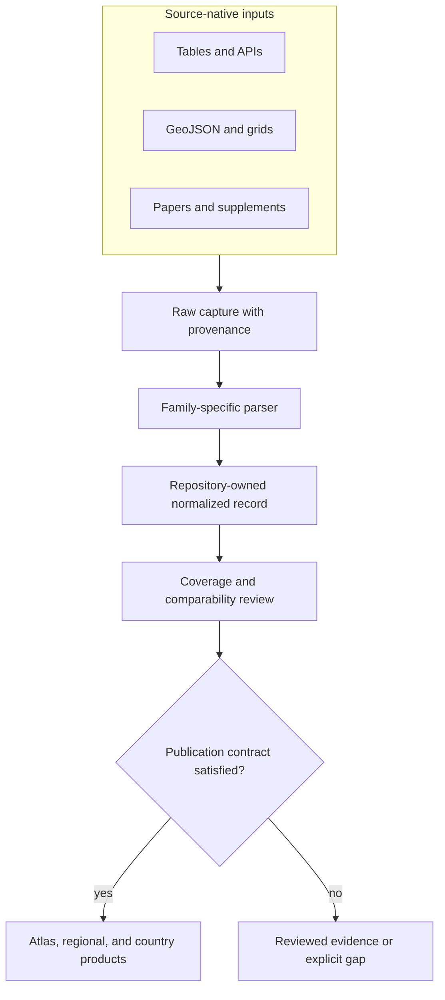

# Shared normalization

LandClim pollen sequences, Neotoma sites, SEAD environmental archaeology,
Swedish archaeology density, hydrography, boundaries, and ancient-DNA samples
do not describe the same kind of evidence. Shared normalization makes their
shape predictable without pretending that their scientific meaning is
interchangeable.

Normalization creates repository-owned records with explicit identity,
provenance, geometry, temporal posture, and evidence role. Source-native fields
and limitations remain available; unsupported precision is never manufactured
to fill a common column.

## One envelope, distinct evidence roles

| Source family | Evidence role | Normalized spatial meaning | Temporal posture |
| --- | --- | --- | --- |
| LandClim | primary pollen context | site-sequence points and grid cells | numeric site-sequence intervals where captured |
| Neotoma | primary pollen context | pollen-site points | BP site spans where present; chronology coverage remains uneven |
| SEAD | contextual archaeology | environmental-archaeology site inventory | not uniformly time-resolved in the checked-in capture |
| RAÄ | contextual archaeology | Swedish archaeology density and counts | spatial context without repository-owned time windows |
| SVAR | sampling and hydrography | lakes, catchments, and water bodies | present-day sampling context |
| Boundaries | geographic framing | country and regional polygons | no temporal evidence claim |
| AADR | direct human aDNA | sample-owned points | sample chronology when explicitly supported |
| Animal aDNA | direct animal aDNA | sample-owned sites at admitted resolution | sample chronology with source lineage and precision |

The common envelope lets downstream code ask consistent questions—what is this
record, where did it come from, what geometry does it carry, and what may it be
used for—while the evidence role prevents a contextual layer from silently
becoming direct evidence.

## The normalization boundary

The family-specific parser is essential. It interprets upstream fields using
that source's contract before producing common geometry or dates. The shared
layer begins only after those semantics are understood.

## Invariants preserved across families

Every normalized family is expected to keep these distinctions legible:

- **identity** — stable source and record identifiers remain recoverable;
- **lineage** — acquisition metadata and source references lead back to the
  captured input;
- **evidence role** — direct evidence, contextual evidence, and geographic
  framing cannot be substituted for one another;
- **spatial resolution** — exact coordinates, named-site coordinates, regions,
  and density surfaces remain different claims;
- **temporal support** — a numeric interval, a textual period, no captured
  chronology, and a modern context layer remain different states;
- **missingness** — absent or unresolved values stay absent or unresolved;
- **publication posture** — normalization alone does not make a record public.

This is why shared normalization is not a universal schema that demands a
value in every field. It is a contract for comparable *meaning* and traceable
limits.

## Spatial and temporal restraint

A site name can be standardized for matching while retaining the reported
text. A source-provided coordinate can be converted to a common geometry while
retaining its resolution and provenance. A supported date range can be
expressed in normalized BP terms while retaining the reported date text and
normalization basis.

The reverse transformations are forbidden: a regional label does not become
an exact point, a site inventory does not gain a synthetic date, and an
archaeology density surface does not become sample evidence. These constraints
protect comparisons from false alignment.

## From normalized data to publication

Family-owned outputs live under paths such as `data/landclim/normalized/`,
`data/neotoma/normalized/`, `data/sead/normalized/`, and
`data/adna/species/<species-slug>/normalized/`. Review surfaces record coverage,
freshness, spatial posture, temporal comparability, and blockers before a
subset is assembled under `docs/report/world/` and regional report roots.

The published subset may therefore be smaller than the normalized collection.
That difference is deliberate: normalization makes evidence inspectable;
review establishes fitness for a specific claim; publication exposes only the
records that satisfy that claim's contract.

See the [source-family matrix](source-family-matrix.md) for per-family
contracts, [spatiotemporal posture](spatiotemporal-posture.md) for comparison
limits, and [map inputs](../publications/map-inputs.md) for the publication
boundary.
