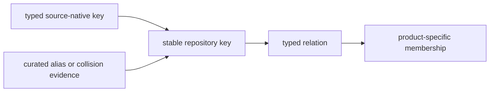
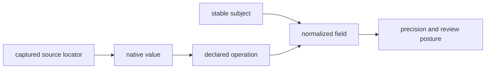
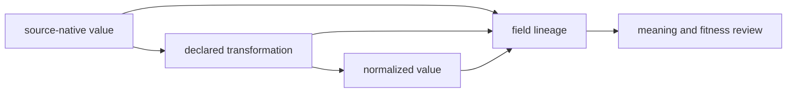
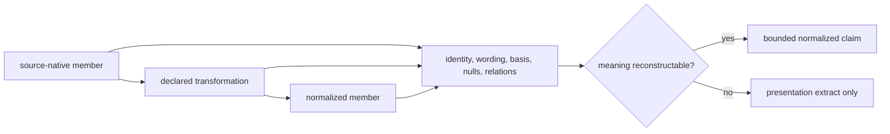
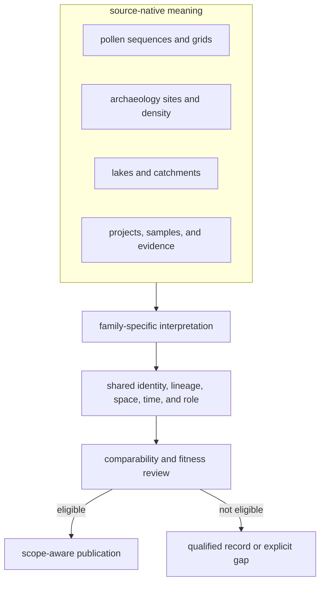
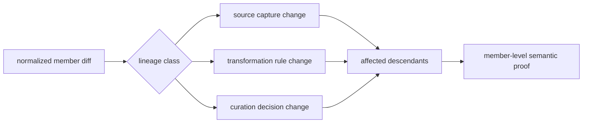
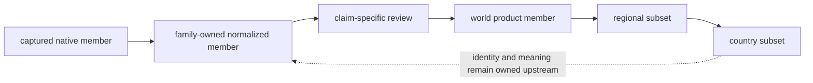

# Shared Normalization

Shared normalization makes records addressable and comparable while
preserving family-specific meaning. It does not force pollen sequences,
archaeology sites, hydrography, boundaries, and ancient-DNA samples into one
scientific schema.

## Common Envelope

A normalized record exposes enough shared structure to answer:

- what object is represented;
- which family and upstream identity supplied it;
- which repository-owned identifier addresses it;
- what geometry and spatial basis it carries;
- what temporal statement and basis it carries;
- which evidence role it may play;
- which captured record and transformation produced it;
- whether it is only normalized, reviewed, qualified, or published.

Family-owned fields remain beside this envelope. A pollen sequence retains
sequence meaning, a registry site retains registry semantics, and a sample
retains sample-level lineage.

### Native Record, Normalized Member, And Product Feature

The three representations have different ownership and must remain
distinguishable even when all are serialized as JSON:

| Representation | Owner | Stable responsibility |
| --- | --- | --- |
| captured native record | upstream family and capture manifest | preserve what was obtained, from where, under which release and use posture |
| normalized member | family contract | assign typed identity and expose place, time, role, lineage, and family-owned semantics |
| product feature | named publication contract | select an eligible member, carry qualifications, and express only the fields needed for that product |

Publication is therefore projection plus admission, not another normalization
pass. A product feature points back to its normalized member; the normalized
member points back to captured evidence. Product-specific labels or geometry
must not overwrite either earlier representation.

## Identity Before Shape

The normalized database may render several families as rows or GeoJSON
features, but storage shape does not define identity. Each record carries a
typed key within an owning namespace.

| Key component | Purpose |
| --- | --- |
| family or object type | prevents equal-looking identifiers from different domains from colliding |
| source release or project | fixes the upstream identity context in which the native key is meaningful |
| source-native key | preserves the upstream member without relying on row order or display name |
| repository key | provides a stable address for governed relations and downstream membership |
| alias or collision posture | records equivalence evidence, ambiguity, merge, or split decisions |

Display labels remain attributes. A renamed lake, differently formatted sample
label, or translated place can keep the same governed identity; conversely,
equal labels can belong to different objects.

## Field Lineage

Every normalized value should be classifiable by how it was obtained:

| Value class | Required lineage | Example |
| --- | --- | --- |
| preserved | source field and source-native value | accession, reported locality, or registry identifier |
| parsed | source text plus parsing rule | numeric interval parsed from a declared date field |
| normalized | source value plus vocabulary or unit mapping | country code, taxon label, or coordinate reference system |
| derived | named inputs plus deterministic method | bounding box, distance, density, or summary count |
| curated | competing evidence plus recorded decision and owner | sample-to-site link or qualified coordinate |
| absent | explicit missing, unresolved, inapplicable, or withheld state | chronology not supplied by the source |

This classification prevents a derived or curated value from appearing
source-native after it has moved downstream. It also makes review proportional:
preserved values need identity proof; parsed and normalized values need
transformation proof; derived values need method and input proof; curated
values need a decision record.

### Field Contract

Each non-trivial normalized field can be reconstructed as a compact contract:

| Contract member | Question it answers |
| --- | --- |
| subject | Which stable source-native object owns the field? |
| source | Which captured artifact and locator supplied the input? |
| native value | What did the source say before repository interpretation? |
| operation | Was the value preserved, parsed, normalized, derived, or curated, and by which rule? |
| result | What value, unit, vocabulary, geometry, or null state was retained? |
| posture | What precision, ambiguity, conflict, or review qualification applies? |

The contract is evaluated per field because identity, locality, chronology,
and coordinates may have different evidence. A record-level success flag would
allow one strong field to conceal another field's unresolved state.

## Lossless By Meaning

Normalization is lossless when every repository value can be interpreted
against the source statement that produced it, including deliberate absence.
It does not require the normalized file to reproduce the upstream file byte for
byte.

For every transformed field, the evidence chain retains:

1. the source member and field locator;
2. the verbatim or source-native value when interpretation matters;
3. the transformation class and named rule;
4. the normalized value, unit, vocabulary, or geometry;
5. the null, ambiguity, precision, or conflict state; and
6. the review or curation owner when the result is not mechanical.

A normalized value without this chain is structurally convenient but
scientifically brittle: readers cannot distinguish transcription, parsing,
mapping, derivation, or expert judgment.

### Declare An Information-Loss Budget

Some source detail is intentionally not reproduced in a compact normalized
member. The contract distinguishes acceptable projection from destructive
loss:

| Source information | Normalized treatment | Loss condition that blocks reuse |
| --- | --- | --- |
| native identity and aliases | retain stable native key and attributed aliases | only a display label or row number remains |
| source wording | retain verbatim value or exact locator where interpretation matters | normalized category cannot be traced to the expression it replaced |
| units and basis | retain native unit, normalized unit, rule, and precision | converted number survives without basis or transformation |
| missingness | preserve missing, unresolved, withheld, and inapplicable states | all states collapse to null, zero, or empty text |
| one-to-many relations | retain typed member identities and cardinality | repeated rows appear to be independent observations |
| conflict and qualification | retain competitors, decision, and claim ceiling | only the selected convenient value remains |

The budget is semantic, not a requirement to copy every upstream byte. A
normalized member is lossless enough for a claim when the omitted material
cannot change identity, value meaning, uncertainty, relation cardinality, or
the supported interpretation.

## Family Semantics

| Family | Spatial meaning | Temporal meaning | Evidence role |
| --- | --- | --- | --- |
| LandClim | site-sequence point or REVEALS grid | sequence interval where captured | primary pollen context |
| Neotoma | pollen-site point | site span where present; uneven coverage | primary pollen context |
| SEAD | environmental-archaeology site | not uniformly time-resolved in the capture | contextual domain |
| RAÄ | registry point or density surface | no repository-owned uniform time window | contextual domain |
| SVAR | current lake, catchment, or water body | present-day sampling context | sampling context |
| boundaries | country or regional polygon | no temporal evidence claim | geographic framing |
| AADR | release-owned sample point | sample chronology where supported | direct human aDNA |
| animal aDNA | admitted sample-owned site at recorded precision | sample chronology with source and precision | direct animal aDNA |

## Preserved Distinctions

- reported and normalized values remain separately recoverable;
- exact, approximate, substituted, region-only, and withheld geography remain
  different states;
- numeric interval, textual period, project context, and absent chronology
  remain different states;
- direct evidence, context, sampling support, comparator, and framing remain
  different roles;
- missing and unresolved values are not converted to empty certainty;
- normalization status is not publication status.

## Normalization Refusal

Not every source value has a defensible normalized result. The transformation
can preserve the native value and refuse a stronger representation:

| Condition | Retained state | Forbidden shortcut |
| --- | --- | --- |
| ambiguous identifier | native identifier plus collision candidates | choosing the first matching label |
| locality without defensible geometry | reported locality and its precision class | assigning a convenient centroid as an exact point |
| textual period without supported conversion | source text and contextual-time posture | inventing numeric endpoints |
| mixed or unknown units | source value, unit evidence, and unresolved status | assuming the dominant unit |
| conflicting source claims | all attributed claims and a conflict relation | silently selecting one value |
| absent or restricted payload | acquisition outcome and recovery state | treating an empty normalized file as evidence of absence |

Refusal is a successful data-preparation outcome when it preserves the source
statement and prevents false precision. A later curation decision may resolve
the field, but it must add evidence and lineage rather than mutate the earlier
capture into apparent certainty.

## Nulls, Collisions, And Deduplication

Null states remain semantic. `missing`, `unresolved`, `not applicable`, and
`withheld` describe different relationships to the source and cannot be
collapsed into an empty string or zero. A consumer that does not understand a
state must preserve it rather than invent a default.

Identity collisions are reviewed within the family that owns the observation
unit. Matching labels, titles, place names, or rounded coordinates are
candidate signals, not proof of equality. Deduplication must retain the source
members, comparison rule, chosen governing identity, and any unresolved
conflict. Cross-family records are normally related, not deduplicated, because
they observe different objects.

## Join Eligibility

A shared identifier shape does not authorize a scientific join. A join must
declare the relation and compatible dimensions:

| Relation | Minimum support |
| --- | --- |
| same object | governing identity relation, not label similarity alone |
| same place | compatible geometry, basis, and precision |
| same period | compatible normalized chronology and uncertainty |
| contextual proximity | declared distance or containment rule plus evidence roles |
| product membership | named scope and admission decision |

Co-located records with incompatible time support remain spatially comparable
only. Records within one country remain co-members of a geographic scope, not
evidence of association.

A join result inherits the weakest compatible precision of its members. Two
records with point geometry are not an exact spatiotemporal match when one
point is approximate or one chronology is contextual. The normalized envelope
exposes those limits so comparison code and readers can refuse the stronger
relation.

## Audit A Normalization Change

A normalized diff is interpretable only when its cause is classified. Compare
member identities before counts, then route each changed field through its
lineage class:

| Observed change | Evidence to inspect | Legitimate consequence |
| --- | --- | --- |
| source-native value changed | capture version, member identity, and original field | normalized descendants may change under the same rule |
| parser or vocabulary changed | rule identity, affected source values, and before/after mapping | all members using the rule require semantic review |
| derived value changed | named inputs, method, units, and precision | dependent relations and products require recomputation |
| curated decision changed | competing evidence, decision reason, and owner | claim posture or admission may change without changing source text |
| null state changed | prior state, recovered evidence, and new state | only the newly supported claim may strengthen |
| count changed with stable members | grouping, scope, or denominator definition | narrative totals change; member evidence may remain identical |

The proof is not merely that regenerated files match the new code. It must
show that source-native meaning is still recoverable, units and nulls retain
their semantics, identities did not merge accidentally, and every strengthened
claim has new supporting evidence. A mechanically stable count can still hide
a damaging field reinterpretation; a changed count can be harmless when scope
or grouping changed explicitly.

Canonicalization tests should therefore compare identities and semantic
packets, not only serialized bytes. Key order, whitespace, or equivalent
numeric representation can change without scientific effect; changed null
class, unit basis, relation cardinality, role, or precision cannot.

## Publication Boundary

The normalized collection is intentionally broader than the published subset.
Review evaluates fitness for one claim and product; publication admits only
records that satisfy that contract and preserves qualifications or exclusions
for those that do not.

World products under `docs/report/world/` consume family-owned normalized and
reviewed members through explicit product contracts. They are descendants, not
a second normalization authority. Regional and country products inherit the
same stable evidence identities while applying narrower geography and retaining
the parent member's evidence role and qualification.

Continue with the [spatiotemporal posture](spatiotemporal-posture.md) for
comparison limits and [map inputs](../publications/map-inputs.md) for the
publication handoff. The [object and relation model](../database/object-and-relation-model.md)
defines the typed identities that normalization and joins must preserve.
