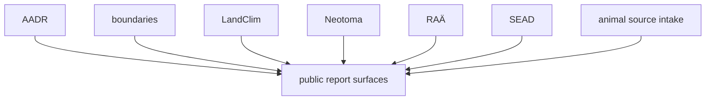

# Source Comparison

Each source family in this repository answers a different kind of question.
They can appear together in one map or report, but that does not make their
evidence claims interchangeable.

This page is for the reader who asks the right first question: "which source
family can actually answer the thing I care about?"

## Comparison Model

Layers can render together while still meaning very different things. A shared
map is not a shared evidence grade.

## Which Source Helps With Which Question

- AADR supports human ancient DNA context and release-based sample metadata questions
- Boundaries support country framing, region filtering, and map context questions
- LandClim supports pollen sequence and REVEALS context questions
- Neotoma supports paleoecological pollen-site context questions
- RAÄ supports Sweden-scoped archaeology context questions
- SEAD supports broader environmental archaeology context questions
- animal source intake supports project recovery, supplement capture, and non-human sample extraction questions

## Good Reader Rule

- open [source family matrix](source-family-matrix.md) when the question is repository balance
- open [animal source intake](animal-source-intake.md) when the question is paper, supplement, or sample recovery
- open one source page only after you know what kind of answer you are looking for

## What This Means For Reuse

If you want to use this repository for a geography that is not yet a published
atlas surface, source comparison matters first. It tells you:

- which source families already travel well beyond the currently published map
  surfaces
- which ones are scope-limited, such as Sweden-specific archaeology or thin
  animal recovery
- which evidence families can provide framing, context, or direct claim support
  for your new question

That keeps reuse honest. You start from what each source family can support,
not from what would look attractive on a combined map.

## Why This Comparison Matters

The common failure is to compare sources by how they look on a map instead of
by the narrower question each one can honestly answer.
