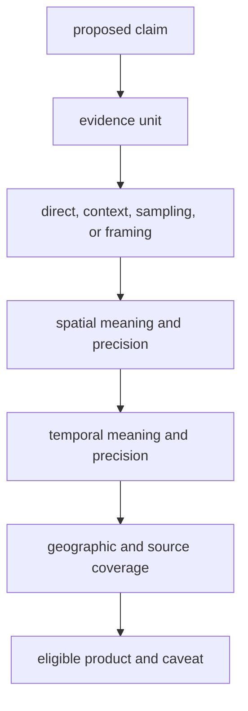
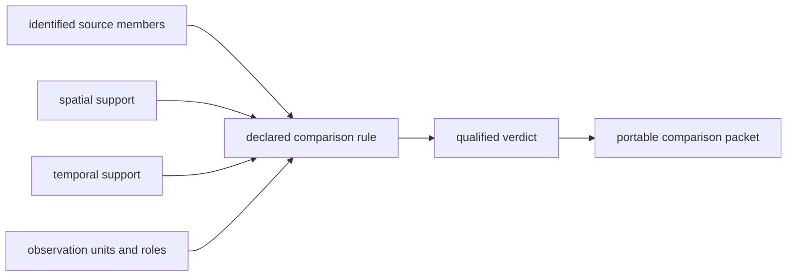

# Source Comparison

Source choice begins with the claim, not with whichever layer is easiest to
plot. Families differ in evidence unit, geographic reach, temporal support,
and publication role. Those differences remain visible when several families
share one atlas.

## Choose By Question

| Question | Primary family | Evidence unit | Role in a combined product | Principal limit |
| --- | --- | --- | --- | --- |
| What vegetation or pollen setting surrounds a place? | [LandClim](landclim.md) | site sequence and REVEALS grid | primary pollen context | does not establish a sample-level claim |
| Which pollen sites support cross-place comparison? | [Neotoma](neotoma.md) | palaeoecological site record | primary pollen context | chronology coverage is not uniform |
| What environmental archaeology context surrounds the evidence? | [SEAD](sead.md) | environmental-archaeology site | contextual domain | nearby archaeology is not sample proof |
| What dense Swedish archaeology context is available? | [RAÄ](raa.md) | registry record and spatial density | contextual domain | intentionally jurisdiction-specific |
| Which lakes and water bodies frame sampling choices? | SVAR | lake, catchment, and water-body record | sampling context | present-day hydrography is not historical evidence |
| Which country or region contains a feature? | [Boundaries](boundaries.md) | governed polygon | geographic framing | boundaries carry no scientific weight by themselves |
| Which human aDNA samples appear in a versioned release? | [AADR](aadr.md) | release-owned sample metadata | direct human aDNA | metadata publication is not genotype analysis |
| Which animal samples have defensible source, place, and time evidence? | [Animal source intake](animal-source-intake.md) | project, paper, supplement, sample, and evidence relation | direct animal aDNA | recovery and publication maturity differ by record |

PalaeOpen is an interoperability network rather than a captured evidence
family. It can strengthen metadata alignment and collaboration without
becoming direct support for a published feature.

## Comparison Axes

```mermaid
flowchart TB
    Claim["proposed claim"] --> Unit["evidence unit"]
    Unit --> Role["direct, context, sampling, or framing"]
    Role --> Space["spatial meaning and precision"]
    Space --> Time["temporal meaning and precision"]
    Time --> Reach["geographic and source coverage"]
    Reach --> Product["eligible product and caveat"]
```

Two layers are comparable only across dimensions they both actually support.
Co-location permits a spatial comparison; it does not establish shared time,
causal relation, or equal evidence strength.

## Valid Combinations

| Combination | Supports | Does not support automatically |
| --- | --- | --- |
| LandClim + Neotoma | complementary pollen and palaeoenvironmental reading | one universal pollen chronology |
| pollen + SEAD or RAÄ | environmental and archaeology context around a place | direct association between a site and a biological sample |
| pollen + SVAR | lake-centered sampling and landscape interpretation | field suitability, permits, or preserved sediment quality |
| direct aDNA + context layers | interpretation of a governed sample within a wider landscape | transfer of context-layer precision to the sample |
| evidence + boundaries | reproducible geographic selection and display | representativeness within the selected area |

## Declare The Join

Cross-source records do not share a universal key. The bridge itself is a
derived claim and must name the rule that relates the members:

| Bridge | What may be joined | Required qualification |
| --- | --- | --- |
| identity | two records proven to describe the same governed sample, site, project, or source member | aliases and labels are not sufficient keys |
| containment | point or geometry inside a governed boundary snapshot | boundary version and endpoint precision remain visible |
| proximity | two defensible geometries under a declared distance method and band | proximity is not association or contemporaneity |
| temporal overlap | comparable point or interval claims in the same time basis | overlap is compatibility, not causation |
| category match | normalized values under one declared vocabulary | normalization cannot erase source-specific meaning |
| aggregate comparison | explicitly partitioned populations with compatible denominators | totals remain typed by observation unit and scope |

Joining by display name, rounded coordinate, or row position is not a stable
comparison. Those values can change without the governed identity changing—or
remain unchanged while the scientific ownership differs.

## Comparison Verdicts

Every comparison should end in one of four explicit postures:

| Verdict | Required condition | Defensible use |
| --- | --- | --- |
| aligned | observation units, roles, space, time, and scope support the declared relation | direct comparison within the recorded precision |
| partially aligned | only named dimensions overlap | qualified comparison of those dimensions only |
| contextual | one family informs interpretation but does not measure the target claim | context, prioritization, or hypothesis formation |
| refused | the proposed bridge requires unsupported identity, precision, time, role, or denominator | preserve the gap and state what evidence is missing |

The verdict applies to the proposed claim, not permanently to a source family.
SEAD can be valid contextual archaeology for a lake analysis while being
refused as same-period evidence when numeric intervals are absent. Boundaries
can be aligned for geographic containment while remaining incapable of
supporting biological association.

## Comparison Packet

A reusable comparison preserves the inputs and bridge that produced its
verdict. At minimum, record:

| Packet member | Why it is necessary |
| --- | --- |
| family and member identities | prevents display labels from becoming join keys |
| source releases and product scope | fixes the populations being compared |
| observation units and evidence roles | states what each member can establish |
| spatial basis and precision | bounds distance, containment, and co-location claims |
| temporal class, basis, and interval eligibility | separates numeric overlap from contextual time |
| denominator and missingness posture | prevents visible counts from implying completeness |
| comparison rule | makes the spatial, temporal, or categorical bridge explicit |
| verdict and qualifications | preserves aligned, partial, contextual, or refused meaning |

```mermaid
flowchart LR
    Members["identified source members"] --> Bridge["declared comparison rule"]
    Space["spatial support"] --> Bridge
    Time["temporal support"] --> Bridge
    Roles["observation units and roles"] --> Bridge
    Bridge --> Verdict["qualified verdict"]
    Verdict --> Packet["portable comparison packet"]
```

Without the packet, a downstream table can retain the result while losing why
the comparison was permitted. That is especially dangerous for derived counts
or distance bands, which appear precise even when their members carry unlike
coverage or time semantics.

## Example: Proximity Without Temporal Equivalence

Suppose a pollen site, a heritage record, and an ancient-DNA sample fall within
the same distance band of a registered lake. The geometry supports a declared
proximity calculation. It does not establish that the observations are
contemporaneous, that the heritage record relates to the specimen, or that the
lake is a feasible coring target.

A defensible result retains each member ID and evidence role, the distance
rule, each spatial precision, the available temporal classes, and a contextual
verdict. A single combined “evidence count” would discard the differences that
make the comparison interpretable.

The non-members matter as well. If 20 sites are eligible for a proximity test,
three lack point-quality geometry, and two are outside the selected product,
the result population is 15 tested sites—not an unexplained count of 15 nearby
features. Eligibility, tested membership, matches, and exclusions are separate
denominators.

## Reuse Outside Current Products

A source family is portable when its identity, acquisition, normalized
semantics, evidence role, and review criteria remain meaningful in the new
scope. Jurisdiction-specific sources may still be reusable as a pattern, but
their records and authority do not travel beyond their governed coverage.

Before reuse, establish:

- the denominator and geographic scope;
- whether the normalized record retains source-native meaning;
- which temporal and spatial comparisons remain valid;
- whether license and retrieval context permit the intended use;
- which new review or publication gate is required.

Reuse must also preserve negative evidence. Exclusions, unresolved identities,
missing intervals, and jurisdictional limits cannot be dropped merely because
the destination schema has no field for them. A schema that cannot retain the
qualification cannot inherit the original claim strength.

The [source-family matrix](source-family-matrix.md) records the repository-wide
roles, while [shared normalization](shared-normalization.md) explains how
different families become structurally comparable without becoming
scientifically interchangeable.
