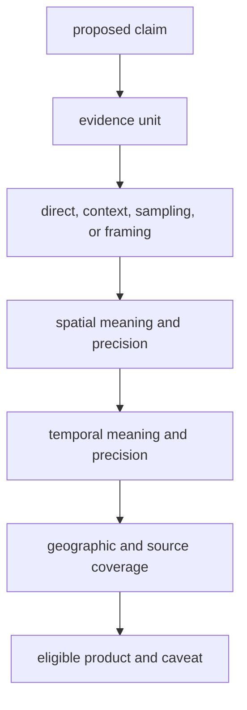

# Source Comparison

Source choice begins with the claim, not with whichever layer is easiest to
plot. Families differ in evidence unit, geographic reach, temporal support,
and publication role. Those differences remain visible when several families
share one atlas.

## Choose By Question

| Question | Primary family | Evidence unit | Role in a combined product | Principal limit |
| --- | --- | --- | --- | --- |
| What vegetation or pollen setting surrounds a place? | [LandClim](landclim.md) | site sequence and REVEALS grid | primary pollen context | does not establish a sample-level claim |
| Which pollen sites support cross-place comparison? | [Neotoma](neotoma.md) | palaeoecological site record | primary pollen context | chronology coverage is not uniform |
| What environmental archaeology context surrounds the evidence? | [SEAD](sead.md) | environmental-archaeology site | contextual domain | nearby archaeology is not sample proof |
| What dense Swedish archaeology context is available? | [RAÄ](raa.md) | registry record and spatial density | contextual domain | intentionally jurisdiction-specific |
| Which lakes and water bodies frame sampling choices? | SVAR | lake, catchment, and water-body record | sampling context | present-day hydrography is not historical evidence |
| Which country or region contains a feature? | [Boundaries](boundaries.md) | governed polygon | geographic framing | boundaries carry no scientific weight by themselves |
| Which human aDNA samples appear in a versioned release? | [AADR](aadr.md) | release-owned sample metadata | direct human aDNA | metadata publication is not genotype analysis |
| Which animal samples have defensible source, place, and time evidence? | [Animal source intake](animal-source-intake.md) | project, paper, supplement, sample, and evidence relation | direct animal aDNA | recovery and publication maturity differ by record |

PalaeOpen is an interoperability network rather than a captured evidence
family. It can strengthen metadata alignment and collaboration without
becoming direct support for a published feature.

## Comparison Axes

```mermaid
flowchart TB
    Claim["proposed claim"] --> Unit["evidence unit"]
    Unit --> Role["direct, context, sampling, or framing"]
    Role --> Space["spatial meaning and precision"]
    Space --> Time["temporal meaning and precision"]
    Time --> Reach["geographic and source coverage"]
    Reach --> Product["eligible product and caveat"]
```

Two layers are comparable only across dimensions they both actually support.
Co-location permits a spatial comparison; it does not establish shared time,
causal relation, or equal evidence strength.

## Valid Combinations

| Combination | Supports | Does not support automatically |
| --- | --- | --- |
| LandClim + Neotoma | complementary pollen and palaeoenvironmental reading | one universal pollen chronology |
| pollen + SEAD or RAÄ | environmental and archaeology context around a place | direct association between a site and a biological sample |
| pollen + SVAR | lake-centered sampling and landscape interpretation | field suitability, permits, or preserved sediment quality |
| direct aDNA + context layers | interpretation of a governed sample within a wider landscape | transfer of context-layer precision to the sample |
| evidence + boundaries | reproducible geographic selection and display | representativeness within the selected area |

## Reuse Outside Current Products

A source family is portable when its identity, acquisition, normalized
semantics, evidence role, and review criteria remain meaningful in the new
scope. Jurisdiction-specific sources may still be reusable as a pattern, but
their records and authority do not travel beyond their governed coverage.

Before reuse, establish:

- the denominator and geographic scope;
- whether the normalized record retains source-native meaning;
- which temporal and spatial comparisons remain valid;
- whether license and retrieval context permit the intended use;
- which new review or publication gate is required.

The [source-family matrix](source-family-matrix.md) records the repository-wide
roles, while [shared normalization](shared-normalization.md) explains how
different families become structurally comparable without becoming
scientifically interchangeable.
