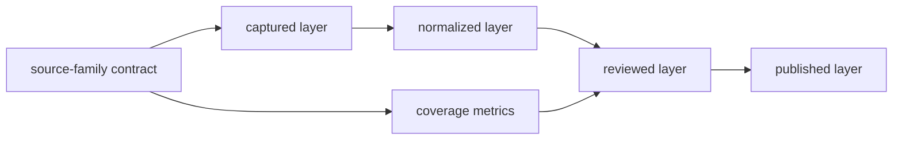

# Source Family Matrix

The source-family matrix describes what each governed family contributes and
where its authority stops. It is a role and lifecycle inventory, not a ranking
of scientific importance.

## Governed Families

| Family | Domain | Evidence role | Normalized unit | Characteristic review | Published use |
| --- | --- | --- | --- | --- | --- |
| LandClim | pollen context | primary context | site sequence and grid cell | freshness, coverage, temporal posture | world and regional pollen layers |
| Neotoma | pollen context | primary context | pollen-site record | site-level temporal comparability | world and regional pollen layers |
| SEAD | archaeology context | contextual domain | environmental-archaeology site | access, temporal, and normalization legibility | archaeology context layers |
| RAÄ | archaeology context | contextual domain | Swedish registry record and density surface | coverage and spatial interpretation | Sweden-focused archaeology layers |
| SVAR | hydrography | sampling context | lake, catchment, and water-body record | registry coverage and candidate linkage | Sweden lake products and overlays |
| boundaries | geography | framing | country and regional polygon | geometry and scope fitness | world, regional, and country selection |
| AADR | human ancient DNA | direct evidence | release-owned sample metadata | sample locality and chronology posture | human aDNA country and regional layers |
| animal aDNA | non-human ancient DNA | direct evidence | sample-owned species record | project, paper, supplement, place, time, coordinate, and archive integrity | admitted atlas and country members |

The machine-readable authority for these roles and lifecycle roots is
`data/source_family_contracts.json`. Publication maturity is reported
separately because a family can have a complete structural contract while
remaining scientifically qualified.

## Lifecycle Coverage

Every family declares captured, normalized, reviewed, and published surfaces.
Those surfaces may be family-owned directories or shared cross-family
registries, but their responsibilities remain distinct.

## Authority Boundaries

| Family class | May establish | Cannot establish alone |
| --- | --- | --- |
| direct evidence | a bounded claim about its governed observation or sample | collection completeness or representativeness |
| primary context | source-backed environmental setting central to comparison | identity, place, or time for an unrelated sample |
| contextual domain | surrounding archaeological or environmental interpretation | direct biological association |
| sampling context | candidate selection and fieldwork reasoning | feasibility, preservation, permits, or scientific outcome |
| geographic framing | membership in a declared spatial scope | scientific support for a member record |

## Maturity Is Multidimensional

Maturity cannot be reduced to one color or score. Review source identity,
acquisition reproducibility, normalized semantics, spatial support, temporal
support, evidence-role clarity, product admission, and visible limits
independently.

A family can be:

- structurally complete but temporally uneven;
- geographically broad but locally weak;
- scientifically valuable but context-only;
- well captured but not publication-ready;
- admitted to one product while excluded from another.

## Current Review Surfaces

- [source-family matrix data](../../../report/repository_source_family_matrix.json)
- [cross-domain evidence matrix](../../../report/repository_cross_domain_evidence_matrix.json)
- [source explainer audit](../../../report/repository_source_explainer_audit.md)
- [source acquisition queue](../../../report/repository_source_acquisition_queue.json)
- [source ecosystem review](../../../report/repository_source_ecosystem_review.md)

These reports describe the checked-in state. They do not replace the captured
and normalized records that govern individual facts.
