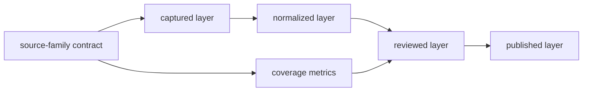
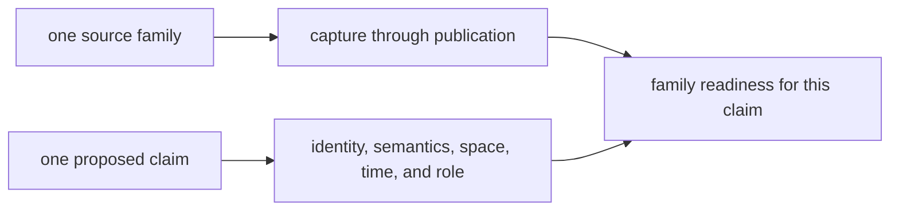
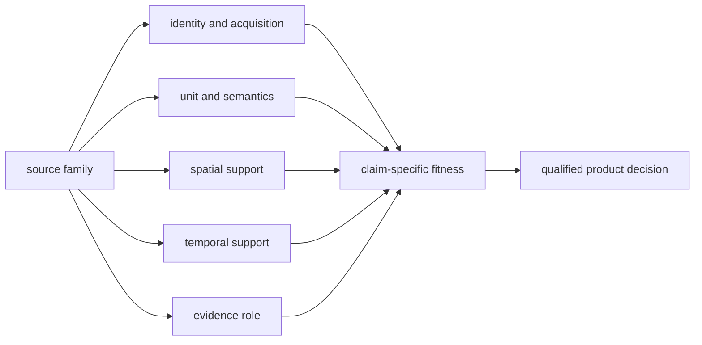

# Source Family Matrix

The source-family matrix describes what each governed family contributes and
where its authority stops. It is a role and lifecycle inventory, not a ranking
of scientific importance.

## Governed Families

| Family | Domain | Evidence role | Normalized unit | Characteristic review | Published use |
| --- | --- | --- | --- | --- | --- |
| LandClim | pollen context | primary context | site sequence and grid cell | freshness, coverage, temporal posture | world and regional pollen layers |
| Neotoma | pollen context | primary context | pollen-site record | site-level temporal comparability | world and regional pollen layers |
| SEAD | archaeology context | contextual domain | environmental-archaeology site | access, temporal, and normalization legibility | archaeology context layers |
| RAÄ | archaeology context | contextual domain | Swedish registry record and density surface | coverage and spatial interpretation | Sweden-focused archaeology layers |
| SVAR | hydrography | sampling context | lake, catchment, and water-body record | registry coverage and candidate linkage | Sweden lake products and overlays |
| boundaries | geography | framing | country and regional polygon | geometry and scope fitness | world, regional, and country selection |
| AADR | human ancient DNA | direct evidence | release-owned sample metadata | sample locality and chronology posture | human aDNA country and regional layers |
| animal aDNA | non-human ancient DNA | direct evidence | sample-owned species record | project, paper, supplement, place, time, coordinate, and archive integrity | admitted atlas and country members |

The machine-readable authority for these roles and lifecycle roots is
`data/source_family_contracts.json`. Publication maturity is reported
separately because a family can have a complete structural contract while
remaining scientifically qualified.

## Lifecycle Coverage

Every family declares captured, normalized, reviewed, and published surfaces.
Those surfaces may be family-owned directories or shared cross-family
registries, but their responsibilities remain distinct.

### Checked-In Stage Metrics

The evidence-stage matrix currently reports all eight families as present
through publication. Its coverage metrics describe unlike populations and
must be read with their units and review limits:

| Family | Checked-in metric | Material qualification |
| --- | ---: | --- |
| LandClim | 492 site sequences; 88 grid cells | observed sequence and model cell are different units |
| Neotoma | 200 normalized points | 175 have BP spans, but no chronology rows are captured |
| SEAD | 2,172 normalized points | the temporal review is inventory-only and unresolved for numeric comparison |
| RAÄ | 761,917 registry records; 318,265 heritage records | published geography is a Sweden-only density projection |
| boundaries | 4 country geometries | framing establishes membership, not scientific evidence |
| SVAR | 40,565 registered lakes | registry membership does not establish sampling feasibility |
| AADR | 3 captured release files in the stage metric | the governed release contains two annotation tables; file count is not sample count |
| animal aDNA | 10 species; 40 projects; 0 samples in this cross-family metric | project breadth does not establish sample-backed publication coverage |

The last row is deliberately visible. A lifecycle surface can exist while its
current cross-family sample denominator is zero. Presence is not a substitute
for the sample, locality, chronology, coordinate, and admission evidence
required by a specimen claim.

## Authority Boundaries

| Family class | May establish | Cannot establish alone |
| --- | --- | --- |
| direct evidence | a bounded claim about its governed observation or sample | collection completeness or representativeness |
| primary context | source-backed environmental setting central to comparison | identity, place, or time for an unrelated sample |
| contextual domain | surrounding archaeological or environmental interpretation | direct biological association |
| sampling context | candidate selection and fieldwork reasoning | feasibility, preservation, permits, or scientific outcome |
| geographic framing | membership in a declared spatial scope | scientific support for a member record |

## Observation Units And Safe Joins

Cross-family analysis is valid only when the join preserves the unit on both
sides. Similar labels and nearby coordinates are candidates for review, not
keys.

| Family | Stable member identity | Safe cross-domain relation | Unsafe shortcut |
| --- | --- | --- | --- |
| LandClim | governed site or grid-cell identity | explicit site/grid relation with stated temporal basis | treating a model cell as an observed pollen sequence |
| Neotoma | database and site/deposit identifiers | retained database identity plus reviewed site relation | joining on site name alone |
| SEAD | SEAD site identifier | declared distance or containment from its reported point | interpreting proximity as sample association |
| RAÄ | national registry identity | declared spatial relation within Swedish registry scope | replacing SEAD or specimen provenance with a nearby heritage record |
| SVAR | registered water-body identity | reviewed candidate-to-lake relation | assuming a same-named water body is the intended sampling basin |
| boundaries | governed geometry identity and version | point-in-polygon membership | using country membership as coordinate validation |
| AADR | release-owned sample identifier | explicit reviewed locality or publication relation | matching a human sample by place label alone |
| animal aDNA | project, accession, sample, and evidence locators | sample-owned locality, chronology, and source relations | collapsing all samples in one project to one place or date |

Derived relations retain both member identifiers, the rule that connected
them, input versions, and the evidence posture of each input. This allows a
distance, containment, or comparison to be recomputed without turning it into
source truth.

## Product Admission Matrix

The same family can be eligible for one product and ineligible for another.

| Product use | Minimum source posture | Refusal condition |
| --- | --- | --- |
| spatial inventory | stable member identity and supported geometry | unresolved identity or geometry |
| country membership | supported geometry and governed boundary version | missing geometry or undeclared boundary basis |
| time-aware comparison | comparable numeric intervals with retained basis | absent, contextual-only, or incomparable chronology |
| contextual overlay | declared contextual role and reproducible spatial relation | context presented as direct association |
| specimen claim | sample-owned identity and claim-specific evidence | project-, paper-, or locality-level evidence substituted for the sample |
| fieldwork prioritization | governed lake identity plus explicit decision inputs and caveats | registry presence or proximity presented as feasibility |

Publication is therefore a claim-specific decision, not the final stage of a
uniform source pipeline. Eligibility must be recomputed when the source,
normalization, boundary, comparison rule, or product contract changes.

## Read Across A Family, Then Down A Claim

The matrix supports two different readings:

Reading across one family shows whether its lifecycle is intact. Reading down
one claim compares only the dimensions needed for that claim. Neither reading
authorizes a global family ranking. LandClim can be mature for pollen context
while AADR is mature for release-owned human metadata; their record counts and
roles are not competing measures of quality.

This distinction also prevents lifecycle completion from being mistaken for
scientific readiness. A family may have captured, normalized, reviewed, and
published artifacts while still carrying a material temporal or geographic
qualification.

## Maturity Is Multidimensional

Maturity cannot be reduced to one color or score. Review source identity,
acquisition reproducibility, normalized semantics, spatial support, temporal
support, evidence-role clarity, product admission, and visible limits
independently.

A family can be:

- structurally complete but temporally uneven;
- geographically broad but locally weak;
- scientifically valuable but context-only;
- well captured but not publication-ready;
- admitted to one product while excluded from another.

## Evaluate Maturity By Claim

Use the matrix as a set of independent questions rather than a ladder:

| Axis | Question | Failure must remain visible as |
| --- | --- | --- |
| identity | Can each governed member be traced to one source-native object and release? | unresolved identity, collision, or missing locator |
| acquisition | Were expected assets captured under recorded access and use conditions? | blocked asset, partial capture, or unknown denominator |
| semantics | Does normalization preserve the family's observation unit and field meaning? | unsupported mapping, ambiguous value, or schema drift |
| space | Is location represented at the precision supported by the source? | approximate, regional, substituted, withheld, or unresolved geometry |
| time | Is chronology numeric, contextual, broad, absent, or inapplicable? | explicit temporal class and uncertainty |
| role | Is the family direct evidence, primary context, contextual, sampling context, or framing? | refusal of role substitution |
| publication | Which named product admits the record and under what qualification? | exclusion, deferral, warning, or empty membership |

A family can be strong on one axis and weak on another without contradiction.
For example, a stable national registry can have excellent identity and spatial
coverage while carrying no uniform chronology suitable for same-period
comparison.

## Current Review Surfaces

- [source-family matrix data](../../../report/repository_source_family_matrix.json)
- [cross-domain evidence matrix](../../../report/repository_cross_domain_evidence_matrix.json)
- [source explainer audit](../../../report/repository_source_explainer_audit.md)
- [source acquisition queue](../../../report/repository_source_acquisition_queue.json)
- [source ecosystem review](../../../report/repository_source_ecosystem_review.md)

These reports describe the checked-in state. They do not replace the captured
and normalized records that govern individual facts.

The [revision and state model](../database/revision-and-state-model.md)
explains why lifecycle presence, record fitness, and publication membership
remain separate database states.
