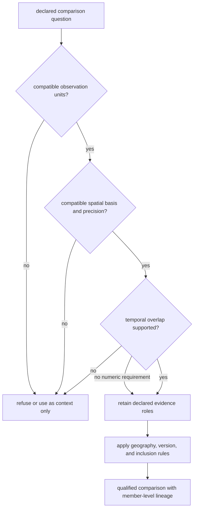
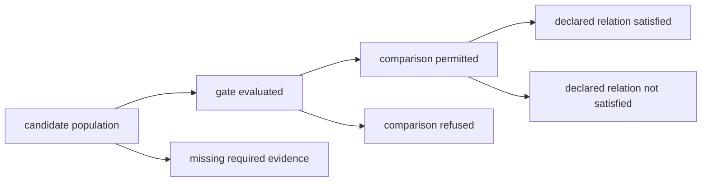

# Spatiotemporal Posture

Spatial and temporal comparability are independent properties. Two records can
occupy the same map cell while referring to different periods, observation
units, and precision classes. Bijux Pollenomics records those differences
before a source enters comparison, ranking, or publication.

The machine-readable authority is
`data/source_spatiotemporal_posture_registry.json`. It declares each family's
spatial role, temporal capability, ranking role, and current evidence basis.

## Family Posture

| Family | Spatial posture | Temporal posture | Safe combined use | Required limit |
| --- | --- | --- | --- | --- |
| LandClim | site sequences and model-grid context | numeric BP windows where present | chronology-aware pollen and landscape context | observed sites and model grids remain distinct |
| Neotoma | palaeoecological site points | numeric site spans for a subset; uneven resolution | site-level pollen comparison where intervals overlap | missing intervals cannot be inferred from nearby sites |
| SEAD | environmental-archaeology site inventory | no uniform numeric intervals in the current capture | broad archaeology context | not same-period support without record-level chronology |
| RAÄ | Swedish registry points and density representation | no repository-wide uniform interval | Swedish spatial archaeology context | density and registry effort do not measure historical abundance |
| SVAR | registered lake and water-body geometry | present-day registry state | candidate identity, containment, and distance | no historical chronology or sampling-feasibility claim |
| boundaries | administrative polygons | no scientific temporal claim | clipping, containment, and scope | no independent evidential weight |
| AADR | sample points at declared metadata precision | sample interval or context where supplied | human aDNA comparison within release and precision | metadata posture is not genotype analysis |
| animal aDNA | sample-owned or qualified site geometry | sample-owned chronology at declared precision | direct specimen evidence when admitted | project-level place or time cannot fill sample gaps |

## Comparison Gate

The gate is claim-specific. A family refused from chronology-aware scoring may
still be valid for geographic framing or broad context. Conversely, numeric
intervals do not authorize a direct biological relation when the families
observe different objects.

### Preserve The Comparison Denominator

A comparison result has at least four populations. Reporting only matches
hides whether non-matches were evaluated or were never comparable.

| Population | Governing question |
| --- | --- |
| candidates | which governed records entered the declared source, geography, and role scope? |
| evaluated | which candidates had the identities and fields needed to run the gate? |
| comparable | which evaluated records passed unit, space, time, and role compatibility? |
| related | which comparable records satisfied the declared overlap, distance, containment, or ranking rule? |

Only the last branch can support a negative result under the declared rule.
Unevaluated and refused records are not evidence of non-overlap or distance;
they are evidence about comparison coverage. A reusable result reports all
four populations, the rule, input revisions, and the reason each record left
the comparison path.

## Precision Rules

- Compare at the weakest supported spatial precision; do not turn a region or
  approximate point into exact distance evidence.
- Compare time only when interval basis, units, uncertainty, and overlap rule
  are declared.
- Preserve absent, contextual, and broad chronology as distinct from numeric
  non-overlap.
- Keep modelled, observed, registered, curated, and derived geometry roles
  visible in the result.
- Retain records excluded by the gate so the denominator and refusal remain
  explainable.

## Read Space And Time As Two Axes

Spatial and temporal results should not be collapsed into one pass/fail flag:

| Spatial result | Temporal result | Defensible posture |
| --- | --- | --- |
| aligned | aligned | qualified spatiotemporal comparison under the declared roles |
| aligned | unavailable | spatial comparison or context only |
| aligned | non-overlapping | spatially proximate but temporally separated under the declared intervals |
| approximate or boundary-sensitive | aligned | qualified comparison with spatial sensitivity visible |
| unavailable | aligned | temporal comparison without point distance or containment |
| unavailable | unavailable | no spatiotemporal comparison; retain as non-comparable context if useful |

“Unavailable” is not equivalent to “no.” Missing chronology does not establish
temporal separation, and region-only geography does not establish spatial
distance. This distinction prevents sparse sources from contributing false
negative evidence.

## Sensitivity At Decision Boundaries

A record near a distance, interval, or polygon boundary may change class when
precision, source version, or method changes. Such a result is
boundary-sensitive and should be reviewed under plausible alternatives:

- use the full supported chronology interval rather than only its mean;
- compare exact and approximate endpoints separately;
- retain the boundary snapshot used for containment;
- rerun ranking when distance bands or missingness rules change; and
- report whether the ordering is stable across the declared scenarios.

Sensitivity does not weaken a result; it identifies which decisions depend on
assumptions and which remain stable under reasonable variation.

## Reading A Lake Ranking

SVAR can anchor lake identity and geometry. LandClim or Neotoma can contribute
pollen context; SEAD and RAÄ can contribute archaeological context; admitted
ancient-DNA records can contribute direct evidence for their specimens. The
ranking manifest must state which sources participate, the distance bands,
temporal rules, missingness treatment, and sensitivity scenarios.

A higher rank means the declared evidence model prioritized that lake relative
to its candidate set. It does not establish coring feasibility, preservation,
access, permits, or the scientific outcome of field sampling.

Continue with [source comparison](source-comparison.md), the [source-family
matrix](source-family-matrix.md), and the [cross-domain evidence
matrix](../overview/cross-domain-evidence-matrix.md).
