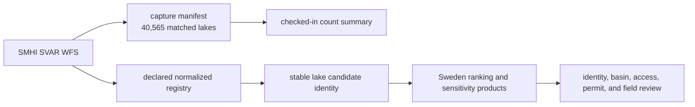
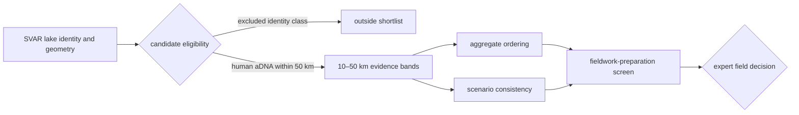

# SMHI SVAR

SMHI SVAR supplies official Swedish lake identity and geometry for
sampling-oriented products. It answers **which registered water body is the
candidate?** It does not answer whether that lake contains suitable sediment,
can be accessed, can be permitted, or is scientifically preferable.

SVAR is a sampling-domain family rather than direct biological or historical
evidence. Nearby pollen, ancient DNA, and archaeology remain owned by their
source families even when they contribute to a lake ranking.

## Current Capture

| Property | Governed value |
| --- | --- |
| source | SMHI SVAR |
| source surface | `https://vattenwebb.smhi.se/svarwebb/` |
| acquisition interface | WFS `lakes` type |
| capture date | `2026-06-22` |
| matched lakes | 40,565 |
| normalized count reported by the capture | 40,565 |
| publication layer key | `svar-lakes` |
| temporal posture | no time dimension |

The count describes registry members in the governed capture. It is not a
count of palaeolakes, sampled basins, accessible sites, or viable coring
locations.

## Shipped And Declared Surfaces

The source-family contract declares a normalized registry at
`data/svar/normalized/sweden_lake_registry.geojson`. The current repository
snapshot does not ship that file. It ships:

- `data/svar/raw/svar_lake_registry_manifest.json`, which records source,
  interface, acquisition date, and matched and normalized counts; and
- `data/svar/normalized/svar_summary.json`, which records the 40,565-member
  count and `svar-lakes` layer identity.

Published Sweden ranking tables retain member-level SVAR identifiers,
representative coordinates, source URLs, name diagnostics, water identities,
and mapped areas for the candidates they publish. Those product members are
auditable, but they are not a substitute for a portable checked-in copy of the
complete normalized registry.

The trust boundary is explicit: the manifest and summary establish
source-scale counts, while a published candidate row
establishes the identity retained for that product. Neither establishes the
unpublished members of the absent normalized registry file.

## Lake Identity Contract

| Field | What it establishes | What it does not establish |
| --- | --- | --- |
| registry ID or UUID | stable source identity for the water body | unique human-readable name |
| water identity | source-owned water object | sampling suitability |
| official geometry | present registry extent | historical shoreline or depositional basin |
| representative point | reproducible anchor derived from the polygon | optimal access or coring coordinate |
| mapped area | geometry-derived screening input | depth, volume, sediment thickness, or preservation |
| source URL | route back to the registry object | permanence of every displayed attribute |

Duplicate lake names are expected and must remain visible. A clean name match
cannot replace the registry identifier, UUID, geometry, and coordinate when a
candidate is cited or reviewed.

## From Registry To Decision Support

The registry owns the candidate, not the surrounding evidence. Distance bands
join governed records around the candidate under a declared model. The model
may prioritize review; it cannot convert registry presence into a sampling
recommendation.

## Audit A Lake Candidate

1. Record the publication version, ranking surface, and scenario.
2. Resolve the row to its SVAR registry ID, UUID, water identity, and source
   URL; use coordinates to disambiguate repeated names.
3. Confirm the representative-point method and mapped area.
4. Read the nearby evidence as separately owned source-family inputs.
5. Inspect aggregate, consensus, sensitivity, and preparation outputs rather
   than quoting an ordinal rank alone.
6. Treat bathymetry, sediment preservation, access, permits, and field safety
   as independent evidence required before a sampling decision.

## Governing Surfaces

- `data/svar/raw/svar_lake_registry_manifest.json` governs capture identity and
  source-scale counts;
- `data/svar/normalized/svar_summary.json` governs the checked-in summary;
- `data/source_family_contracts.json` declares lifecycle ownership;
- `data/source_spatiotemporal_posture_registry.json` declares sampling-domain,
  distance, and no-time postures; and
- [Sweden lake priorities](../../nordic-atlas/sweden-lake-priorities/index.md)
  explains the derived ranking, sensitivity, and field-review boundaries.

Continue with [source comparison](source-comparison.md) before combining SVAR
with another family and [publication reports](../publications/reports.md) when
reusing a ranked candidate.
