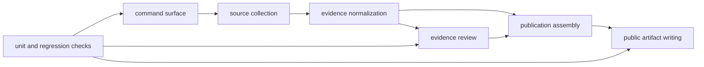

# How Evidence Becomes Outputs

This section explains how source material becomes visible output. It belongs on
the public surface because practical questions quickly turn into architecture
questions:

- how did this report, map point, or bundle get here
- which part of the system governs it
- where should I look when a visible output seems stronger or weaker than I
  expected

The goal here is not to tour internal names. It is to make the publication
flow understandable enough that you can trace one public output back to the
part of the runtime that governs it.

## Flow

## The Main Stages

- commands declare what kind of rebuild, check, or inspection is being
  requested
- collection brings governed source material into the repository
- normalization turns mixed upstream inputs into comparable repository-owned
  evidence files
- review surfaces expose strengths, blockers, caveats, and refusal reasons
- publication writes country, regional, and world-facing outputs
- checks fail when those layers drift apart or start implying too much

## What This Section Helps Explain

- why a visible output is never the whole story by itself
- why source intake, evidence normalization, review, and publication must stay
  visibly separate
- where to go next when your question is about system flow rather than evidence
  content

## Durable Boundaries

- `command_line/` owns CLI parsing, dispatch, and command registration
- `data_downloader/` owns source-family collection, intake helpers, and tracked
  context normalization
- `adna/` owns animal aDNA intake, extraction, normalization, and validation
- `analysis/review/` owns ranking review surfaces rather than public rendering
- `reporting/` owns publication assembly, rendering, and governed report
  writing
- `foundation/` owns repository-truth, release posture, and architecture
  contracts

## Use This Section When You Need To Know

- how commands line up with tracked source material
- where evidence becomes reviewable before it becomes public output
- which parts of the repository own review versus rendering
- where to look if an output changes unexpectedly
- how to trace a public-facing surface back to its governing evidence and rules

## Expanded Pages

- [runtime system model](runtime-system-model.md) explains the end-to-end flow
  in the order it actually runs
- [module map](module-map.md) explains which directories own which parts of the
  lifecycle
- [package split](package-split.md) explains why runtime, maintainer, and alias
  distributions stay separate
