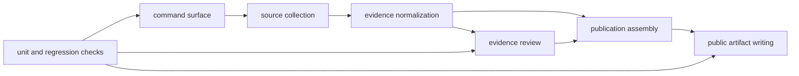

# How Evidence Becomes Outputs

This section explains the public chain from source material to visible output.
The architecture matters only if it helps a reader answer a simple question:
how did this report, map point, or country bundle get here?

The answer should be traceable without already knowing the package tree and
without having to guess which internal module happens to own which step.

## Flow

## The Main Stages

- commands declare what kind of rebuild or inspection is being requested
- collection brings governed source material into the repository
- normalization turns mixed upstream inputs into comparable repository-owned
  evidence files
- review surfaces expose strengths, blockers, and caveats
- publication writes country, regional, and world-facing outputs
- checks fail when these layers drift apart

## Durable Boundaries

- `command_line/` owns CLI parsing, dispatch, and command registration
- `data_downloader/` owns source-family collection, intake helpers, and tracked
  context normalization
- `adna/` owns animal aDNA intake, extraction, normalization, and validation
- `analysis/review/` owns ranking review surfaces rather than public rendering
- `reporting/` owns publication assembly, rendering, and governed report
  writing
- `foundation/` owns repository-truth, release posture, and architecture
  contracts

## Read This Section If You Need To Know

- how the commands line up with tracked source material
- where evidence is normalized before it becomes public output
- which parts of the repository own review versus rendering
- where to look if an output changes unexpectedly

## Expanded Pages

- [runtime system model](runtime-system-model.md) explains the end-to-end flow
  in the order it actually runs
- [module map](module-map.md) explains which directories own which parts of the
  lifecycle
- [package split](package-split.md) explains why runtime, maintainer, and alias
  distributions stay separate
