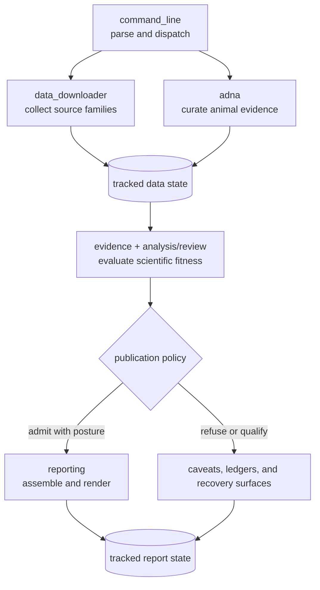
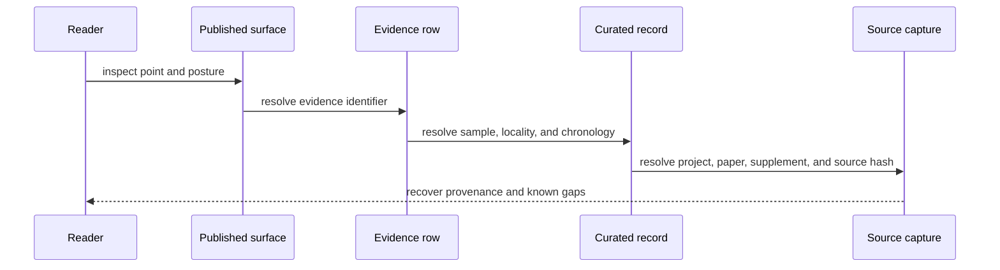

# Evidence Publication Architecture

The runtime is organized around evidence ownership. Commands initiate a
bounded action; collectors preserve source identity; curation modules create
governed records; review modules evaluate fitness and uncertainty; and
reporting modules derive public artifacts. Each boundary has a distinct output
that can be inspected without trusting the final rendering.

## Execution And Evidence Flow

```mermaid
flowchart TB
    CLI["command_line\nparse and dispatch"] --> Collect["data_downloader\ncollect source families"]
    CLI --> Animal["adna\ncurate animal evidence"]
    Collect --> Data[("tracked data state")]
    Animal --> Data
    Data --> Evidence["evidence + analysis/review\nevaluate scientific fitness"]
    Evidence --> Gate{"publication policy"}
    Gate -->|admit with posture| Reporting["reporting\nassemble and render"]
    Gate -->|refuse or qualify| Reviews["caveats, ledgers, and recovery surfaces"]
    Reporting --> Reports[("tracked report state")]
    Reviews --> Reports
```

The two persistent roots have different authority:

- `data/` owns collected, normalized, and reviewed evidence state;
- `docs/report/` owns derived publication bundles and review surfaces.

`artifacts/` holds disposable local build output. A file there does not become
publication evidence until a governed workflow admits it to a tracked surface.

## Lifecycle Owners

| Boundary | Responsibility | Representative outputs |
| --- | --- | --- |
| `command_line/` | CLI parsing, subcommand registration, runtime dispatch | exit status and selected action |
| `data_downloader/` | source acquisition, staging swaps, normalization, hashes, provenance, and source-family contracts | raw and normalized source trees, `collection_summary.json` |
| `adna/` | animal project intake, supplement recovery, sample identity, locality, chronology, coordinate provenance, species normalization, and integrity checks | project evidence surfaces and species records |
| `analysis/review/` | candidate ranking, sensitivity analysis, and review-oriented comparisons | ranking and sensitivity records |
| `evidence/` | atlas evidence rows and scientific review surfaces | evidence tables and fitness assessments |
| `reporting/` | geography selection, bundle assembly, map documents, reports, and review publication | world, region, country, and lake outputs |
| `foundation/` | architecture contracts, ownership, repository truth, release posture, and public claim language | release and credibility assessments |

## Governing Invariants

- Commands may coordinate owners but do not contain scientific business logic.
- Collection uses staged replacement so a failed refresh preserves the previous
  tracked source tree.
- Normalization records source version and content identity rather than
  flattening inputs into anonymous rows.
- Animal evidence remains project- and sample-traceable before it is grouped by
  species or geography.
- Reporting consumes governed evidence and may not strengthen locality,
  chronology, coordinate precision, or source support.
- Refused and qualified records remain visible in review surfaces instead of
  disappearing from the accountability trail.

## Trace A Published Point

```mermaid
sequenceDiagram
    participant R as Reader
    participant P as Published surface
    participant E as Evidence row
    participant C as Curated record
    participant S as Source capture
    R->>P: inspect point and posture
    P->>E: resolve evidence identifier
    E->>C: resolve sample, locality, and chronology
    C->>S: resolve project, paper, supplement, and source hash
    S-->>R: recover provenance and known gaps
```

If any link is absent, the public point is incomplete regardless of how precise
its marker appears.

## Architecture References

- [Runtime system model](runtime-system-model.md) describes execution order,
  persistence, and error handling.
- [Module map](module-map.md) maps scientific and publication questions to code
  ownership.
- [Package split](package-split.md) distinguishes the canonical runtime,
  compatibility distribution, and repository tooling.
- [Data architecture](../../pollenomics-data/overview/data-architecture-handbook.md)
  maps source families across raw, normalized, reviewed, and published layers.
- [Evidence chain](../../pollenomics-data/evidence/index.md) explains the
  sample, locality, chronology, and coordinate semantics behind publication.
