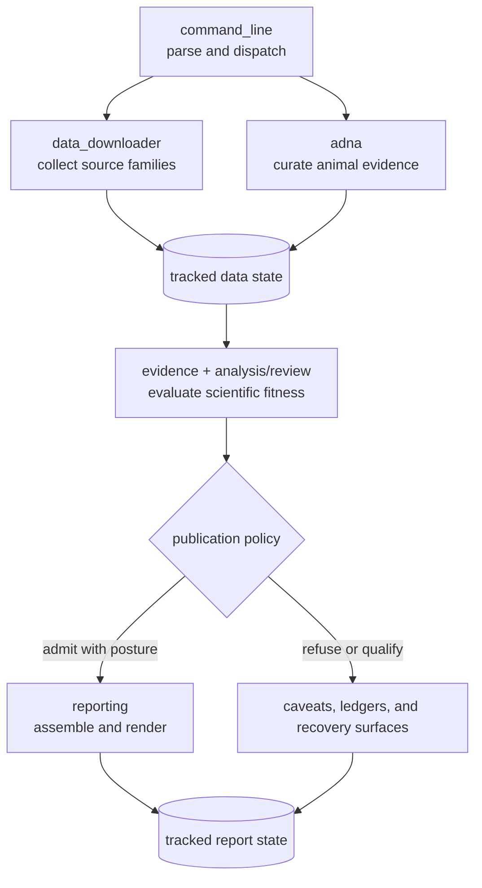
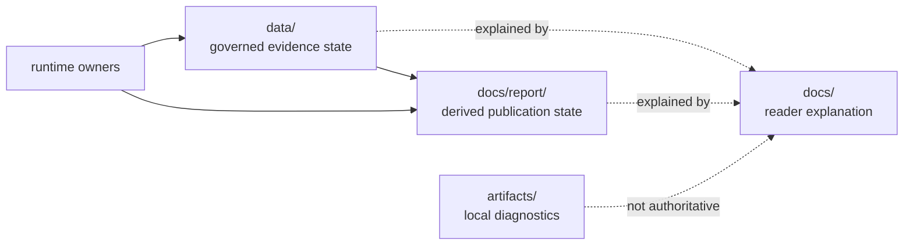
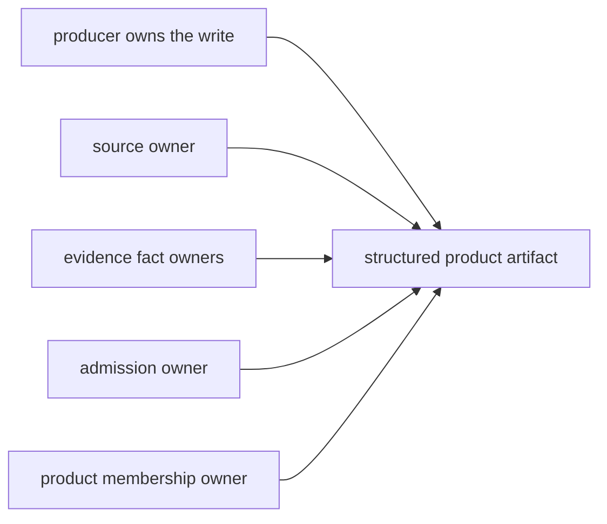
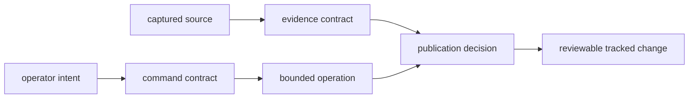
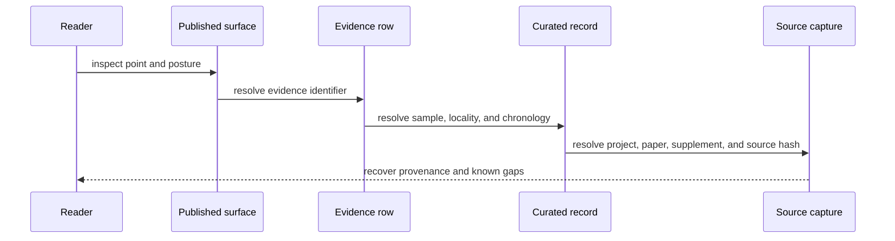
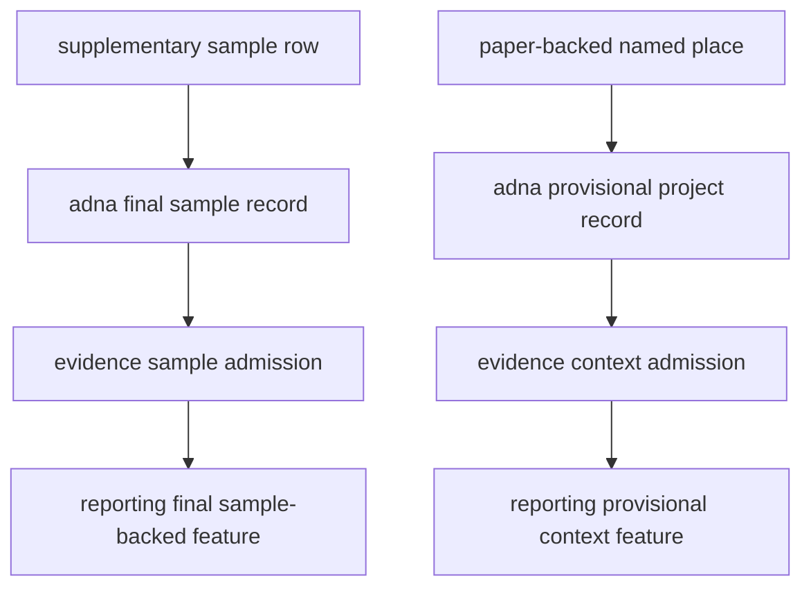

# Evidence Publication Architecture

The runtime is organized around evidence ownership. Commands initiate a
bounded action; collectors preserve source identity; curation modules create
governed records; review modules evaluate fitness and uncertainty; and
reporting modules derive public artifacts. Each boundary has a distinct output
that can be inspected without trusting the final rendering.

## Execution And Evidence Flow

```mermaid
flowchart TB
    CLI["command_line\nparse and dispatch"] --> Collect["data_downloader\ncollect source families"]
    CLI --> Animal["adna\ncurate animal evidence"]
    Collect --> Data[("tracked data state")]
    Animal --> Data
    Data --> Evidence["evidence + analysis/review\nevaluate scientific fitness"]
    Evidence --> Gate{"publication policy"}
    Gate -->|admit with posture| Reporting["reporting\nassemble and render"]
    Gate -->|refuse or qualify| Reviews["caveats, ledgers, and recovery surfaces"]
    Reporting --> Reports[("tracked report state")]
    Reviews --> Reports
```

The two persistent roots have different authority:

- `data/` owns collected, normalized, and reviewed evidence state;
- `docs/report/` owns derived publication bundles and review surfaces.

`artifacts/` holds disposable local build output. A file there does not become
publication evidence until a governed workflow admits it to a tracked surface.

A third tracked root has a different job: `docs/` outside `docs/report/`
explains the system to readers. Those handbook pages interpret contracts and
published state; they are not generated evidence and cannot override a source,
manifest, or review result. Keeping explanation, governed evidence, and derived
publication distinct prevents a confident sentence from becoming an authority
merely because it appears on the public site.

```mermaid
flowchart LR
    Code["runtime owners"] --> Data["data/<br/>governed evidence state"]
    Data --> Report["docs/report/<br/>derived publication state"]
    Code --> Report
    Data -. explained by .-> Guide["docs/<br/>reader explanation"]
    Report -. explained by .-> Guide
    Local["artifacts/<br/>local diagnostics"] -. not authoritative .-> Guide
```

## Lifecycle Owners

| Boundary | Responsibility | Representative outputs |
| --- | --- | --- |
| `command_line/` | CLI parsing, subcommand registration, runtime dispatch | exit status and selected action |
| `data_downloader/` | source acquisition, staging swaps, normalization, hashes, provenance, and source-family contracts | raw and normalized source trees, `collection_summary.json` |
| `adna/` | animal project intake, supplement recovery, sample identity, locality, chronology, coordinate provenance, species normalization, and integrity checks | project evidence surfaces and species records |
| `analysis/review/` | candidate ranking, sensitivity analysis, and review-oriented comparisons | ranking and sensitivity records |
| `evidence/` | atlas evidence rows and scientific review surfaces | evidence tables and fitness assessments |
| `reporting/` | geography selection, bundle assembly, map documents, reports, and review publication | world, region, country, and lake outputs |
| `foundation/` | architecture contracts, ownership, repository truth, release posture, and public claim language | release and credibility assessments |

## Persisted Authority Surfaces

Code ownership determines which operation creates a record. Persisted
contracts determine which checked-in artifact governs it after the operation
finishes.

| Authority | Governing surface | Downstream consumers |
| --- | --- | --- |
| collected source state | `data/collection_summary.json` | source reviews, refresh comparison, publication inputs |
| source-family meaning | `data/source_family_contracts.json` | data portal, maps, cross-domain reviews |
| evidence-stage maturity | `data/source_family_evidence_stage_matrix.json` | coverage and publication-readiness reviews |
| repeated fact ownership | `data/source_fact_ownership_registry.json` | reports and audits that repeat source or evidence facts |
| recurring artifact shapes | `data/evidence_artifact_contracts.json` | project, sample, geography, and report validation |
| public API shape | `apis/bijux-pollenomics/v1/pinned_openapi.json` and `schema.hash` | API consumers and compatibility checks |
| publication membership | geography and product manifests under `docs/report/` | maps, tables, narrative reports, and subset validation |

This division prevents implementation layout from becoming the only way to
understand authority. A reader can identify the governing contract from the
artifact tree, and an operator can trace the module responsible for producing
it.

### Producer Ownership And Fact Ownership Are Different

The module that writes a file is not necessarily the owner of every fact it
serializes. Publication code writes country bundles, but evidence records own
sample identity, place, and time; boundary contracts own containment inputs;
and the product manifest owns membership.

```mermaid
flowchart LR
    Producer["producer owns the write"] --> Artifact["structured product artifact"]
    Source["source owner"] --> Artifact
    Evidence["evidence fact owners"] --> Artifact
    Decision["admission owner"] --> Artifact
    Manifest["product membership owner"] --> Artifact
```

Review a disputed value through fact ownership, and review an incorrectly
materialized file through producer ownership. Correcting the renderer cannot
resolve a chronology conflict; correcting a sample record does not by itself
regenerate every consuming product.

## Governing Invariants

- Commands may coordinate owners but do not contain scientific business logic.
- Collection uses staged replacement so a failed refresh preserves the previous
  tracked source tree.
- Normalization records source version and content identity rather than
  flattening inputs into anonymous rows.
- Animal evidence remains project- and sample-traceable before it is grouped by
  species or geography.
- Reporting consumes governed evidence and may not strengthen locality,
  chronology, coordinate precision, or source support.
- Refused and qualified records remain visible in review surfaces instead of
  disappearing from the accountability trail.

## Control Flow And Evidence Flow

The command path and the evidence path intersect but are not equivalent. The
CLI selects an operation and supplies explicit scope. Evidence modules decide
what the acquired records mean. Publication modules decide which reviewed
records belong to a product. A command may orchestrate all three boundaries;
it may not silently replace their separate contracts.

```mermaid
flowchart LR
    Intent["operator intent"] --> Command["command contract"]
    Command --> Operation["bounded operation"]
    Source["captured source"] --> Evidence["evidence contract"]
    Evidence --> Decision["publication decision"]
    Operation --> Decision
    Decision --> Change["reviewable tracked change"]
```

This separation makes two failures distinguishable: an operation can fail to
execute, or evidence can execute successfully and still fail admission. The
second outcome is a scientific refusal, not a runtime defect.

Read-only inspection commands stop before state replacement. Commands such as
`product-scope`, `surface-map`, `ownership-map`, and the animal review commands
serialize existing contracts or governed state. Materializing commands such as
`collect-data`, `refresh-data-contract-surfaces`, and `publish-reports` may
change an owned tree and therefore require explicit roots and replacement
semantics. The shared command registry gives both classes one discoverable
entry point without pretending that they have the same impact.

## Trace A Published Point

```mermaid
sequenceDiagram
    participant R as Reader
    participant P as Published surface
    participant E as Evidence row
    participant C as Curated record
    participant S as Source capture
    R->>P: inspect point and posture
    P->>E: resolve evidence identifier
    E->>C: resolve sample, locality, and chronology
    C->>S: resolve project, paper, supplement, and source hash
    S-->>R: recover provenance and known gaps
```

If any link is absent, the public point is incomplete regardless of how precise
its marker appears.

### The Same Layer Can Carry Different Evidence Units

The animal map demonstrates why ownership cannot be inferred from geometry.
Two markers can share a layer while resolving through different evidence
chains:

| Visible member | Evidence unit | Required reverse trace | Permitted claim |
| --- | --- | --- | --- |
| final sample-backed feature | recovered sample | feature → evidence row → final sample identity → supplementary row and coordinate → project capture | qualified sample presence at the recorded locality |
| Wadi Halfa provisional feature | project context | feature → evidence row → provisional identity → paper-backed named place → project capture | spatial project context at an approximate geocode |

`reporting/` is allowed to place both members because the point-class contract
preserves their difference. It is not allowed to collapse them into one sample
population. Recovering a source-native Wadi sample would begin in `adna/`, flow
through `evidence/`, and only then change the published class.

```mermaid
flowchart TB
    SampleSource["supplementary sample row"] --> SampleRecord["adna final sample record"]
    SampleRecord --> SampleReview["evidence sample admission"]
    SampleReview --> SamplePoint["reporting final sample-backed feature"]
    PlaceSource["paper-backed named place"] --> ContextRecord["adna provisional project record"]
    ContextRecord --> ContextReview["evidence context admission"]
    ContextReview --> ContextPoint["reporting provisional context feature"]
```

## Architecture References

- [Runtime system model](runtime-system-model.md) describes execution order,
  persistence, and error handling.
- [Module map](module-map.md) maps scientific and publication questions to code
  ownership.
- [Package split](package-split.md) distinguishes the canonical runtime,
  compatibility distribution, and repository tooling.
- [Data architecture](../../pollenomics-data/overview/data-architecture-handbook.md)
  maps source families across raw, normalized, reviewed, and published layers.
- [Evidence chain](../../pollenomics-data/evidence/index.md) explains the
  sample, locality, chronology, and coordinate semantics behind publication.
