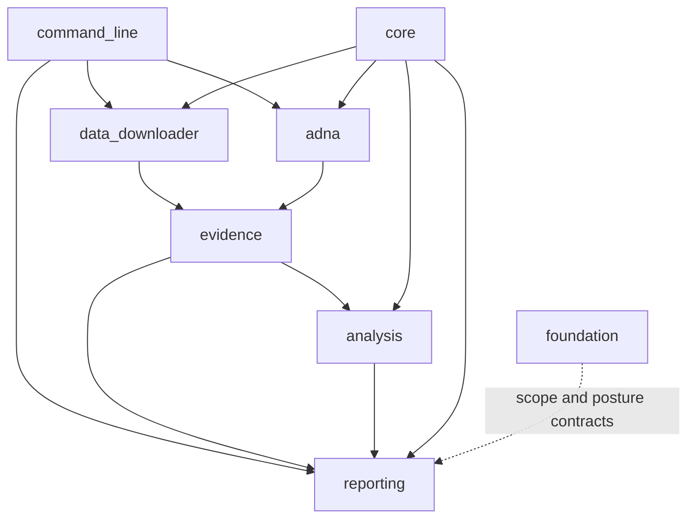
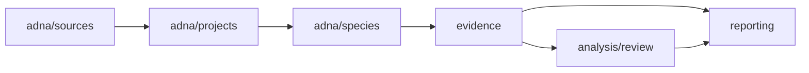

# Module Map

The canonical runtime namespace is organized by evidence responsibility. A
module owns the scientific or operational decision it makes, not every file it
reads or every downstream product that copies its result.

The namespace paths below are relative to the runtime package. Its animal
evidence boundary is `src/bijux_pollenomics/adna/`.

## Ownership Map

| Namespace | Durable responsibility | Governed outputs or decisions |
| --- | --- | --- |
| `command_line/` | parsing, dispatch, and the durable command registry | selected action, validated arguments, exit behavior, and declared write root |
| `data_downloader/` | source-family acquisition and context normalization | capture metadata, normalized context, traceability, hashes, and collection summary |
| `adna/` | animal project recovery and sample-owned evidence | project library, sample identity, locality, chronology, coordinates, species records, and archive findings |
| `evidence/` | product-facing evidence fitness and evidence rows | scientific review and atlas evidence surfaces |
| `analysis/` | explicit comparison and ranking methods | candidate rankings, sensitivity, lake evidence, and review packets |
| `reporting/` | scope selection, bundle assembly, rendering, and review publication | world, regional, country, atlas, lake, traceability, and truth-review products |
| `foundation/` | product scope, ownership, architecture, credibility, and release posture | runtime contracts and repository-level claim boundaries |
| `core/` | mechanics shared without transferring domain ownership | time, GeoJSON, distance, HTTP, file, and text primitives |

`command_line/` owns parsing, dispatch, and the durable command registry.
Within acquisition, `data_downloader/pipeline/`, `data_downloader/sources/`,
`data_downloader/intake/`, and `data_downloader/exports/` separate orchestration,
source interpretation, payload decoding, and owned output writing.

Within analysis, `analysis/review/` owns candidate-site ranking reviews and
their sensitivity evidence. Within publication, `reporting/bundles/` owns
bundle assembly, `reporting/presentation/` owns human-facing formatting,
`reporting/rendering/` writes structured and narrative artifacts, and
`reporting/review/` publishes repository-truth surfaces.

## Dependency Shape

Coordination does not transfer fact ownership. `command_line/` selects work;
it does not define evidence meaning. `core/` supplies reusable mechanics; it
does not own source semantics. `reporting/` selects admitted evidence; it does
not strengthen upstream precision.

## Reading The Dependency Direction

Dependencies point from coordination and products toward the owners they
consume. They do not authorize a downstream module to rewrite upstream
meaning. In particular:

- `reporting/` may filter an evidence row for one product but cannot repair its
  locality or chronology;
- `analysis/` may score declared inputs but cannot silently change their
  evidence roles;
- `evidence/` may qualify normalized records but cannot invent source-native
  identifiers;
- `core/` may parse time or geometry but cannot choose the scientific
  interpretation for a family.

When a change appears to require the reverse direction, the missing concept
usually belongs in the upstream owner or in an explicit contract shared at
the boundary.

## Animal Evidence Path

This path keeps a discovered archive project, a recovered paper supplement, a
sample row, a named site, and a publishable point as distinct evidence units.

## Compatibility Boundaries

The `bijux_pollenomics` namespace is the scientific owner. The `pollenomics`
alias distribution delegates to that runtime. Lower-level compatibility shims
may preserve older imports, but they cannot become independent evidence or
publication owners. The maintainer distribution can inspect these boundaries
without embedding runtime science in repository tooling.

A new responsibility belongs in the smallest domain that can name its input,
decision, and governed result without becoming a generic helper bucket.

## Trace A Behavior

Start from the observable surface and move inward:

| Observation | First owner | Continue with |
| --- | --- | --- |
| command option or exit | `command_line/` | resolved handler, then the invoked domain API |
| collected family file | `data_downloader/` | family source adapter, normalization, and export contract |
| animal sample claim | `adna/` | project, paper, sample, locality, chronology, and coordinate evidence |
| evidence qualification | `evidence/` | governing record and target product rule |
| ranking or sensitivity result | `analysis/review/` | declared inputs, scenarios, and stability output |
| bundle member or map feature | `reporting/` | manifest, admission decision, evidence row, and source identity |

This route follows ownership instead of filename similarity. It is the safest
way to distinguish a presentation defect from a curation or acquisition
defect.
