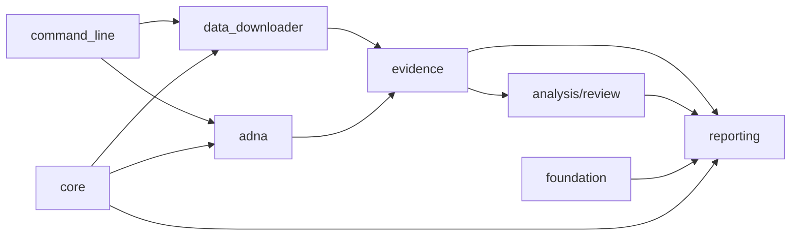

# Module Map

The runtime groups code by the evidence lifecycle. Ownership begins with the
scientific or operational decision being made, then narrows to a module and an
artifact contract.

## Responsibility Map

| Question | Canonical owner | Governed result |
| --- | --- | --- |
| Which command was requested and how is it dispatched? | `command_line/` | parsed intent, validated arguments, selected handler, and exit status |
| How did upstream material enter the repository? | `data_downloader/` | staged source capture, normalized source-family outputs, hashes, and collection summary |
| Which animal project, sample, place, date, or coordinate is supported? | `adna/` | project dossiers, sample evidence, ambiguity decisions, species records, and integrity findings |
| How are candidates ranked or compared under sensitivity scenarios? | `analysis/review/` | ranking evidence, scenario results, and stability assessments |
| Which evidence rows are fit for atlas or scientific review? | `evidence/` | publication-ready evidence rows and fitness assessments |
| How does governed evidence become a public product? | `reporting/` | world, regional, country, atlas, lake, traceability, and review outputs |
| Which product claims and ownership boundaries are allowed? | `foundation/` | scope, ownership, repository-truth, credibility, and release posture |
| Which mechanics are genuinely cross-domain? | `core/` | file, text, GeoJSON, HTTP, time, and distance primitives |

## Dependency Direction

`core/` supplies mechanics, not scientific ownership. `command_line/`
coordinates work, not evidence meaning. `reporting/` consumes admitted evidence
and cannot strengthen its locality, chronology, or coordinate posture.

## Animal Evidence Path

Animal source recovery begins in `adna/sources/`; project and sample curation
remain in `adna/projects/`; species-owned normalized records remain under the
animal domain; atlas and country publication continue through `evidence/` and
`reporting/`. The path preserves the distinction between a discovered project,
a supported sample, and a publishable point.

## Package Boundaries

- `bijux_pollenomics` is the canonical runtime namespace.
- `pollenomics` resolves to that runtime and owns no scientific fork.
- `bijux-pollenomics-dev` operates repository checks and release support but
  owns no runtime evidence logic.
- compatibility modules do not become canonical ownership merely because an
  older import still resolves through them.

A visible output should resolve to one owner for evidence meaning and one owner
for publication. Ambiguous ownership is itself a traceability defect.
