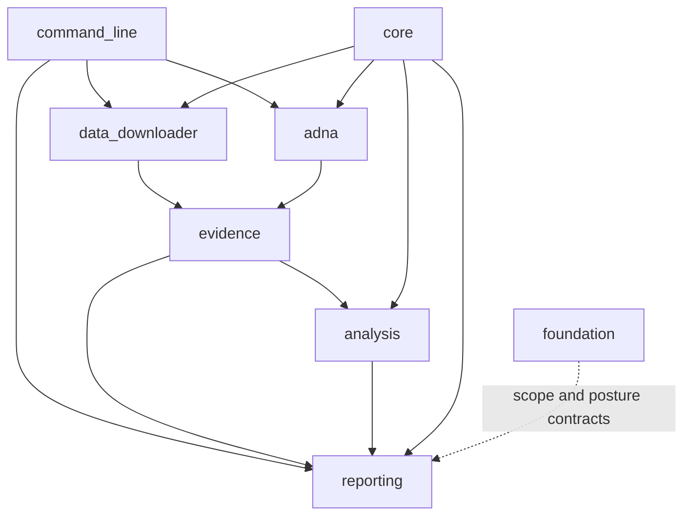
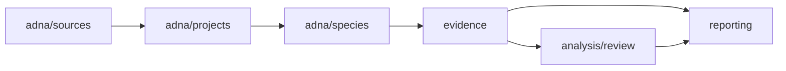
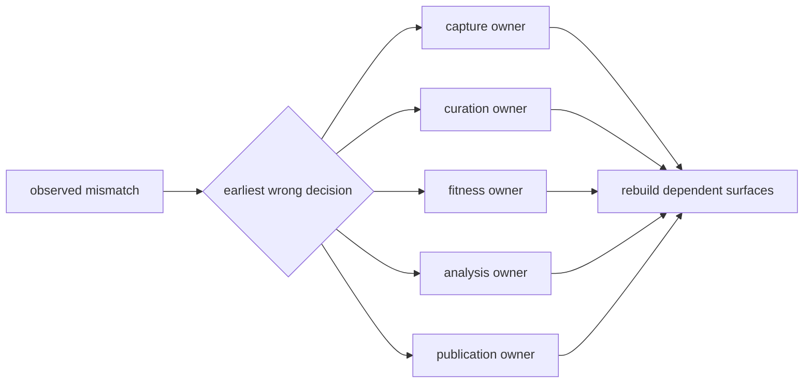

# Module Map

The canonical runtime namespace is organized by evidence responsibility. A
module owns the scientific or operational decision it makes, not every file it
reads or every downstream product that copies its result.

The namespace paths below are relative to the runtime package. Its animal
evidence boundary is `src/bijux_pollenomics/adna/`.

## Ownership Map

| Namespace | Durable responsibility | Governed outputs or decisions |
| --- | --- | --- |
| `command_line/` | parsing, dispatch, and the durable command registry | selected action, validated arguments, exit behavior, and declared write root |
| `data_downloader/` | source-family acquisition and context normalization | capture metadata, normalized context, traceability, hashes, and collection summary |
| `adna/` | animal project recovery and sample-owned evidence | project library, sample identity, locality, chronology, coordinates, species records, and archive findings |
| `evidence/` | product-facing evidence fitness and evidence rows | scientific review and atlas evidence surfaces |
| `analysis/` | explicit comparison and ranking methods | candidate rankings, sensitivity, lake evidence, and review packets |
| `reporting/` | scope selection, bundle assembly, rendering, and review publication | world, regional, country, atlas, lake, traceability, and truth-review products |
| `foundation/` | product scope, ownership, architecture, credibility, and release posture | runtime contracts and repository-level claim boundaries |
| `core/` | mechanics shared without transferring domain ownership | time, GeoJSON, distance, HTTP, file, and text primitives |

Three top-level modules are deliberate boundary adapters rather than new
domains: `cli.py` exposes the console entry point, `config.py` centralizes
default roots and product constants, and `publication_policy.py` exposes shared
publication rules. Scientific behavior still belongs to the domain package
that owns the decision.

`command_line/` owns parsing, dispatch, and the durable command registry.
Within acquisition, `data_downloader/pipeline/`, `data_downloader/sources/`,
`data_downloader/intake/`, and `data_downloader/exports/` separate orchestration,
source interpretation, payload decoding, and owned output writing.

Within analysis, `analysis/review/` owns candidate-site ranking reviews and
their sensitivity evidence. Within publication, `reporting/bundles/` owns
bundle assembly, `reporting/presentation/` owns human-facing formatting,
`reporting/rendering/` writes structured and narrative artifacts, and
`reporting/review/` publishes repository-truth surfaces.

## Dependency Shape

Coordination does not transfer fact ownership. `command_line/` selects work;
it does not define evidence meaning. `core/` supplies reusable mechanics; it
does not own source semantics. `reporting/` selects admitted evidence; it does
not strengthen upstream precision.

## Reading The Dependency Direction

Dependencies point from coordination and products toward the owners they
consume. They do not authorize a downstream module to rewrite upstream
meaning. In particular:

- `reporting/` may filter an evidence row for one product but cannot repair its
  locality or chronology;
- `analysis/` may score declared inputs but cannot silently change their
  evidence roles;
- `evidence/` may qualify normalized records but cannot invent source-native
  identifiers;
- `core/` may parse time or geometry but cannot choose the scientific
  interpretation for a family.

When a change appears to require the reverse direction, the missing concept
usually belongs in the upstream owner or in an explicit contract shared at
the boundary.

### Choose The Owner By Invariant

Place behavior with the invariant it must preserve, not with the file format
it happens to read or write:

| Invariant | Owning boundary |
| --- | --- |
| an upstream member is acquired with recoverable identity and bytes | `data_downloader/` or `adna/sources/` |
| a sample, place, chronology, coordinate, or relation retains scientific meaning | `adna/` and its evidence contracts |
| a record supports a declared use or remains qualified | `evidence/` |
| a declared population is ranked under explicit features and scenarios | `analysis/` |
| admitted members form a coherent geographic or purpose-specific product | `reporting/` |
| a product claim remains inside the implemented and releasable boundary | `foundation/` |

For example, GeoJSON serialization is a mechanical concern, coordinate
precision is an evidence concern, geographic admission is a product concern,
and marker styling is a presentation concern. Keeping those decisions apart
allows one correction to propagate without turning a shared format helper
into a scientific owner.

## Animal Evidence Path

This path keeps a discovered archive project, a recovered paper supplement, a
sample row, a named site, and a publishable point as distinct evidence units.

## Compatibility Boundaries

The `bijux_pollenomics` namespace is the scientific owner. The `pollenomics`
alias distribution delegates to that runtime. Lower-level compatibility shims
may preserve older imports, but they cannot become independent evidence or
publication owners. The maintainer distribution can inspect these boundaries
without embedding runtime science in repository tooling.

A new responsibility belongs in the smallest domain that can name its input,
decision, and governed result without becoming a generic helper bucket.

The package split is also enforced by negative ownership. The maintainer
package may inspect documentation, release, and repository contracts, but may
not own source collection, species normalization, or atlas publication. The
short-name distribution may delegate imports and commands, but may not fork
scientific logic. These prohibitions keep tooling and compatibility from
becoming shadow runtimes.

## Trace A Behavior

Start from the observable surface and move inward:

| Observation | First owner | Continue with |
| --- | --- | --- |
| command option or exit | `command_line/` | resolved handler, then the invoked domain API |
| collected family file | `data_downloader/` | family source adapter, normalization, and export contract |
| animal sample claim | `adna/` | project, paper, sample, locality, chronology, and coordinate evidence |
| evidence qualification | `evidence/` | governing record and target product rule |
| ranking or sensitivity result | `analysis/review/` | declared inputs, scenarios, and stability output |
| bundle member or map feature | `reporting/` | manifest, admission decision, evidence row, and source identity |

This route follows ownership instead of filename similarity. It is the safest
way to distinguish a presentation defect from a curation or acquisition
defect.

## Place A Correction At Its Owner

The visible symptom is often downstream of the responsible boundary. Locate
the earliest decision that is wrong and correct it there:

| Observed mismatch | Owning correction | Downstream consequence |
| --- | --- | --- |
| source version, retrieval URL, or payload hash is wrong | `data_downloader/` capture and family contract | normalize again, then rebuild affected evidence and products |
| recovered animal identifier, locality, chronology, or coordinate is wrong | `adna/` project or sample evidence | review admission again before republishing |
| evidence role or fitness posture is wrong | `evidence/` and its product rule | regenerate review and every product that consumes the decision |
| ranking changes under the wrong scenario or interval rule | `analysis/review/` | regenerate ranking, sensitivity, and fieldwork-preparation packets |
| correct evidence is selected but serialized or rendered incorrectly | `reporting/` | rebuild the affected bundle without rewriting upstream evidence |
| public release wording overstates a governed result | the release-posture producer in `foundation/` or the owning report builder | regenerate the gate or review surface; do not patch generated prose |

Generated artifacts are evidence of the producer's behavior. Hand-editing one
would hide the defective decision and leave the next regeneration incorrect.
