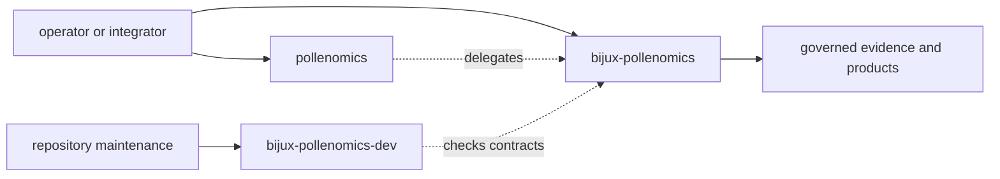
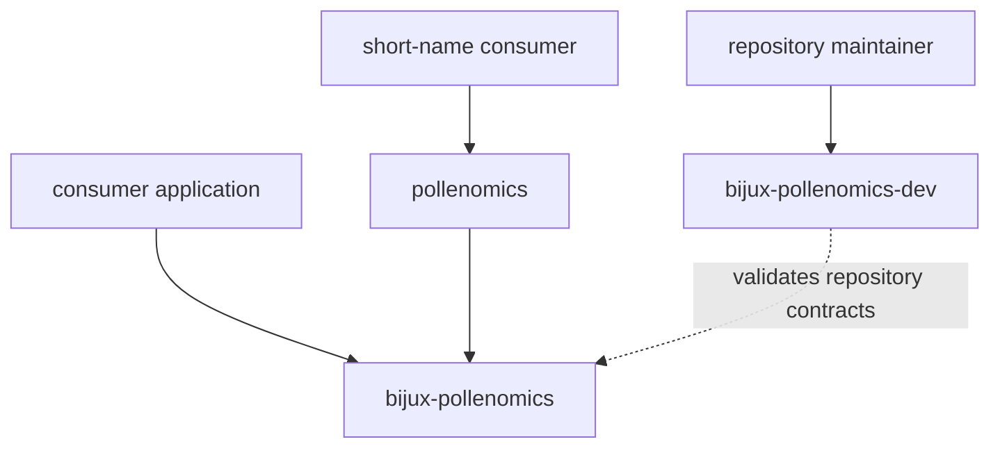

# Package Split

The repository publishes three Python distributions with one runtime identity.
The split separates scientific behavior, compatibility, and repository
maintenance without creating competing products.

## Distribution Contracts

| Distribution | Namespace or command | Responsibility | Not its responsibility |
| --- | --- | --- | --- |
| `bijux-pollenomics` | `bijux_pollenomics`, `bijux-pollenomics` | canonical collection, evidence, review, analysis, and publication runtime | repository-only policy checks |
| `pollenomics` | `pollenomics`, `pollenomics` | short-name compatibility facade over the canonical runtime | independent scientific or command behavior |
| `bijux-pollenomics-dev` | `bijux_pollenomics_dev` | repository checks, documentation integrity, packaging, and release support | source semantics, evidence decisions, or publication rules |

## One Scientific Runtime

All collection, sample recovery, normalization, scientific review, ranking,
and publication behavior belongs to `bijux_pollenomics`. The shorter package
may re-export supported Python names and delegate its console command, but it
must return the same results for the same inputs.

This equivalence matters for reproducibility: package spelling cannot change
which records are admitted, how chronology is interpreted, or which warnings
appear in a bundle.

## Tooling Is Not Evidence Authority

The development distribution can verify documentation, API drift, dependency
policy, packages, badges, and release conditions. These checks can detect a
broken evidence contract, but the toolkit does not own the scientific rule it
checks. Corrections belong in the canonical runtime or governed data surface.

## Choosing A Distribution

- install `bijux-pollenomics` for the canonical command and Python API;
- use `pollenomics` when the shorter compatibility identity is required;
- use `bijux-pollenomics-dev` only for repository maintenance workflows.

Applications should not depend on the development distribution to reach
runtime behavior. Integrations that use the alias should remain portable to
the canonical package without a scientific or artifact change.

## Installation And Dependency Direction

Consumer applications depend on the canonical distribution, or on the alias
when compatibility requires it. The canonical runtime never depends on the
alias or the development toolkit. This direction prevents repository-only
checks from becoming runtime requirements and prevents the compatibility
identity from acquiring unique behavior.

Installing both runtime names does not create two data stores. Governed roots
are selected by the operation and repository contract, not by distribution
spelling. An integration that observes different files, warnings, or
admission decisions through the alias has found a defect.

## Boundary Invariants

- one input state has one runtime interpretation;
- aliases delegate instead of forking behavior;
- repository checks remain outside scientific execution;
- public exports are explicit at the canonical facade;
- compatibility code carries no unique evidence or publication state.

Versioning must preserve those invariants across all three distributions. A
new canonical capability may be exposed through the alias, and a new
repository check may inspect it, but neither companion distribution can ship a
scientific capability that the canonical runtime does not own.
