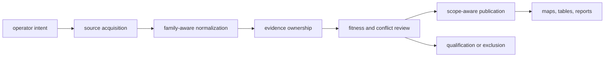
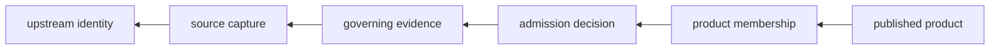

# Runtime System Model

Bijux Pollenomics is a stateful evidence and publication system. It acquires
source families, preserves their identities, normalizes comparable structure,
records scientific decisions, and publishes qualified products. Each boundary
has a different authority and a different failure meaning.

## Lifecycle

| Boundary | Governing decision | Persistent result |
| --- | --- | --- |
| command | Which supported action was requested? | exit status and declared writes |
| acquisition | Which upstream material and retrieval context entered the system? | raw capture, metadata, and hashes |
| normalization | How can source fields be compared without strengthening them? | stable family-owned records |
| evidence | Which record owns identity, place, time, taxonomy, and provenance? | linked evidence surfaces |
| review | Is the record fit for one declared use and precision? | findings, qualifications, and exclusions |
| publication | Which admitted members belong to one product scope? | manifests, bundles, traceability, and renderings |

## Authority Does Not Flow Backward

Publication consumes scientific decisions but cannot redefine them. A map
renderer may position a supported point; it cannot promote a region-only
record to exact coordinates. A country bundle may repeat sample chronology;
it cannot become the authority for that chronology.

The reverse path is equally constrained: acquisition does not imply
normalization success, normalization does not imply publication fitness, and
review for one product does not imply fitness for every product.

## State Boundaries

- `data/` contains governed captured, normalized, reviewed, and governance
  state;
- `docs/report/` contains governed public products and claim-review surfaces;
- `apis/` contains versioned interface descriptions;
- `artifacts/` contains transient environments, logs, previews, and local
  verification output.

Only a complete operation may replace its owned governed tree. Collection and
publication use staging so a failed operation can preserve the previous
coherent state.

## Failure Semantics

| Failure | Meaning |
| --- | --- |
| precondition or parse refusal | the requested action was not valid; governed state should remain untouched |
| acquisition refusal | source identity, access, or payload could not be captured as required |
| normalization refusal | source semantics could not produce a valid governed record |
| evidence qualification | a record exists but supports only a narrower claim |
| admission refusal | known evidence does not satisfy the named product contract |
| publication failure | an admitted product could not be written coherently; the prior product remains authoritative |

Refusal is part of correct operation. The runtime is designed to preserve an
explicit gap rather than create a plausible but unsupported value.

## Extension Rule

New source families and products enter through named ownership boundaries.
They must declare source identity, normalized semantics, evidence role,
review criteria, write scope, and publication effect. A generic parser or
renderer is not a sufficient architecture for a new scientific domain.
