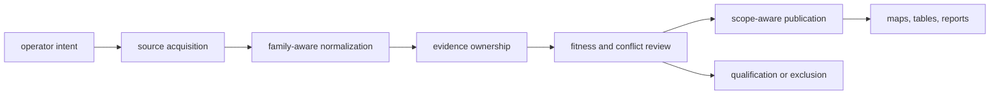
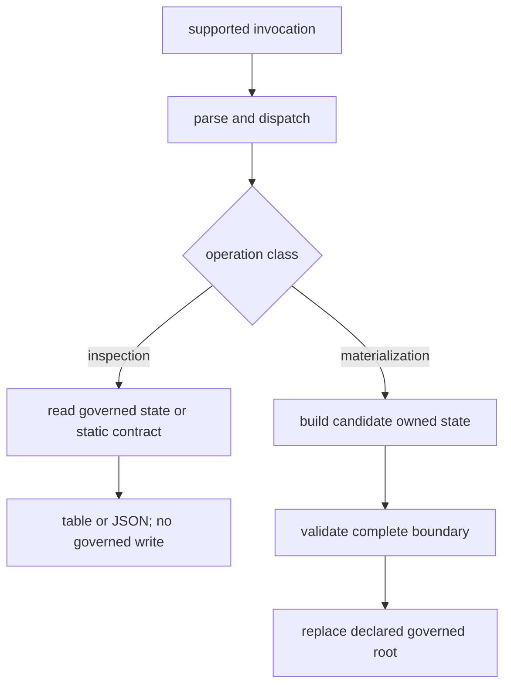
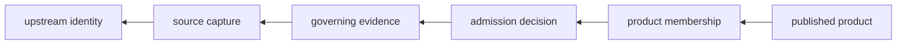
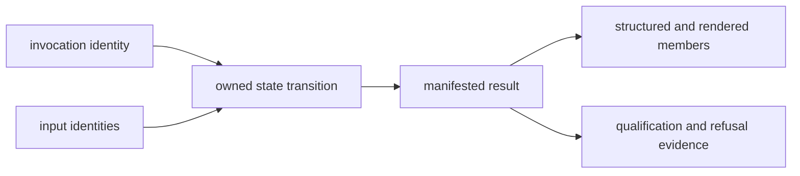

# Runtime System Model

Bijux Pollenomics is a stateful evidence and publication system. It acquires
source families, preserves their identities, normalizes comparable structure,
records scientific decisions, and publishes qualified products. Each boundary
has a different authority and a different failure meaning.

## Lifecycle



| Boundary | Governing decision | Persistent result |
| --- | --- | --- |
| command | Which supported action was requested? | exit status and declared writes |
| acquisition | Which upstream material and retrieval context entered the system? | raw capture, metadata, and hashes |
| normalization | How can source fields be compared without strengthening them? | stable family-owned records |
| evidence | Which record owns identity, place, time, taxonomy, and provenance? | linked evidence surfaces |
| review | Is the record fit for one declared use and precision? | findings, qualifications, and exclusions |
| publication | Which admitted members belong to one product scope? | manifests, bundles, traceability, and renderings |

## Execution Path

State-changing commands follow this control shape. Read-only inspectors use the
same parse-and-dispatch boundary but return a contract or review without a
staging or replacement step:

```mermaid
sequenceDiagram
    actor Operator
    participant CLI as command_line
    participant Owner as domain owner
    participant Stage as isolated staging
    participant Contract as contract validation
    participant State as governed state
    Operator->>CLI: command and explicit roots
    CLI->>CLI: parse and validate preconditions
    CLI->>Owner: typed request
    Owner->>Stage: build complete candidate state
    Owner->>Contract: validate identity and relationships
    alt contract accepted
        Contract-->>Owner: acceptance
        Owner->>State: replace owned tree
        Owner-->>Operator: result and exit status
    else contract refused
        Contract-->>Owner: findings
        Owner-->>Operator: refusal; prior state retained
    end
```

Parsing and dispatch select an owner; they do not perform scientific
interpretation. The domain owner reads governed inputs, builds a candidate
result, and validates the whole owned boundary before replacement. This is why
an exit status describes the requested operation, while a manifest describes
the scientific state that operation produced.



This distinction matters for automation. `--json` makes an inspector
machine-readable; it does not make it state-changing. Conversely, a command
that returns a report object may still have written governed files. Determine
impact from the command contract and explicit root arguments, not from output
format.

## Authority Does Not Flow Backward

Publication consumes scientific decisions but cannot redefine them. A map
renderer may position a supported point; it cannot promote a region-only
record to exact coordinates. A country bundle may repeat sample chronology;
it cannot become the authority for that chronology.



The reverse path is equally constrained: acquisition does not imply
normalization success, normalization does not imply publication fitness, and
review for one product does not imply fitness for every product.

## State Boundaries

- `data/` contains governed captured, normalized, reviewed, and governance
  state;
- `docs/report/` contains governed public products and claim-review surfaces;
- `apis/` contains versioned interface descriptions;
- `artifacts/` contains transient environments, logs, previews, and local
  verification output.

Only a complete operation may replace its owned governed tree. Collection and
publication use staging so a failed operation can preserve the previous
coherent state.

The atomicity guarantee belongs to each owning operation, not to an imagined
repository-wide transaction. A source refresh, animal foundation rebuild, and
report publication are separate state transitions. If an operator chains them,
the operation ledger must record which transitions completed and which prior
tree remains authoritative after a later refusal.

State does not move between these roots merely because two files have the
same format. A JSON file under `artifacts/` is diagnostic output; a JSON file
under a governed family tree becomes evidence only through its owning
contract. Likewise, a rendered report may repeat a fact without acquiring
ownership of that fact.

## Integration Seams

| Need | Supported seam | Stability source |
| --- | --- | --- |
| run a complete workflow | canonical command and its declared options | command registry, help, and exit behavior |
| compose runtime behavior | top-level Python facade and named public modules | explicit exports and result types |
| consume governed evidence | family contracts, stable identifiers, and normalized records | schemas, provenance, and ownership registry |
| consume a publication | bundle manifest plus structured members | product scope, membership, warnings, and exclusions |
| design an HTTP client | frozen OpenAPI v1 description | pinned schema and digest, not service availability |

Internal module paths are navigation aids, not automatically supported APIs.
Integrators should cross a named seam at the highest boundary that preserves
the evidence they need.

The OpenAPI row is intentionally asymmetric: the schema is a compatibility
artifact, while this package does not start an HTTP service. A client can use
the frozen description to design or validate a future adapter, but cannot infer
that an endpoint is deployed from the presence of `apis/`.

## Failure Semantics

| Failure | Meaning |
| --- | --- |
| precondition or parse refusal | the requested action was not valid; governed state should remain untouched |
| acquisition refusal | source identity, access, or payload could not be captured as required |
| normalization refusal | source semantics could not produce a valid governed record |
| evidence qualification | a record exists but supports only a narrower claim |
| admission refusal | known evidence does not satisfy the named product contract |
| publication failure | an admitted product could not be written coherently; the prior product remains authoritative |

Refusal is part of correct operation. The runtime is designed to preserve an
explicit gap rather than create a plausible but unsupported value.

Errors therefore fall into three observable classes: invalid requests return
before governed writes; operational failures retain diagnostics and the last
coherent owned tree; scientific refusals persist the qualification or
exclusion needed to explain why a candidate did not become a claim. Retrying
cannot convert the third class into success unless its governing evidence or
product contract changes.

## Operation Evidence Packet

A consequential run is reconstructable from more than its exit code. Preserve
these identities together when evaluating or citing an operation:

| Identity | Question answered |
| --- | --- |
| invocation | Which command, arguments, installed distribution, and explicit roots were used? |
| inputs | Which source versions, capture hashes, manifests, and prior governed state were read? |
| transition | Which owner built the candidate, what validation ran, and which governed tree could change? |
| result | Which manifest or review packet names the accepted, qualified, refused, and excluded members? |
| product | Which structured and rendered artifacts share that result identity? |

This packet separates operational success from scientific admission. For
example, `publish-reports` can complete coherently while preserving a
provisional animal context feature or refusing a temporal comparison. The
successful state transition proves that the publication contract ran; the
manifest and review surfaces determine what the result supports.



## Extension Rule

New source families and products enter through named ownership boundaries.
They must declare source identity, normalized semantics, evidence role,
review criteria, write scope, and publication effect. A generic parser or
renderer is not a sufficient architecture for a new scientific domain.

Code navigation begins with the boundary that owns the decision:
`command_line/` for dispatch, `data_downloader/` for acquisition,
`adna/` for animal sample evidence, `evidence/` for fitness,
`analysis/` for comparison, and `reporting/` for publication. Shared mechanics
belong in `core/` only when they carry no source- or product-specific meaning.
