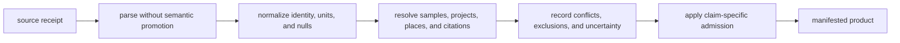
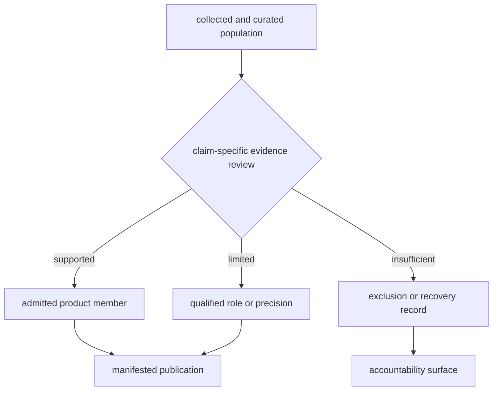
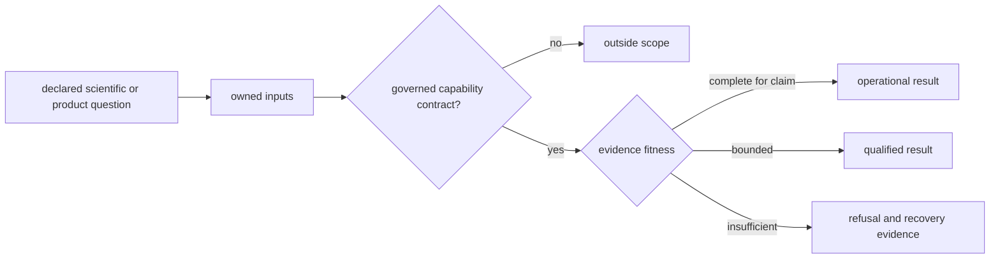

# Evidence Publication Capabilities

Bijux Pollenomics currently operates as an atlas builder and evidence-
publication runtime with explicit limits. It collects source families, curates
sample and context evidence, reviews claim fitness, ranks declared candidates,
and publishes scoped products. The broader harmonization and interpretation
engine is a project direction, not a current runtime claim.

That distinction does not reduce the implemented system to rendering. The
current product owns material state transitions, evidence contracts, refusal
paths, and public descendants. It does mean that readers should judge the
runtime by those concrete capabilities instead of assigning it analyses that
the public interfaces do not perform.

## Operational Capabilities

| Capability | Governed inputs | Result |
| --- | --- | --- |
| family-specific source collection | pinned source identities and family-specific acquisition rules | tracked captures with hashes, retrieval context, and replacement semantics where the family contract materializes them |
| evidence-database preparation | captured material, extraction rules, identity contracts, and null semantics | repository-owned records with preserved provenance, typed uncertainty, conflicts, and negative outcomes |
| animal evidence curation | archive projects, papers, supplements, and recovered samples | stable identity, locality, chronology, coordinate, conflict, and recovery records |
| cross-domain publication | admitted evidence plus declared source roles | world, Europe-plus, Nordic, and country bundles |
| geographic traceability | product manifests, feature IDs, and evidence owners | map members that resolve back to governed records and sources |
| lake decision support | SVAR identities, contextual evidence, ranking model, and sensitivity scenarios | ranked candidates with input roles and stability evidence |
| release accountability | coverage, drift, exclusion, and integrity reviews | passing checks, qualified claims, and explicit refusals |

These capabilities produce checked-in structured artifacts, not only prose or
screenshots. Each state-changing operation has an owned input boundary,
manifested output, and review surface. They constitute an evidence-publication
platform; they are not evidence that the planned general engine already exists.

Operational here means that an owned contract exists and is exercised for the
named result. It does not mean that every family has the same artifacts. The
current lifecycle matrix records full capture, normalization, review, and
publication materialization for Neotoma, SEAD, and animal ancient DNA. Other
families retain narrower stage combinations: LandClim, RAÄ, and boundaries
lack a materialized review stage, while SVAR and AADR currently retain capture
and publication evidence without materialized normalized or review artifacts.
Those absences are visible capability limits, not stages inferred from a
successful downstream build.

### Database Preparation Is Executable Evidence Work

Preparation is not a clerical prelude to analysis. It is where source-native
observations become accountable repository evidence:

The preparation capability is demonstrated by retained lineage and decisions,
not merely by the existence of a table. A defensible record carries source
identity, extraction context, normalization semantics, relationship evidence,
and its review or blocking posture. Where one of those surfaces is not
materialized for a family, the capability claim stops at the last observable
stage.

## Qualified Capabilities

Some real capabilities carry narrower claims because the evidence is uneven:

- animal source recovery tracks 40 projects and 868 recovered sample rows,
  while expected-sample denominators remain incomplete;
- animal point publication admits 233 final sample-backed features and one
  provisional project-context feature without presenting the 234-row surface
  as one homogeneous sample population;
- Neotoma provides 170 numerically comparable site spans alongside five
  contextual-only and 25 unresolved sites;
- SEAD provides 2,172 mapped Nordic context features, while all 2,195 reviewed
  inventory rows remain temporally unresolved in the current capture; and
- Sweden lake ranking supports prioritization, while field readiness remains
  dependent on bathymetry, access, permissions, and on-site verification.

The animal database also contains different governed populations: 894
sample-foundation rows, 868 recovered project sample-master identities, and
234 point-publication members. These are distinct contracts rather than a
single attrition funnel. The public layer contains 233 final sample-backed
features and one provisional project-context feature.

The engine is credible because all three branches are durable outputs.

## Capability Ledger

Operational status is claim-specific. The same domain can be operational for
one output, qualified for another, and outside scope for a stronger analysis.

| Domain question | State | Governed result | Claim ceiling |
| --- | --- | --- | --- |
| Which AADR v66 rows belong to a country bundle? | operational | release-resolved members, manifest, table, and GeoJSON | geographic publication of metadata, not genotype analysis |
| Which recovered animal samples meet the point contract? | operational for 233 features | final sample identity, locality, coordinate, chronology posture, and traceability | admitted subset, not complete project recovery |
| May the Wadi Halfa dromedary context appear spatially? | qualified | one provisional project-context feature with approximate named-place geocode | context feature, not recovered sample evidence |
| Are current SEAD sites contemporaneous with nearby aDNA? | refused | 2,195 unresolved temporal review rows | spatial context only until chronology is recovered |
| Which Swedish lakes rank under declared scenarios? | qualified decision support | ranking, sensitivity, and fieldwork-preparation packets | prioritization, not sampling readiness |
| What population-genetic process produced a pattern? | outside scope | no governed capability | requires a new analysis and evidence contract |

This ledger prevents a mature command or attractive visualization from lending
its status to a stronger question. Capability state follows the claim being
asked, not the package or source family as a whole.

## Planned Engine Surfaces

The public surface contract identifies three planned capabilities:

| Planned surface | Missing current contract |
| --- | --- |
| multi-evidence harmonization runtime | no general observation-unit alignment, cross-family transformation, and governed harmonized output |
| evidence-aware scoring and interpretation engine | no general inference contract connecting domain evidence to scientific interpretation |
| workflow replay and diff execution | no public runtime that replays arbitrary governed stages and explains semantic differences between runs |

Existing commands may inspect, rebuild, or compare particular governed
surfaces. Those focused operations should not be generalized into these broader
engine claims.

## Outside Current Scope

No current contract supports:

- AADR genotype processing or population-genetic inference;
- automatic causal inference across pollen, archaeology, and ancient DNA;
- synthetic chronology for records whose source does not own numeric time;
- exact geolocation from broad locality or project geography;
- autonomous field-site selection or coring instructions;
- continent-wide claims from Sweden-specific RAÄ context; or
- a single composite evidence score that erases family roles and uncertainty.

An output that appears to provide one of these results would be outside the
declared product, even if it could be computed from nearby columns or map
geometry.

## Extension Contract

A new source family or analytical capability becomes part of the current
product only when it has:

1. stable upstream identity, version, licence, and acquisition lineage;
2. a declared observation unit and normalized schema;
3. fact ownership, null semantics, and conflict behavior;
4. spatial and temporal posture;
5. a distinct evidence role and product question;
6. admission, qualification, and exclusion rules;
7. manifests and traceability for every public descendant; and
8. focused verification that detects semantic drift.

This contract allows the system to grow without describing intention as
implementation. Until all eight relations exist, the proposed surface remains
external, exploratory, or planned rather than a published runtime capability.

Continue to [runtime scope and ownership](runtime-scope-and-ownership.md),
[publication scope](publication-scope-model.md), and the
[data system](../../pollenomics-data/index.md).
