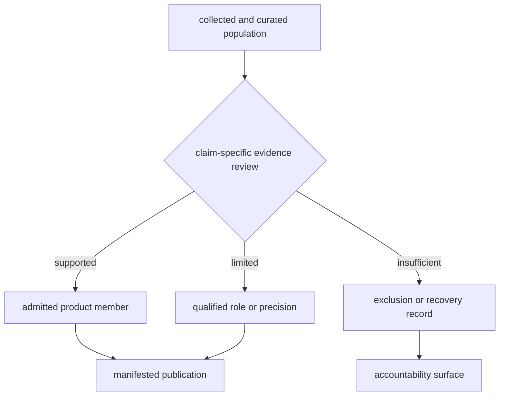

# Evidence Engine Capabilities

Bijux Pollenomics is an operational evidence publication engine with explicit
limits. It collects source families, curates sample and context evidence,
evaluates claim fitness, and publishes scoped products. It does not present
uneven evidence maturity as a finished universal analysis system.

## Operational Capabilities

| Capability | Governed inputs | Result |
| --- | --- | --- |
| source collection | pinned source identities and family-specific acquisition rules | tracked raw and normalized family state with hashes and replacement semantics |
| animal evidence curation | archive projects, papers, supplements, and recovered samples | stable identity, locality, chronology, coordinate, conflict, and recovery records |
| cross-domain publication | admitted evidence plus declared source roles | world, Europe-plus, Nordic, and country bundles |
| geographic traceability | product manifests, feature IDs, and evidence owners | map members that resolve back to governed records and sources |
| lake decision support | SVAR identities, contextual evidence, ranking model, and sensitivity scenarios | ranked candidates with input roles and stability evidence |
| release accountability | coverage, drift, exclusion, and integrity reviews | passing checks, qualified claims, and explicit refusals |

These capabilities produce checked-in structured artifacts, not only prose or
screenshots. Each state-changing operation has an owned input boundary,
manifested output, and review surface.

## Qualified Capabilities

Some real capabilities carry narrower claims because the evidence is uneven:

- animal source recovery tracks 40 projects and 868 recovered sample rows,
  while expected-sample denominators remain incomplete;
- animal point publication admits 234 supported rows without presenting them
  as complete project or species coverage;
- Neotoma provides 170 numerically comparable site spans alongside five
  contextual-only and 25 unresolved sites;
- SEAD provides 2,172 mapped Nordic context features, while all 2,195 reviewed
  inventory rows remain temporally unresolved in the current capture; and
- Sweden lake ranking supports prioritization, while field readiness remains
  dependent on bathymetry, access, permissions, and on-site verification.

The engine is credible because all three branches are durable outputs.

## Outside Current Scope

No current contract supports:

- AADR genotype processing or population-genetic inference;
- automatic causal inference across pollen, archaeology, and ancient DNA;
- synthetic chronology for records whose source does not own numeric time;
- exact geolocation from broad locality or project geography;
- autonomous field-site selection or coring instructions;
- continent-wide claims from Sweden-specific RAÄ context; or
- a single composite evidence score that erases family roles and uncertainty.

An output that appears to provide one of these results would be outside the
declared product, even if it could be computed from nearby columns or map
geometry.

## Extension Contract

A new source family or analytical capability becomes part of the engine only
when it has:

1. stable upstream identity, version, licence, and acquisition lineage;
2. a declared observation unit and normalized schema;
3. fact ownership, null semantics, and conflict behavior;
4. spatial and temporal posture;
5. a distinct evidence role and product question;
6. admission, qualification, and exclusion rules;
7. manifests and traceability for every public descendant; and
8. focused verification that detects semantic drift.

This contract allows the system to grow without describing intention as
implementation. Until all eight relations exist, the proposed surface remains
external or exploratory rather than a published engine capability.

Continue to [runtime scope and ownership](runtime-scope-and-ownership.md),
[publication scope](publication-scope-model.md), and the
[data system](../../pollenomics-data/index.md).
