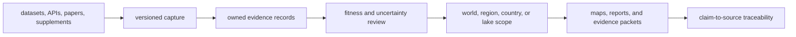
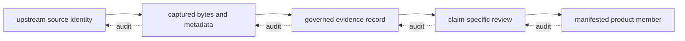
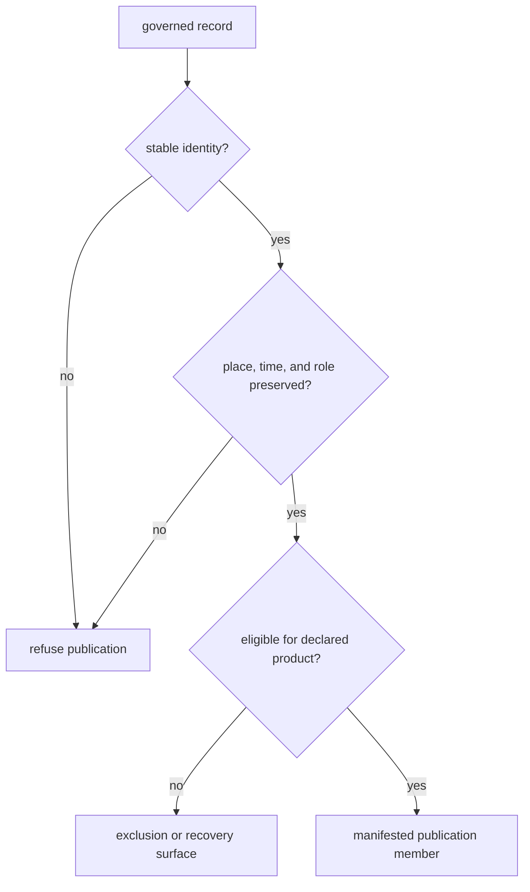
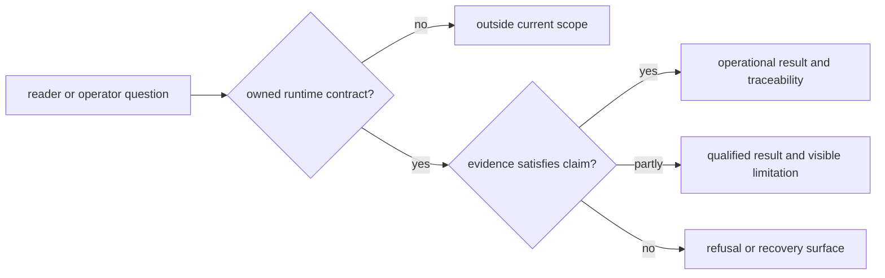

# Product Boundary

Bijux Pollenomics is an atlas builder and evidence-publication system. It
acquires heterogeneous scientific and geographic sources, preserves their
identities and limitations, creates repository-owned evidence records, and
derives scoped maps and reports from the admitted subset.

The product is the accountable chain, not only the final visualization.

The executable product-scope contract names the current mode
`atlas_builder` and the project direction `future_engine`. That is a product
boundary, not a disclaimer hidden at the edge of the documentation. Collection,
curation, review, ranking, and publication are current runtime behavior;
general multi-evidence harmonization and interpretation remain outside the
implemented contract.

The checked-in evidence state and publication state are deliberately
different sizes. Collection preserves records that may be contextual,
unresolved, excluded, or awaiting stronger source recovery. Publication exposes
only the members admitted for a declared geography and use. That difference is
an observable product decision, not undocumented filtering.

## Product Responsibilities

| Responsibility | Durable result |
| --- | --- |
| acquisition | identifiable source material with retrieval and version context |
| normalization | stable fields and identifiers without invented precision |
| evidence review | explicit locality, chronology, coordinate, ambiguity, and comparability posture |
| publication | governed membership, geography, labels, and caveats |
| accountability | a reverse path from a visible feature to its governing evidence and source |

These responsibilities stay together because a polished output without its
capture and review lineage cannot support a consequential scientific claim.

### The Product Has Two Directions

Forward execution creates a publication; reverse inspection establishes
trust. Both directions are required:

| Direction | Success condition | Failure meaning |
| --- | --- | --- |
| source to product | each transformation preserves identity, role, precision, and admission rationale | the candidate remains qualified, excluded, or unrecoverable |
| product to source | a visible member resolves through manifest, review, evidence, capture, and upstream identity | the published claim is incomplete even if the rendering works |

A screenshot proves neither direction. A source citation proves origin but not
product membership. Trust comes from the linked chain.

## Product Guarantees

The product boundary holds only when all of these relationships remain true:

- every publication member has a stable identity within its source family;
- normalization preserves source-native meaning and represents missing values
  without invented precision;
- evidence review records the basis for place, time, coordinates, and role;
- product membership names geography, version, admission posture, and caveat;
- child geographies remain defensible subsets of their governed parents; and
- rejected or deferred records remain accountable outside the visible subset.

## Products And Non-Products

| Surface | Product responsibility | Boundary |
| --- | --- | --- |
| curated data tree | evidence identity, lineage, semantics, and review state | not itself a public scientific conclusion |
| atlas and reports | scoped publication and interpretation | not an independent evidence authority |
| candidate ranking | reproducible decision support | not a sampling instruction or field result |
| fieldwork record | evidence from one dated visit | not representative coverage of a lake or region |
| recovery and refusal outputs | accountable incompleteness | not evidence of biological absence |
| local build artifacts | diagnostics and previews | not governed repository state |

## Current Product Surfaces

| Surface family | What readers receive | Accountability companion |
| --- | --- | --- |
| world, Europe-plus, and Nordic | maps, evidence rows, rankings, and regional reviews | manifests, traceability, subset validation, and scientific review |
| Sweden, Norway, Finland, and Denmark | national samples, citations, warnings, and context | country bundle membership and parent-scope lineage |
| Sweden lake priorities | ranked candidates and sensitivity evidence | ranking manifest, input roles, caveats, and fieldwork preparation |
| Lyngsjön fieldwork | one dated visit with situated observations | explicit boundary against generalized suitability claims |
| recovery and release reviews | measurable gaps, conflicts, and blocked language | governing evidence paths and conditions for reconsideration |

These surfaces are different views over one governed system. Their proximity
in navigation or on a map does not make their evidence units interchangeable.

## Scientific Scope

Pollen and environmental archaeology provide palaeoenvironmental context.
Boundaries and hydrography frame geography. AADR supplies versioned human
ancient-DNA metadata. Animal ancient DNA is recovered from papers,
supplements, and project archives into sample-owned evidence. Field
observations and Sweden lake rankings add direct-visit and decision-support
surfaces without being promoted to universal scientific conclusions.

The domains can coexist in one publication while retaining different units,
coverage, uncertainty, and evidentiary roles.

## Capability States

Every capability belongs to one of three reader-visible states:

| State | Meaning | Example |
| --- | --- | --- |
| operational | the runtime owns the complete input, decision, and output contract | versioned source collection and manifested report publication |
| qualified | a real governed surface exists, but its evidence limits block a broader claim | admitted animal points beside explicit project-recovery gaps |
| outside scope | no current runtime contract produces the claimed result | genotype analysis, causal inference, or autonomous sampling decisions |

Qualified does not mean experimental or hidden. It means the repository can
defend a narrower result and can name the evidence that prevents stronger
language. Refusal is likewise a product outcome when the runtime completed but
the scientific contract did not pass.

Capability state is also separate from roadmap state. An operational atlas
publication remains operational even though a broader engine is planned. A
planned engine surface does not become qualified merely because the repository
already holds relevant evidence; it remains outside the current product until
an owned interface, transformation, result, and fitness contract exist.

### Capability Evidence Packet

A capability is demonstrated only when four surfaces agree:

| Surface | Required evidence |
| --- | --- |
| interface | supported command or Python entry point with explicit inputs and write scope |
| state transition | named owner, prior state, candidate state, and replacement behavior |
| governed result | manifest, stable member identities, schemas, and evidence roles |
| fitness | qualifications, exclusions, warnings, and claim ceiling |

Code that can calculate a value is not by itself a product capability. For
example, coordinate proximity is computable, but causal association remains
outside scope because no governed inference contract owns that conclusion.

## Runtime Boundary

`bijux-pollenomics` owns collection, normalization, evidence review, heuristic
candidate ranking, and publication behavior. The tracked `data/` tree records
repository-owned evidence state; `docs/report/` contains derived publications;
validation guards the contract between them.

The runtime does not turn geographic proximity into causation, process AADR
genotypes, infer missing sample coordinates, or replace field verification.

## Evaluate The Product By Question

| Question | Governing explanation |
| --- | --- |
| What is included and where does the claim boundary stop? | [Repository scope and limits](repository-scope-and-limits.md) |
| How do world, regional, country, and specialized outputs relate? | [Publication scope model](publication-scope-model.md) |
| Which layer owns each operation and artifact? | [Runtime scope and ownership](runtime-scope-and-ownership.md) |
| Which capabilities are operational, qualified, or outside scope? | [Evidence engine capabilities](evidence-engine-capabilities.md) |
| Which source or evidence record supports a visible claim? | [Data system](../../pollenomics-data/index.md) |
| How should atlas layers and points be interpreted? | [Nordic Evidence Atlas](../../nordic-atlas/index.md) |

Trust increases when the publication, evidence record, and source capture agree.
When they do not, the narrower upstream authority wins and the publication must
be corrected, qualified, or refused.
