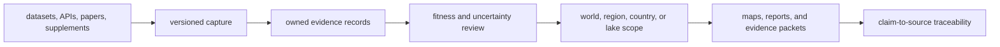

# Product Boundary

Bijux Pollenomics is an evidence publication system. It acquires heterogeneous
scientific and geographic sources, preserves their identities and limitations,
creates repository-owned evidence records, and derives scoped maps and reports
from the admitted subset.

The product is the accountable chain, not only the final visualization.

## Product Responsibilities

| Responsibility | Durable result |
| --- | --- |
| acquisition | identifiable source material with retrieval and version context |
| normalization | stable fields and identifiers without invented precision |
| evidence review | explicit locality, chronology, coordinate, ambiguity, and comparability posture |
| publication | governed membership, geography, labels, and caveats |
| accountability | a reverse path from a visible feature to its governing evidence and source |

These responsibilities stay together because a polished output without its
capture and review lineage cannot support a consequential scientific claim.

## Scientific Scope

Pollen and environmental archaeology provide palaeoenvironmental context.
Boundaries and hydrography frame geography. AADR supplies versioned human
ancient-DNA metadata. Animal ancient DNA is recovered from papers,
supplements, and project archives into sample-owned evidence. Field
observations and Sweden lake rankings add direct-visit and decision-support
surfaces without being promoted to universal scientific conclusions.

The domains can coexist in one publication while retaining different units,
coverage, uncertainty, and evidentiary roles.

## Runtime Boundary

`bijux-pollenomics` owns collection, normalization, evidence evaluation, and
publication behavior. The tracked `data/` tree records repository-owned
evidence state; `docs/report/` contains derived publications; validation guards
the contract between them.

The runtime does not turn geographic proximity into causation, process AADR
genotypes, infer missing sample coordinates, or replace field verification.

## Evaluate The Product By Question

| Question | Governing explanation |
| --- | --- |
| What is included and where does the claim boundary stop? | [Repository scope and limits](repository-scope-and-limits.md) |
| How do world, regional, country, and specialized outputs relate? | [Publication scope model](end-state-product-model.md) |
| Which layer owns each operation and artifact? | [Runtime scope and ownership](runtime-scope-and-ownership.md) |
| Which source or evidence record supports a visible claim? | [Data system](../../pollenomics-data/index.md) |
| How should atlas layers and points be interpreted? | [Nordic Evidence Atlas](../../nordic-atlas/index.md) |

Trust increases when the publication, evidence record, and source capture agree.
When they do not, the narrower upstream authority wins and the publication must
be corrected, qualified, or refused.
