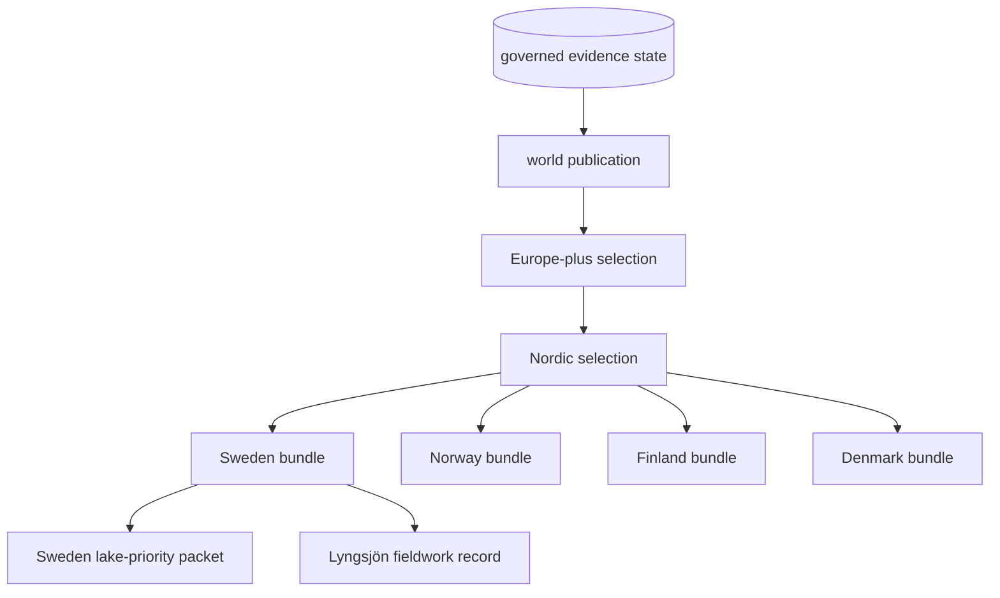
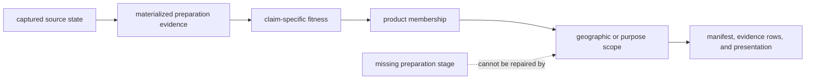
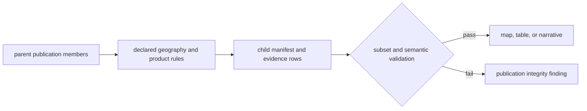

# Publication Scope Model

Bijux Pollenomics publishes one governed evidence state through several
geographic and purpose-specific views. World, Europe-plus, Nordic, country,
lake-ranking, and fieldwork surfaces are related products, not independent
databases with separate truth rules.

“One governed evidence state” means one authority chain, not one homogeneous
table. Source families retain different observation units, lifecycle
materialization, precision, and claim roles. Publication composes eligible
members while preserving those differences.

## Geographic Lineage

The arrows mean governed derivation, not increasing evidence strength. A
narrower geography selects records and context appropriate to its scope; it
cannot acquire a more precise locality, stronger chronology, or better source
lineage merely by being closer to the reader's question.

## Publication Is Downstream Selection

Selection answers whether an eligible record belongs in a declared product.
It does not certify collection completeness, create a normalized artifact, or
supply a review record that the evidence lifecycle does not contain. If a
publication member depends on a family with a narrower materialized lifecycle,
the product must preserve that limit in its role, caveat, and traceability.

## Scope Responsibilities

| Scope | Primary reader question | Governing responsibility | Important limit |
| --- | --- | --- | --- |
| world | what is the broadest shared publication posture? | parent membership, common layers, and global caveats | source density and maturity remain uneven |
| Europe-plus | how does European evidence relate to the broader surface? | regional selection and traceability back to world | not a separate European database |
| Nordic | what evidence and context are available across the Nordic region? | Nordic membership, cross-country comparison, and regional review | RAÄ and SVAR remain Sweden-specific inputs |
| country | which admitted records, citations, and warnings belong to one nation? | filtered descendant bundle with country scope reasons | absence can reflect scope, recovery, or refusal |
| lake priority | which Swedish lakes rank under declared evidence and sensitivity rules? | decision-support inputs, weights, ranking, and caveats | not a fieldwork or sampling instruction |
| fieldwork | what was observed during one situated visit? | date, place, observations, and evidence boundary | not representative lake or regional coverage |

## Subset Invariants

A child publication is trustworthy only when it preserves these relationships:

1. every child member resolves to governed evidence and an admitted parent
   lineage;
2. geographic filtering records why a member is included or excluded;
3. identifiers, evidence roles, spatial precision, and temporal posture do not
   change meaning between scopes;
4. country and specialized packets retain citations, warnings, and relevant
   refusal evidence; and
5. a rendered map or narrative never overrides the bundle manifest and
   evidence rows that govern membership.

Subset validation is stronger than checking coordinates against a bounding
box. It also verifies that the child's evidence identity and interpretation
remain compatible with its parent and governing data.

## Specialized Products Remain Attached

The Sweden lake-priority packet combines SVAR lake identity with available
pollen, archaeology, aDNA, and contextual evidence under declared ranking and
sensitivity rules. It remains attached to the Sweden and Nordic publication
lineage because its inputs and caveats come from the same governed state.

The Lyngsjön fieldwork record is different again: it preserves evidence from a
specific visit. It can inform interpretation of one candidate but does not
retroactively validate the ranking model or establish general site
suitability.

## Choose The Narrowest Sufficient Scope

- use the world surface for the broadest inventory and shared posture;
- use Europe-plus when European context matters beyond the Nordic selection;
- use Nordic for regional comparison and Nordic contextual layers;
- use a country bundle for national membership, citations, and warnings;
- use the lake-priority packet for declared Swedish decision support; and
- use the fieldwork record for claims about the documented visit itself.

Choosing a narrower scope improves relevance, not authority. Consequential
claims still resolve through the publication member to the governing evidence
and captured source.

### Absence Has More Than One Cause

When a record does not appear in a child product, inspect its governed state
before interpreting the omission:

| Cause | Meaning |
| --- | --- |
| outside geography or purpose | valid evidence is irrelevant to this scope |
| source not captured or recovered | the repository cannot yet account for the candidate record |
| preparation stage absent | the family lacks a materialized artifact required by the claim |
| evidence unresolved | identity, locality, chronology, coordinates, or role remain insufficient |
| product refusal | known evidence does not satisfy the declared admission rule |

Only the first is ordinary scope filtering. None is evidence of biological or
archaeological absence.

## Inspect The Contract

Each geographic family publishes a manifest or publication contract,
point-traceability surface, scientific review, and associated caveats. Read
those beside the visible map. The [publication guide](../../pollenomics-data/publications/index.md)
describes bundle authority, while [provenance and publication linkage](../../pollenomics-data/overview/provenance-and-publication-linkage.md)
shows how one member resolves back to its source.
