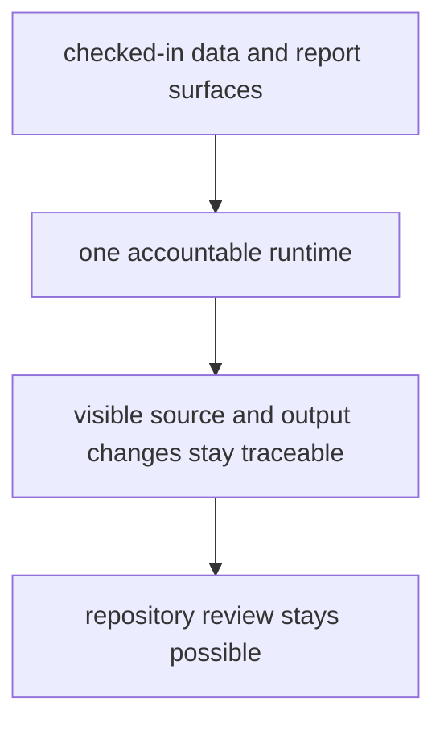

# Repository Scope and Limits

This repository is broader than one map layer and narrower than a finished
cross-evidence pollenomics platform.

It is broad because it brings together multiple evidence families: pollen
context, environmental archaeology, administrative and spatial boundaries,
fieldwork documentation, and animal ancient DNA. It is narrow because those
families are not yet equally mature, and because the repository still refuses
to pretend that visible output automatically means complete scientific support.

The runtime belongs here because the repository needs one accountable rebuild
path for those outputs. The runtime does not justify itself by being
complicated. It justifies itself by making changes easier to trace, inspect,
and challenge.

## Scope Model

The runtime earns its place only while it keeps pollen context, environmental
context, archaeology context, and aDNA context more reviewable than an ad hoc
script pile would.

## Why The Split Exists

- command entrypoints stay explicit instead of living in ad hoc shell history
- collection, normalization, and publication can be verified as one product
  surface
- visible atlas and report changes can be traced back to one owned rebuild path
- cross-domain evidence families can stay connected without collapsing into a
  single map-only story

## What The Repository Does Not Claim

- it does not claim that every visible map point is backed by equally strong
  evidence
- it does not claim that the current animal aDNA slice already represents a
  finished pollenomics engine
- it does not claim that public-facing outputs can be trusted without checking
  the tracked files that support them
- it does not claim that presentation polish is the same thing as scientific
  completeness

## First Places To Check

- `packages/bijux-pollenomics/src/bijux_pollenomics/`
- `packages/bijux-pollenomics/tests/`
- `data/`
- `docs/report/`

## Boundary Test

If the runtime stops making visible evidence changes easier to trace and review,
the package split is no longer earning its place in the repository.
