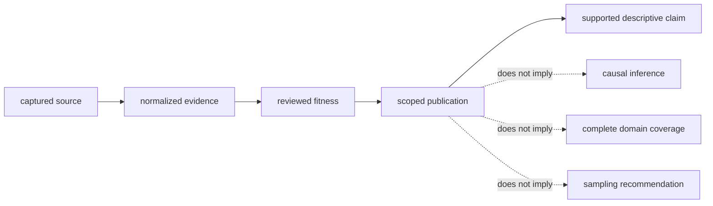
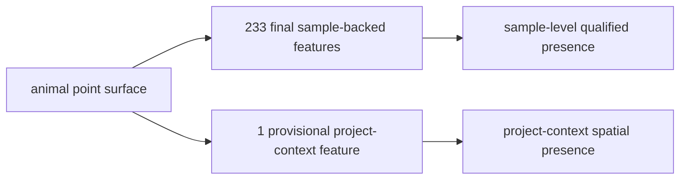
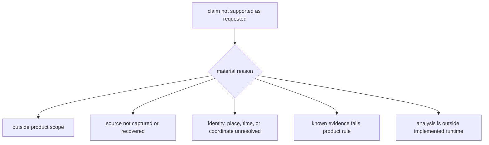

# Repository Scope and Limits

The repository is broader than a map application and narrower than an
integrated scientific inference platform. Its current product mode is an atlas
builder backed by governed acquisition, evidence curation, review, heuristic
ranking, publication, and traceability across several uneven source families.

This boundary prevents two opposite errors. Calling the repository “only a
map” ignores the database, refusal records, release reviews, and reproducible
publication pipeline. Calling it a finished evidence engine promotes planned
harmonization and interpretation work into a capability the runtime does not
yet own.

## Implemented Runtime And Project Direction

| Surface | Status | Defensible statement |
| --- | --- | --- |
| source collection and normalization | implemented | the runtime captures named source families and writes governed raw and normalized state |
| atlas and country publication | implemented | the runtime assembles scoped bundles, reports, and maps from admitted evidence |
| candidate ranking | implemented with a heuristic claim ceiling | declared features and scenarios produce reviewable decision-support artifacts |
| multi-evidence harmonization runtime | planned | no current public contract performs general cross-domain harmonization |
| evidence-aware interpretation engine | planned | no current public contract produces general scientific interpretation or causal inference |
| workflow replay and diff execution | planned | individual builds are reproducible, but a general replay-and-diff engine is not a current surface |

The machine-readable authority for this distinction is the product and surface
scope returned by the Python facade and the `product-scope` and `surface-map`
commands. Narrative descriptions cannot expand that executable contract.

## Evidence Domains

| Domain | Repository role | Important boundary |
| --- | --- | --- |
| LandClim and Neotoma | pollen and palaeoenvironmental context | source coverage and temporal resolution remain family-specific |
| SEAD and RAÄ | environmental-archaeology and heritage context | contextual density is not sample evidence |
| boundaries and SMHI SVAR | geographic scope and lake identity | framing does not establish scientific association |
| AADR | versioned human ancient-DNA metadata | genotype processing is not implemented |
| animal ancient DNA | sample, locality, chronology, coordinate, and citation evidence | exact publication requires sample-owned support |
| fieldwork | direct record of a specific visit | a visit does not establish general site suitability |

## Claim Boundary

```mermaid
flowchart LR
    Captured["captured source"] --> Normalized["normalized evidence"]
    Normalized --> Reviewed["reviewed fitness"]
    Reviewed --> Published["scoped publication"]
    Published --> Supported["supported descriptive claim"]
    Published -. does not imply .-> Causal["causal inference"]
    Published -. does not imply .-> Complete["complete domain coverage"]
    Published -. does not imply .-> Recommendation["sampling recommendation"]
```

The runtime can establish which records were acquired, how they were
normalized, whether they met a publication rule, and where they appear. It
cannot make unlike evidence commensurate merely by placing it on the same map.

## Publication Claims

The repository can support claims such as:

- a named source family was captured at a declared version or retrieval state;
- a published feature belongs to a governed product scope;
- an admitted animal point has the identity, locality, coordinate, and
  qualification required by its declared point class;
- a lake appears in a stated ranking scenario using declared inputs;
- a record was excluded because a required evidence dimension was unresolved.

It does not claim that every domain is equally complete, that proximity proves
temporal overlap, that every country has equivalent source coverage, or that a
ranked lake is ready for sampling.

### One Point Layer, Two Claim Classes

The current animal point surface illustrates the repository boundary:

| Class | Members | Supported statement | Unsupported promotion |
| --- | ---: | --- | --- |
| final sample-backed | 233 | these product members resolve to directly extracted final sample identities and supplementary coordinates | the tracked project or species collection is complete |
| provisional project context | 1 | the Wadi Halfa feature retains paper-backed place context and an approximate geocode | a source-native sample row was recovered or the excavation coordinate is exact |

Both can be visible because visibility follows a declared point class. A
sample-count analysis cannot treat them as the same observation unit. The
stronger analysis uses only final samples or records a separate context class
and its effect on the result.

```mermaid
flowchart LR
    Layer["animal point surface"] --> Samples["233 final sample-backed features"]
    Layer --> Context["1 provisional project-context feature"]
    Samples --> SampleClaim["sample-level qualified presence"]
    Context --> ContextClaim["project-context spatial presence"]
```

## Match The Claim To The Surface

| Intended claim | Sufficient starting surface | Required follow-up |
| --- | --- | --- |
| a record appears in a geographic product | product manifest and evidence row | governing evidence identity and scope reason |
| a point has defensible coordinates | point traceability and coordinate posture | locality evidence and coordinate provenance |
| two records are temporally comparable | temporal-semantics payloads | original chronology, bounds, evidence class, and caveats |
| a lake ranked under one scenario | ranking table and manifest | feature inputs, weights, sensitivity, and missing evidence |
| a source family was captured reproducibly | collection summary and family contract | retrieval metadata, hashes, replacement behavior, and review state |
| evidence is absent from a publication | exclusion, warning, or recovery surface | distinguish scope, refusal, unresolved evidence, and non-capture |

A screenshot, popup, or summary count can orient a reader but is insufficient
for a sample-level, temporal, or decision-support claim without its governing
follow-up.

## Limits Are Typed Outcomes

```mermaid
flowchart TD
    Missing["claim not supported as requested"] --> Cause{"material reason"}
    Cause --> Scope["outside product scope"]
    Cause --> Capture["source not captured or recovered"]
    Cause --> Evidence["identity, place, time, or coordinate unresolved"]
    Cause --> Contract["known evidence fails product rule"]
    Cause --> Capability["analysis is outside implemented runtime"]
```

These outcomes are not interchangeable. A scope exclusion can be answered by
a different product; a recovery gap requires source work; an evidence gap
requires stronger support; a contract refusal protects against overclaim; and
an unimplemented analysis requires a new governed capability.

## Accountability Test

A capability belongs in this repository when its inputs, transformations,
review decision, and published result can be inspected together. If a result
depends on private scripts, untracked corrections, inferred precision, or an
unrecorded eligibility decision, it is outside the trustworthy product
boundary until that lineage is made explicit.

Continue with [runtime scope and ownership](runtime-scope-and-ownership.md) for
implementation ownership or the [data system](../../pollenomics-data/index.md)
for source and evidence contracts.
