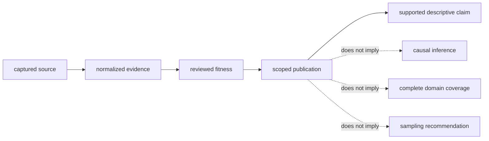

# Repository Scope and Limits

The repository is broader than a map application and narrower than an
integrated scientific inference platform. Its implemented strength is governed
acquisition, evidence curation, publication, and traceability across several
uneven source families.

## Evidence Domains

| Domain | Repository role | Important boundary |
| --- | --- | --- |
| LandClim and Neotoma | pollen and palaeoenvironmental context | source coverage and temporal resolution remain family-specific |
| SEAD and RAÄ | environmental-archaeology and heritage context | contextual density is not sample evidence |
| boundaries and SMHI SVAR | geographic scope and lake identity | framing does not establish scientific association |
| AADR | versioned human ancient-DNA metadata | genotype processing is not implemented |
| animal ancient DNA | sample, locality, chronology, coordinate, and citation evidence | exact publication requires sample-owned support |
| fieldwork | direct record of a specific visit | a visit does not establish general site suitability |

## Claim Boundary

```mermaid
flowchart LR
    Captured["captured source"] --> Normalized["normalized evidence"]
    Normalized --> Reviewed["reviewed fitness"]
    Reviewed --> Published["scoped publication"]
    Published --> Supported["supported descriptive claim"]
    Published -. does not imply .-> Causal["causal inference"]
    Published -. does not imply .-> Complete["complete domain coverage"]
    Published -. does not imply .-> Recommendation["sampling recommendation"]
```

The runtime can establish which records were acquired, how they were
normalized, whether they met a publication rule, and where they appear. It
cannot make unlike evidence commensurate merely by placing it on the same map.

## Publication Claims

The repository can support claims such as:

- a named source family was captured at a declared version or retrieval state;
- a published feature belongs to a governed product scope;
- an admitted animal point has sample-owned locality and coordinate evidence;
- a lake appears in a stated ranking scenario using declared inputs;
- a record was excluded because a required evidence dimension was unresolved.

It does not claim that every domain is equally complete, that proximity proves
temporal overlap, that every country has equivalent source coverage, or that a
ranked lake is ready for sampling.

## Accountability Test

A capability belongs in this repository when its inputs, transformations,
review decision, and published result can be inspected together. If a result
depends on private scripts, untracked corrections, inferred precision, or an
unrecorded eligibility decision, it is outside the trustworthy product
boundary until that lineage is made explicit.

Continue with [runtime scope and ownership](runtime-scope-and-ownership.md) for
implementation ownership or the [data system](../../pollenomics-data/index.md)
for source and evidence contracts.
