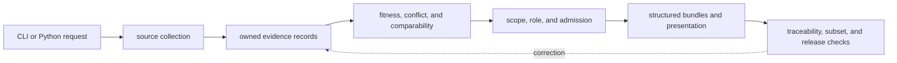

# Runtime Scope And Ownership

`bijux-pollenomics` is the canonical runtime that turns explicit source and
repository inputs into governed data, review, ranking, and publication
artifacts. Ownership follows scientific meaning: collection owns acquisition,
evidence modules own normalized claims, review owns fitness, product contracts
own membership, and reporting owns presentation.

## Runtime Boundaries

The arrow into publication carries admitted evidence and declared roles. It
does not transfer upstream fact ownership to the report writer. A correction
starts at the earliest governing record and then regenerates its descendants.

## Ownership Map

| Runtime boundary | Owns | Durable result |
| --- | --- | --- |
| `data_downloader` and `adna.sources` | retrieval, decoding, source identity, and captured artifacts | versioned family trees and animal source dossiers |
| `adna.projects` and normalization modules | stable samples, sites, chronology, coordinates, and family records | repository-owned evidence state |
| `evidence` and `analysis.review` | ambiguity, precision, comparability, recovery, and refusal | review ledgers and fitness outcomes |
| `foundation` and analysis modules | product scope, evidence role, admission, ranking, and sensitivity policy | machine-readable product and decision contracts |
| `reporting` assembly | member relationships, bundles, and structured public rows | world, regional, country, and specialized product state |
| `reporting` presentation | Markdown, HTML, tables, maps, and reader navigation | derived human-facing artifacts |

The tracked `data/` tree is governed evidence state. `docs/report/` contains
derived publication and accountability state. Public guides explain how to
read those artifacts; they do not become a third database.

## Command Semantics

Commands fall into two operational classes:

| Class | Representative commands | Contract |
| --- | --- | --- |
| orientation | `product-scope`, `surface-map`, `ownership-map`, `source-support`, `adna-species` | read declared capabilities without rebuilding governed state |
| state-changing | `collect-data`, `refresh-animal-adna-foundation`, `publish-reports` | consume explicit roots, write governed artifacts, and require semantic review |

A successful process exit means software execution completed. It does not mean
every requested scientific claim passed. State-changing operations can
legitimately emit qualified results, empty admitted subsets, exclusions, or a
release refusal while returning successful execution.

## Operation Evidence Packet

A reproducible runtime result includes:

1. command or API identity and explicit arguments;
2. governed input roots and source or product version;
3. software outcome and diagnostics;
4. written manifest and artifact membership;
5. semantic changes to identities, fields, precision, or membership;
6. admitted, qualified, excluded, and unresolved outcomes; and
7. focused verification against the affected contract.

Terminal output alone cannot prove what entered a product. Generated files
without invocation and input identity cannot prove how they were produced.

## Adjacent Packages

| Distribution | Responsibility | Boundary |
| --- | --- | --- |
| `bijux-pollenomics` | canonical scientific and publication runtime | owns schemas, commands, evidence rules, and outputs |
| `pollenomics` | short executable and import compatibility | forwards to the canonical runtime; owns no scientific fork |
| `bijux-pollenomics-dev` | repository-only documentation, validation, and release support | must not own public runtime behavior or scientific truth |

Repository workflow policy can decide when to run the runtime, but it cannot
change evidence meaning. Public documentation can explain an output, but it
cannot admit a record. The compatibility package can rename an entry point,
but it cannot produce a distinct schema or scientific result.

## Explicit Limits

The runtime does not:

- process AADR genotype data;
- infer missing sample coordinates or chronology from nearby records;
- treat map proximity as temporal overlap or causation;
- turn archaeology density, boundaries, or lake identity into direct evidence;
- certify access, bathymetry, permits, or coring suitability; or
- make every tracked source record eligible for publication.

Continue to [evidence engine capabilities](evidence-engine-capabilities.md),
[repository scope and limits](repository-scope-and-limits.md), and the
[runtime architecture](../architecture/runtime-system-model.md).
