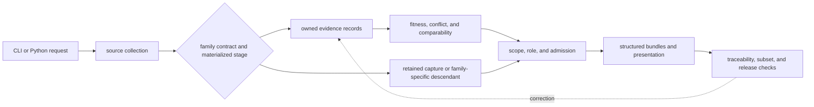
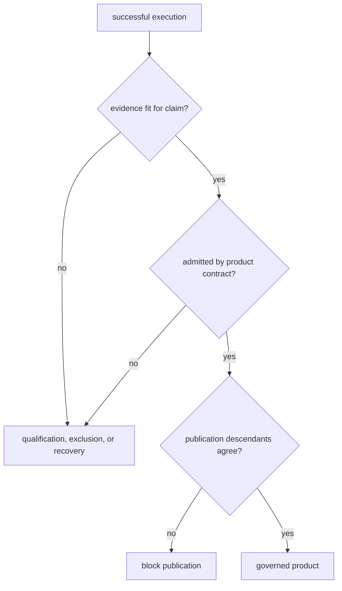

# Runtime Scope And Ownership

`bijux-pollenomics` is the canonical runtime that turns explicit source and
repository inputs into governed data, review, ranking, and publication
artifacts. Each family materializes only the stages its current contract owns;
a downstream product does not prove that an absent normalized or review
artifact exists. Ownership follows scientific meaning: collection owns
acquisition, evidence modules own normalized claims, review owns fitness,
product contracts own membership, and reporting owns presentation.

## Domain Language

| Term | Meaning in this runtime | Common misreading |
| --- | --- | --- |
| capture | retained upstream material plus retrieval identity | evidence already fit for a claim |
| governed record | repository-owned identity and claim representation with source lineage | a generic row whose columns are self-authoritative |
| review | claim- and use-specific evaluation of fitness, precision, conflict, or recovery | a universal quality score |
| admission | decision that one governed record belongs to one product scope and role | proof that every claim on the record is analytically comparable |
| publication | manifested members, warnings, traceability, and renderings | a new source of scientific facts |
| refusal | durable result that preserves why a stronger claim or representation is unsupported | missing work that may be discarded |

These terms name ownership transitions. “Collected,” “reviewed,” and
“published” are not interchangeable maturity badges, and a later state never
retroactively supplies an earlier missing authority.

## Lifecycle And Surface Map

The arrow into publication carries admitted evidence and declared roles. It
does not transfer upstream fact ownership to the report writer. A correction
starts at the earliest governing record and then regenerates its descendants.
The direct path is not a shortcut around scientific review; it makes the
current family-specific lifecycle observable. Claims that require a missing
stage remain unavailable until that stage is governed and materialized.

## Ownership Boundary And Map

| Runtime boundary | Owns | Durable result |
| --- | --- | --- |
| `data_downloader` and `adna.sources` | retrieval, decoding, source identity, and captured artifacts | versioned family trees and animal source dossiers |
| `adna.projects` and normalization modules | stable samples, sites, chronology, coordinates, and family records | repository-owned evidence state |
| `evidence` and `analysis.review` | ambiguity, precision, comparability, recovery, and refusal | review ledgers and fitness outcomes |
| `foundation` and analysis modules | product scope, evidence role, admission, ranking, and sensitivity policy | machine-readable product and decision contracts |
| `reporting` assembly | member relationships, bundles, and structured public rows | world, regional, country, and specialized product state |
| `reporting` presentation | Markdown, HTML, tables, maps, and reader navigation | derived human-facing artifacts |

The tracked `data/` tree is governed evidence state. `docs/report/` contains
derived publication and accountability state. Public guides explain how to
read those artifacts; they do not become a third database.

An ownership boundary is crossed only through a declared contract. Repeating
a chronology in a popup does not transfer chronology ownership to the popup;
calling a collector from the CLI does not transfer source-family semantics to
the command parser. Corrections begin at the earliest authority and flow
forward through typed descendants.

## Capability Map

| Capability | Current owner | Current result | Claim ceiling |
| --- | --- | --- | --- |
| source collection | family collectors and animal source intake | versioned captures, metadata, hashes, and source dossiers | capture presence, not scientific fitness |
| evidence preparation | family normalization and animal evidence modules | stable records, relations, provenance, and unresolved states | represented meaning, not automatic product admission |
| scientific review | evidence and analysis review modules | conflicts, precision, comparability, recovery, and refusal | the declared claim and use only |
| product assembly | product contracts and reporting assembly | world, regional, country, lake, and fieldwork membership | manifested members within one scope |
| presentation | reporting renderers | maps, tables, Markdown, and HTML | faithful rendering of admitted state |
| repository verification | maintainer package and focused tests | contract findings and release stops | agreement for the checked boundary, not new scientific authority |

The map describes implemented owners. General multi-evidence harmonization,
evidence-aware interpretation, and workflow replay remain outside the current
runtime capability boundary even where the repository contains design
direction for them.

## Command Semantics

Commands fall into two operational classes:

| Class | Representative commands | Contract |
| --- | --- | --- |
| orientation | `product-scope`, `surface-map`, `ownership-map`, `source-support`, `adna-species` | read declared capabilities without rebuilding governed state |
| state-changing | `collect-data`, `refresh-animal-adna-foundation`, `publish-reports` | consume explicit roots, write governed artifacts, and require semantic review |

A successful process exit means software execution completed. It does not mean
every requested scientific claim passed. State-changing operations can
legitimately emit qualified results, empty admitted subsets, exclusions, or a
release refusal while returning successful execution.

### Four Success Conditions

| Condition | Question answered | What failure requires |
| --- | --- | --- |
| execution | did the command complete its software contract? | diagnose invocation, input, or runtime failure |
| evidence fitness | do identity, place, time, coordinates, and role support the claim? | recover, qualify, or refuse evidence |
| admission | does the record satisfy the declared product rule? | retain an accountable exclusion or change the governed rule |
| publication integrity | do manifest, evidence rows, traceability, and presentation agree? | block release and regenerate descendants |

No later condition upgrades an earlier one. A map build can be technically
successful while a row remains scientifically unresolved, and a valid
evidence record can remain outside a particular publication scope.

## Operation Evidence Packet

A reproducible runtime result includes:

1. command or API identity and explicit arguments;
2. governed input roots and source or product version;
3. software outcome and diagnostics;
4. written manifest and artifact membership;
5. semantic changes to identities, fields, precision, or membership;
6. admitted, qualified, excluded, and unresolved outcomes; and
7. focused verification against the affected contract.

Terminal output alone cannot prove what entered a product. Generated files
without invocation and input identity cannot prove how they were produced.

## Dependencies And Adjacencies

| Distribution | Responsibility | Boundary |
| --- | --- | --- |
| `bijux-pollenomics` | canonical scientific and publication runtime | owns schemas, commands, evidence rules, and outputs |
| `pollenomics` | short executable and import compatibility | forwards to the canonical runtime; owns no scientific fork |
| `bijux-pollenomics-dev` | repository-only documentation, validation, and release support | must not own public runtime behavior or scientific truth |

Repository workflow policy can decide when to run the runtime, but it cannot
change evidence meaning. Public documentation can explain an output, but it
cannot admit a record. The compatibility package can rename an entry point,
but it cannot produce a distinct schema or scientific result.

Dependencies used for coordinate transformation, safe XML processing,
serialization, or rendering supply mechanics. They do not own the repository's
source roles, claim precision, or admission policy. An adjacency becomes a
product dependency only through a named interface and an explicit transfer of
typed data—not because both systems can read the same file format.

## Change Principles

1. Change a fact at its earliest governing record, then regenerate declared
   descendants.
2. Preserve source-native identity and wording before normalizing shape.
3. Keep collection, fitness, admission, and rendering as separate decisions.
4. Prefer a qualified or refused result to invented precision or silent loss.
5. Require explicit roots for operations that read or replace governed state.
6. Treat manifests, exclusions, warnings, and traceability as one publication
   contract.
7. Expand the runtime only through a durable owner, typed boundary, and
   focused proof.

These principles keep a correction local to its authority while still making
its publication impact visible. They also prevent compatibility adapters,
workflow routers, and renderers from becoming accidental scientific owners.

## Explicit Limits

The runtime does not:

- process AADR genotype data;
- infer missing sample coordinates or chronology from nearby records;
- treat map proximity as temporal overlap or causation;
- turn archaeology density, boundaries, or lake identity into direct evidence;
- certify access, bathymetry, permits, or coring suitability; or
- make every tracked source record eligible for publication.

Continue to [evidence engine capabilities](evidence-engine-capabilities.md),
[repository scope and limits](repository-scope-and-limits.md), and the
[runtime architecture](../architecture/runtime-system-model.md).
