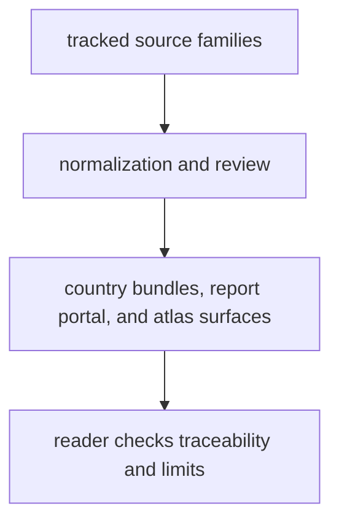

# Bijux Pollenomics Product Guide

`bijux-pollenomics` is the product guide for the repository's public evidence.
It explains how the repository takes several different evidence families, keeps
their provenance visible, and publishes them as reviewable data files, report
bundles, and map surfaces.

The central idea is straightforward. This repository is not only a codebase and
not only a map website. It is a rebuildable evidence system. It collects and
normalizes pollen context, environmental archaeology, boundaries, fieldwork
material, and animal ancient-DNA evidence, then writes public outputs that a
reader can inspect under `data/` and `docs/report/`.

This guide exists so a new reader can understand that system without needing to
read the source code first, without already knowing the package tree, the make
targets, or the internal module names.

It is written so readers can understand the repository without needing to read the source code first.

  <a class="md-button md-button--primary" href="../../index.md">Open the documentation home</a>
  <a class="md-button" href="foundation/">What this repository is for</a>
  <a class="md-button" href="architecture/">How evidence becomes outputs</a>
  <a class="md-button" href="interfaces/">Commands and public contracts</a>
  <a class="md-button" href="operations/">Install and rebuild</a>
  <a class="md-button" href="quality/">Checks and current limits</a>

## What You Can Learn Here

- what the repository is trying to publish, not just what code it happens to
  contain
- how tracked source material becomes reviewable outputs under `data/` and
  `docs/report/`
- which command and file boundaries are meant to stay stable for readers and
  operators
- where the current evidence is strong, where it is still partial, and why the
  project refuses stronger language in those weaker areas
- where to go next if your question is about provenance, publication, atlas
  interpretation, rebuild workflows, or release limits

## Publication Loop

## Start Here

- start with [foundation](foundation/index.md) if you want the broadest answer:
  what this repository is for, what it is not for, and how far the current
  product honestly goes
- move to [architecture](architecture/index.md) if your question is how one
  source file or one evidence row eventually becomes a report, bundle, or map
- use [interfaces](interfaces/index.md) if you want the public runtime surface:
  commands, file contracts, durable APIs, and example entrypoints
- use [operations](operations/index.md) if you want the practical rebuild path:
  install, verify, refresh data, publish reports, and recover from failure
- use [quality](quality/index.md) if you want to judge whether current outputs
  are strong enough for the claim being made

## Routes By Question

- what do you publish, and what do you still refuse to claim:
  [repository scope and limits](foundation/repository-scope-and-limits.md)
- how does source material become visible data and report outputs:
  [runtime system model](architecture/runtime-system-model.md)
- what commands do I actually run for inspection, rebuilds, and checks:
  [entrypoints and examples](interfaces/entrypoints-and-examples.md)
- how do I follow the common rebuild paths without getting lost in internal
  tooling:
  [common workflows](operations/common-workflows.md)
- how do I judge whether a surface is reviewable, publishable, or still too
  weak for a stronger claim:
  [runtime invariants and limits](quality/runtime-invariants-and-limits.md)

## What This Guide Covers

- the product shape of the runtime
- the architecture that turns governed evidence into governed outputs
- the public command and file contracts a reader can inspect
- the operational route for rebuilding and checking the repository
- the quality rules that keep visible output language honest

## What This Guide Does Not Assume

- that the reader already knows the repository layout
- that every visible output has the same scientific strength
- that the current animal ancient-DNA slice already equals a finished
  pollenomics engine
- that maintainer-only rules belong on the public product surface
