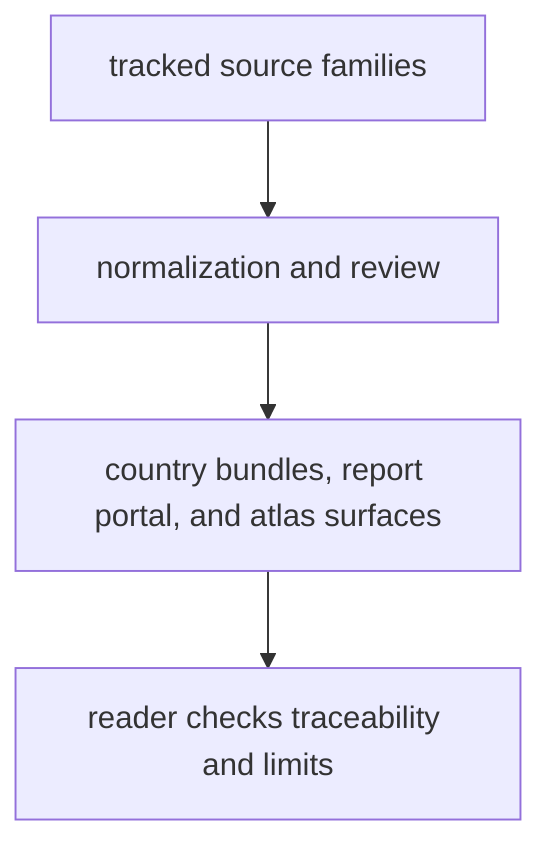

# Bijux Pollenomics Product Guide

`bijux-pollenomics` is the public guide to the repository as a product, not
just as a codebase. It explains what the repository publishes today, why those
outputs exist, how far they can be trusted, and where a reader should go when a
map, report, or evidence file raises a bigger question.

The central idea is simple. This repository rebuilds one governed evidence
system, then publishes several reader-facing cuts from that same state. Pollen
context, environmental archaeology, boundary framing, fieldwork records, and
animal ancient-DNA recovery all live in one repository, but they do not all
carry the same scientific weight. The guide exists to keep those differences
clear.

Use this handbook when your first question is not "which module owns this,"
but:

- what this repository is actually for
- what I can use from it right now
- what kind of question each output can answer
- what the current limits are before I rely on a public map, report, or data file

  <a class="md-button md-button--primary" href="../../index.md">Open the documentation home</a>
  <a class="md-button" href="foundation/">What this repository is for</a>
  <a class="md-button" href="architecture/">How evidence becomes outputs</a>
  <a class="md-button" href="interfaces/">Commands and public contracts</a>
  <a class="md-button" href="operations/">Install and rebuild</a>
  <a class="md-button" href="quality/">Checks and current limits</a>

## What This Guide Helps You Do

- understand the product shape before reading package names or command syntax
- decide whether you need the visible public answer, the narrower evidence
  chain, or the rebuild workflow behind it
- tell which surfaces are mature public context and which remain partial or
  recovery-heavy
- move from a big reader question to the right page quickly instead of
  wandering through internal terminology

## Publication Loop

## What Readers Usually Want To Know First

- what the repository already publishes with confidence:
  pollen context, environmental archaeology context, boundary framing, and
  governed report bundles
- what remains visibly partial:
  animal ancient-DNA recovery and the claims that depend on deeper sample
  extraction
- how to use the product without overstating it:
  start with public outputs for orientation, then drop to evidence and review
  surfaces when a claim matters
- how this can grow to more countries and more regions:
  the world, Europe-plus, Nordic, and country outputs are meant to be one
  expansion model, not separate products

## Start Here

- start with [foundation](foundation/index.md) if you need the product answer:
  what this repository is for, what it refuses to claim, and why
- move to [architecture](architecture/index.md) if you need the lifecycle
  answer: how evidence becomes reviewable files, reports, and maps
- use [interfaces](interfaces/index.md) if you need the runtime answer: which
  commands, files, and contracts are meant to stay stable
- use [operations](operations/index.md) if you need the practical answer: how
  to install, verify, rebuild, and recover locally
- use [quality](quality/index.md) if you need the trust answer: what the
  current checks, limits, and refusal rules actually say

## Routes By Question

- what does this repository publish, and what does it still refuse to claim:
  [repository scope and limits](foundation/repository-scope-and-limits.md)
- how does source material become visible data, reports, and map surfaces:
  [runtime system model](architecture/runtime-system-model.md)
- what commands do I actually run for inspection, rebuilds, and checks:
  [entrypoints and examples](interfaces/entrypoints-and-examples.md)
- how do I follow common rebuild paths without getting lost in internal
  tooling:
  [common workflows](operations/common-workflows.md)
- how do I judge whether a surface is reviewable, publishable, or still too
  weak for a stronger claim:
  [runtime invariants and limits](quality/runtime-invariants-and-limits.md)
- where do the public data explanations live if I care more about evidence than
  code:
  [data handbook](../pollenomics-data/index.md)

## What This Guide Covers

- the product shape of the runtime
- the architecture that turns governed evidence into governed outputs
- the public command and file contracts a reader can inspect
- the operational route for rebuilding and checking the repository
- the quality rules that keep visible output language honest

## What This Guide Does Not Promise

- that the reader already knows the repository layout
- that every visible output has the same scientific strength
- that the current animal ancient-DNA slice already equals a finished
  pollenomics engine
- that maintainer-only rules belong on the public product surface
