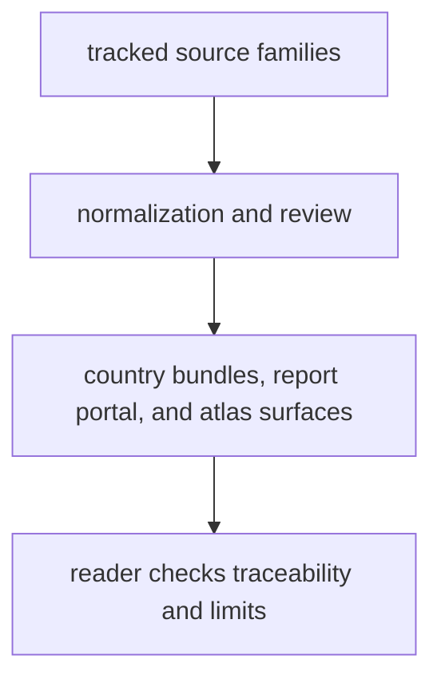

# Bijux Pollenomics Product Guide

`bijux-pollenomics` is the product guide for the repository's public evidence
system. It explains how pollen context, environmental archaeology, boundaries,
fieldwork records, and animal ancient DNA are turned into reviewable data
files, country bundles, and map-facing report surfaces.

The goal of this guide is simple: a reader should understand what the
repository publishes, how those outputs are rebuilt, and what the current
limits still are without needing to read the source code first.

  <a class="md-button md-button--primary" href="../../index.md">Open the documentation home</a>
  <a class="md-button" href="foundation/">What this repository is for</a>
  <a class="md-button" href="architecture/">How evidence becomes outputs</a>
  <a class="md-button" href="interfaces/">Commands and public contracts</a>
  <a class="md-button" href="operations/">Install and rebuild</a>
  <a class="md-button" href="quality/">Checks and current limits</a>

## What You Can Learn Here

- what the repository is trying to publish, not just what code it contains
- how tracked source material becomes reviewable outputs under `data/` and
  `docs/report/`
- which commands are part of the stable rebuild path
- how to interpret the current limits without overstating the animal aDNA slice
- where to go next if your question is about data provenance, fieldwork, atlas
  behavior, or repository maintenance

## Publication Loop

## Start Here

- why the repository exists and where it stops:
  [foundation](foundation/index.md)
- how evidence becomes visible outputs:
  [architecture](architecture/index.md)
- which commands and files are part of the public contract:
  [interfaces](interfaces/index.md)
- how to install, rebuild, and verify:
  [operations](operations/index.md)
- how confidence is earned and where current limits still sit:
  [quality](quality/index.md)

## Routes By Question

- what do you publish and what do you refuse to claim:
  [repository scope and limits](foundation/repository-scope-and-limits.md)
- how do commands become data files and reports:
  [runtime system model](architecture/runtime-system-model.md)
- what commands do I run for rebuilds and checks:
  [entrypoints and examples](interfaces/entrypoints-and-examples.md)
- how do I run the common rebuild paths safely:
  [common workflows](operations/common-workflows.md)
- how do I judge whether the current outputs are strong enough:
  [runtime invariants and limits](quality/runtime-invariants-and-limits.md)

## What This Package Owns

- the rebuild path from tracked source material to public report and map
  surfaces
- the command entrypoints used to refresh evidence and regenerate outputs
- the normalization and review logic that makes source material comparable
- the publication logic that writes country, regional, and world-facing outputs

## What This Package Does Not Claim

- that the public reader should already know the code layout
- that every visible output has identical evidence quality
- that the current animal aDNA recovery slice already equals a complete
  pollenomics engine
- that repository maintenance rules belong in the product guide
