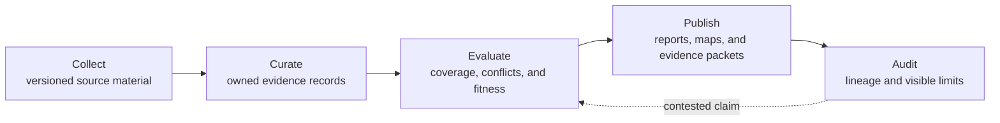
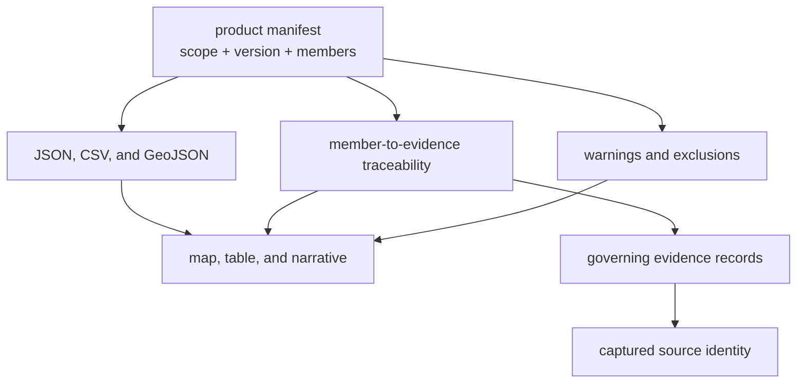
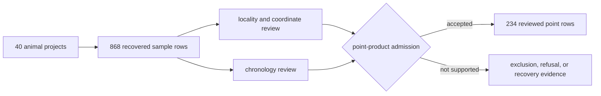
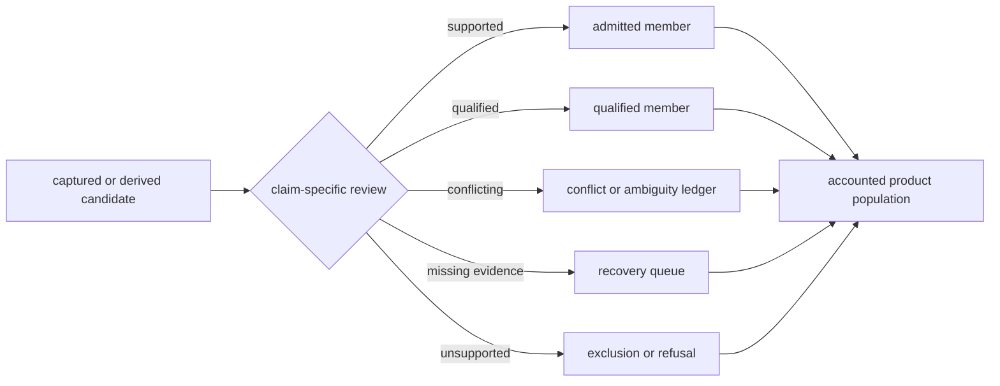
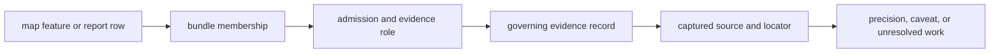

# Bijux Pollenomics

`bijux-pollenomics` turns heterogeneous scientific and spatial sources into a
versioned, reviewable publication system. It collects source material, creates
repository-owned evidence records, exposes uncertainty and conflicts, and
publishes world, regional, country, and lake-oriented views from the same
governed state.

The system keeps unlike evidence unlike. Pollen observations, environmental
archaeology, heritage records, hydrography, administrative boundaries, human
ancient DNA, animal ancient DNA, and field observations may share a map, but
they retain distinct provenance, temporal meaning, spatial precision, and
publication rules.

  <a class="md-button md-button--primary" href="../pollenomics-data/">Explore the evidence system</a>
  <a class="md-button" href="architecture/">Follow the publication flow</a>
  <a class="md-button" href="interfaces/">Use commands and contracts</a>
  <a class="md-button" href="operations/">Install and rebuild</a>
  <a class="md-button" href="quality/">Understand guarantees and limits</a>

## One Repository, Four Responsibilities

```mermaid
flowchart LR
    Collect["Collect\nversioned source material"] --> Curate["Curate\nowned evidence records"]
    Curate --> Evaluate["Evaluate\ncoverage, conflicts, and fitness"]
    Evaluate --> Publish["Publish\nreports, maps, and evidence packets"]
    Publish --> Audit["Audit\nlineage and visible limits"]
    Audit -. contested claim .-> Evaluate
```

| Responsibility | Durable result |
| --- | --- |
| Collection | source identity, retrieval metadata, content hashes, replacement rules, and tracked raw artifacts |
| Curation | normalized records, sample and site linkage, chronology evidence, coordinate provenance, and source-family contracts |
| Evaluation | ambiguity ledgers, scientific reviews, coverage metrics, sensitivity results, and release refusal reasons |
| Publication | consistent world, Europe-plus, Nordic, country, lake, and fieldwork surfaces with traceable inputs |

This division prevents a polished output from becoming its own authority. The
publication layer can select, summarize, and render evidence; it cannot invent
support that the curated state does not contain.

## What The System Decides

Bijux Pollenomics makes bounded, reviewable decisions at named surfaces. It
does not turn every available field into a scientific conclusion.

| Decision | Evidence considered | Result retained |
| --- | --- | --- |
| source admission | upstream identity, access, licence, version, and intended role | selected, recoverable, blocked, or outside scope |
| record identity | source keys, labels, accessions, joins, and ambiguity evidence | stable identity, aliases, unresolved candidates, or refusal to merge |
| claim precision | source wording, locality support, dating basis, coordinates, and provenance | supported precision, qualification, substitution, conflict, or unknown |
| product admission | evidence role, geography, claim fitness, and publication contract | admitted member, qualified member, exclusion, or deferred recovery |
| ranking posture | declared features, weights, scenarios, and sensitivity | decision-support order with stability and field-evidence requirements |

The system does not decide that proximity implies association, that a registry
lake is suitable for coring, that project context is sample evidence, or that
an unresolved date can be made numeric. Those are precisely the shortcuts its
curation and refusal records are designed to prevent.

## A Publication Is A Claim Graph

A report directory is not a bag of equivalent files. The manifest defines the
product and its members; structured rows carry reusable values; traceability
connects members to evidence; warnings and exclusions constrain
interpretation; and HTML or Markdown renders that state for people.

```mermaid
flowchart TB
    Manifest["product manifest<br/>scope + version + members"] --> Rows["JSON, CSV, and GeoJSON"]
    Manifest --> Trace["member-to-evidence traceability"]
    Manifest --> Warnings["warnings and exclusions"]
    Rows --> View["map, table, and narrative"]
    Trace --> View
    Warnings --> View
    Trace --> Evidence["governing evidence records"]
    Evidence --> Source["captured source identity"]
```

The graph matters in both directions. A reader can challenge a visible member
by tracing it upstream. A curator can assess the publication impact of a
changed source or decision by following descendants. A copied map or table
without its manifest and qualifications is therefore an incomplete product.

## What Is Available

- a source collection pipeline for AADR, boundaries, LandClim, Neotoma, RAÄ,
  SEAD, and SMHI SVAR
- repository-owned raw, normalized, reviewed, and published layers described
  by machine-readable contracts
- sample-level animal aDNA curation across project accessions, papers,
  supplements, identities, localities, chronology, coordinates, and species
  views
- world, Europe-plus, Nordic, Sweden, Norway, Finland, and Denmark report
  families derived from shared publication contracts
- candidate-site ranking and sensitivity surfaces, including the Sweden lake
  evidence packet and fieldwork shortlist
- a typed Python API, the `bijux-pollenomics` command, and the compatible
  `pollenomics` command

## Governed State Today

The checked-in state demonstrates all four responsibilities at meaningful
scale. Collection spans seven independently governed source families. The
normalized context includes 492 LandClim site sequences, 200 Neotoma sites,
2,172 SEAD sites, a RAÄ density source representing 761,917 published Swedish
sites, and 40,565 SVAR lakes.

Animal aDNA demonstrates the deeper evidence model. Forty tracked projects
currently contribute 868 recovered sample rows. The public animal point review
admits 234 rows: 233 backed by supplementary-table coordinates and one by a
documented approximate named-site resolution. Only four projects have a
trustworthy expected sample count, so identity recovery is auditable without
being misrepresented as collection completeness.

```mermaid
flowchart LR
    Project["40 animal projects"] --> Sample["868 recovered sample rows"]
    Sample --> Place["locality and coordinate review"]
    Sample --> Time["chronology review"]
    Place --> Admission{"point-product admission"}
    Time --> Admission
    Admission -->|accepted| Point["234 reviewed point rows"]
    Admission -->|not supported| VisibleGap["exclusion, refusal, or recovery evidence"]
```

The funnel is claim-specific rather than a universal quality score. A sample
excluded from exact point publication can remain valid for identity,
project-level inventory, regional context, or future source recovery.

## The Database Preserves Negative Information

A trustworthy evidence database must retain more than admitted rows. Bijux
Pollenomics preserves the states that explain why an apparently plausible
claim was qualified, deferred, or refused:

| Record family | Question it answers | Why it matters |
| --- | --- | --- |
| ambiguity ledger | which candidate identities could not be reconciled? | prevents convenient label matching from becoming identity |
| conflict ledger | which captured claims disagree, and which authority governs? | prevents normalization from erasing source disagreement |
| substitution ledger | where does broader project context stand in for missing sample evidence? | keeps inherited context from appearing sample-owned |
| recovery queue | which source, table, locator, or field is still needed? | turns missingness into an actionable evidence requirement |
| exclusion and refusal surface | why did a known record fail one publication contract? | distinguishes unsupported representation from source absence |
| sensitivity output | how stable is a ranking under declared alternatives? | prevents one ordinal result from masquerading as certainty |

```mermaid
flowchart LR
    Candidate["captured or derived candidate"] --> Review{"claim-specific review"}
    Review -->|supported| Admit["admitted member"]
    Review -->|qualified| Caveat["qualified member"]
    Review -->|conflicting| Conflict["conflict or ambiguity ledger"]
    Review -->|missing evidence| Recovery["recovery queue"]
    Review -->|unsupported| Refusal["exclusion or refusal"]
    Admit --> Account["accounted product population"]
    Caveat --> Account
    Conflict --> Account
    Recovery --> Account
    Refusal --> Account
```

The accounted population is therefore larger than the visible subset. A
publication is trustworthy when every expected candidate can be resolved to a
member, a qualification, an exclusion, an unresolved identity, or a declared
recovery gap—and when those outcomes retain their governing evidence.

This is also why a smaller public atlas can represent deeper work than a
larger unqualified map. Refusal is not discarded effort; it is the stored
result of applying an evidence contract.

## Follow The Question, Not The Rendering

| Question | First surface | Governing follow-up |
| --- | --- | --- |
| Which records are publicly visible for a geography? | world, regional, or country report bundle | bundle manifest and subset validation |
| Why does one animal point appear? | point traceability row | sample record, site evidence, chronology evidence, coordinate provenance, and source lineage |
| Why is an expected point absent? | exclusion or warning surface | recovery queue, conflict ledger, substitution ledger, or release guard |
| What environmental context surrounds a sample or lake? | source-family map layer | source contract and temporal semantics for that family |
| Why does one lake rank above another? | ranking table | ranking manifest, feature inputs, and sensitivity analysis |
| What changed after source collection? | collection summary | source metadata, snapshot hash, normalized hash, and family review |

The first surface locates the answer; the follow-up establishes its authority.
A map is usually the fastest index, while the evidence database is the stronger
surface for a claim about one record.

Absence follows the same rule. A record may be absent because it lies outside
the product geography, lacks claim-specific evidence, remains unresolved, was
excluded by policy, or was never recovered from the source. Only the relevant
scope, exclusion, and recovery records distinguish those meanings.

## Evidence Strength Is Explicit

The current evidence families do not have equal maturity. Pollen and several
environmental context layers have stable collection and publication routes.
Human aDNA uses versioned AADR metadata. Animal aDNA has a deeper curation
model because source papers and supplements often disagree, omit sample-level
fields, or identify only a broad locality.

An animal record can therefore occupy different states:

- source discovered but supporting material incomplete;
- sample identity established but locality or chronology unresolved;
- normalized to a species record but not eligible for exact-point publication;
- admitted to an atlas candidate surface with explicit precision and caveats;
- blocked from publication by a release guard.

These states are meaningful results. A blocked record communicates what is
known, what is missing, and what recovery work would change the decision.

The same principle applies outside animal aDNA. SEAD remains useful archaeology
context even though its current capture lacks numeric time intervals. RAÄ
remains valuable for Swedish density context without becoming Nordic-wide
coverage. SVAR governs lake identity without contributing scientific evidence
weight merely because a lake is close to another layer.

## Choose A Route

- [Foundation](foundation/index.md) defines the scientific and product scope.
- [Architecture](architecture/index.md) follows evidence from a command to a
  tracked artifact and public output.
- [Interfaces](interfaces/index.md) covers the CLI, Python API, and artifact
  contracts.
- [Operations](operations/index.md) covers installation, validation, rebuilds,
  and recovery.
- [Quality](quality/index.md) covers invariants, tests, publication language,
  and known limits.
- [Data](../pollenomics-data/index.md) covers source families, curation,
  evidence semantics, and publications.
- [Nordic atlas](../nordic-atlas/index.md) covers visible layers, filters, and
  point interpretation.
- [Sweden lake priorities](../nordic-atlas/sweden-lake-priorities/index.md)
  covers ranking evidence and fieldwork-oriented use.

## Boundaries

The current maps are inspectable publications, not autonomous scientific
inference or sampling systems. In particular:

- spatial proximity does not establish temporal overlap or causal relation;
- an administrative boundary frames a view but does not add scientific weight;
- approximate or substituted locality evidence is not equivalent to a verified
  sample coordinate;
- ranking outputs support prioritization but do not replace bathymetry,
  permitting, access assessment, or field verification; and
- the runtime does not process AADR genotype files or provide a finished
  integrated eDNA, aDNA, pollen, and archaeology analysis engine.

The reliable path for a consequential claim is publication to evidence to
source—not publication alone.

## Audit One Result In Five Minutes

The shortest trust path starts from a visible object and moves upstream:

```mermaid
flowchart LR
    Visible["map feature or report row"] --> Member["bundle membership"]
    Member --> Decision["admission and evidence role"]
    Decision --> Record["governing evidence record"]
    Record --> Capture["captured source and locator"]
    Capture --> Limit["precision, caveat, or unresolved work"]
```

1. Record the feature or row identifier and the product geography.
2. Open the product manifest and confirm that the identifier is a member with
   the role shown by the rendering.
3. Follow its traceability link to the evidence record that owns the claim.
4. Check spatial and temporal posture before comparing it with another layer.
5. Recover the upstream dataset, accession, paper, supplement, or record
   locator and read the visible caveat.

This route distinguishes a real publication member from a display artifact,
and a supported observation from context that merely shares the same map. If a
member lacks any link in this chain, the gap is a product-integrity finding;
it is not something the rendering can repair.

## What To Carry Into Another Analysis

Export the evidence packet, not a screenshot or isolated CSV. The reusable
unit includes the product manifest, selected structured members, stable
identifiers, evidence roles, source and version identity, spatial and temporal
semantics, traceability, and material warnings or exclusions.

That packet preserves the distinctions on which the publication depends. It
allows another analysis to filter or aggregate the selected members without
silently treating archaeology context as aDNA evidence, approximate geography
as exact coordinates, or unresolved chronology as zero.
