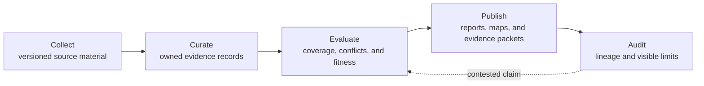

# Bijux Pollenomics

`bijux-pollenomics` turns heterogeneous scientific and spatial sources into a
versioned, reviewable publication system. It collects source material, creates
repository-owned evidence records, exposes uncertainty and conflicts, and
publishes world, regional, country, and lake-oriented views from the same
governed state.

The system keeps unlike evidence unlike. Pollen observations, environmental
archaeology, heritage records, hydrography, administrative boundaries, human
ancient DNA, animal ancient DNA, and field observations may share a map, but
they retain distinct provenance, temporal meaning, spatial precision, and
publication rules.

  <a class="md-button md-button--primary" href="../pollenomics-data/">Explore the evidence system</a>
  <a class="md-button" href="architecture/">Follow the publication flow</a>
  <a class="md-button" href="interfaces/">Use commands and contracts</a>
  <a class="md-button" href="operations/">Install and rebuild</a>
  <a class="md-button" href="quality/">Understand guarantees and limits</a>

## One Repository, Four Responsibilities

```mermaid
flowchart LR
    Collect["Collect\nversioned source material"] --> Curate["Curate\nowned evidence records"]
    Curate --> Evaluate["Evaluate\ncoverage, conflicts, and fitness"]
    Evaluate --> Publish["Publish\nreports, maps, and evidence packets"]
    Publish --> Audit["Audit\nlineage and visible limits"]
    Audit -. contested claim .-> Evaluate
```

| Responsibility | Durable result |
| --- | --- |
| Collection | source identity, retrieval metadata, content hashes, replacement rules, and tracked raw artifacts |
| Curation | normalized records, sample and site linkage, chronology evidence, coordinate provenance, and source-family contracts |
| Evaluation | ambiguity ledgers, scientific reviews, coverage metrics, sensitivity results, and release refusal reasons |
| Publication | consistent world, Europe-plus, Nordic, country, lake, and fieldwork surfaces with traceable inputs |

This division prevents a polished output from becoming its own authority. The
publication layer can select, summarize, and render evidence; it cannot invent
support that the curated state does not contain.

## What Is Available

- a source collection pipeline for AADR, boundaries, LandClim, Neotoma, RAÄ,
  SEAD, and SMHI SVAR
- repository-owned raw, normalized, reviewed, and published layers described
  by machine-readable contracts
- sample-level animal aDNA curation across project accessions, papers,
  supplements, identities, localities, chronology, coordinates, and species
  views
- world, Europe-plus, Nordic, Sweden, Norway, Finland, and Denmark report
  families derived from shared publication contracts
- candidate-site ranking and sensitivity surfaces, including the Sweden lake
  evidence packet and fieldwork shortlist
- a typed Python API, the `bijux-pollenomics` command, and the compatible
  `pollenomics` command

## Follow The Question, Not The Rendering

| Question | First surface | Governing follow-up |
| --- | --- | --- |
| Which records are publicly visible for a geography? | world, regional, or country report bundle | bundle manifest and subset validation |
| Why does one animal point appear? | point traceability row | sample record, site evidence, chronology evidence, coordinate provenance, and source lineage |
| Why is an expected point absent? | exclusion or warning surface | recovery queue, conflict ledger, substitution ledger, or release guard |
| What environmental context surrounds a sample or lake? | source-family map layer | source contract and temporal semantics for that family |
| Why does one lake rank above another? | ranking table | ranking manifest, feature inputs, and sensitivity analysis |
| What changed after source collection? | collection summary | source metadata, snapshot hash, normalized hash, and family review |

The first surface locates the answer; the follow-up establishes its authority.
A map is usually the fastest index, while the evidence database is the stronger
surface for a claim about one record.

## Evidence Strength Is Explicit

The current evidence families do not have equal maturity. Pollen and several
environmental context layers have stable collection and publication routes.
Human aDNA uses versioned AADR metadata. Animal aDNA has a deeper curation
model because source papers and supplements often disagree, omit sample-level
fields, or identify only a broad locality.

An animal record can therefore occupy different states:

- source discovered but supporting material incomplete;
- sample identity established but locality or chronology unresolved;
- normalized to a species record but not eligible for exact-point publication;
- admitted to an atlas candidate surface with explicit precision and caveats;
- blocked from publication by a release guard.

These states are meaningful results. A blocked record communicates what is
known, what is missing, and what recovery work would change the decision.

## Choose A Route

- [Foundation](foundation/index.md) defines the scientific and product scope.
- [Architecture](architecture/index.md) follows evidence from a command to a
  tracked artifact and public output.
- [Interfaces](interfaces/index.md) covers the CLI, Python API, and artifact
  contracts.
- [Operations](operations/index.md) covers installation, validation, rebuilds,
  and recovery.
- [Quality](quality/index.md) covers invariants, tests, publication language,
  and known limits.
- [Data](../pollenomics-data/index.md) covers source families, curation,
  evidence semantics, and publications.
- [Nordic atlas](../nordic-atlas/index.md) covers visible layers, filters, and
  point interpretation.
- [Sweden lake priorities](../nordic-atlas/sweden-lake-priorities/index.md)
  covers ranking evidence and fieldwork-oriented use.

## Boundaries

The current maps are inspectable publications, not autonomous scientific
inference or sampling systems. In particular:

- spatial proximity does not establish temporal overlap or causal relation;
- an administrative boundary frames a view but does not add scientific weight;
- approximate or substituted locality evidence is not equivalent to a verified
  sample coordinate;
- ranking outputs support prioritization but do not replace bathymetry,
  permitting, access assessment, or field verification; and
- the runtime does not process AADR genotype files or provide a finished
  integrated eDNA, aDNA, pollen, and archaeology analysis engine.

The reliable path for a consequential claim is publication to evidence to
source—not publication alone.
